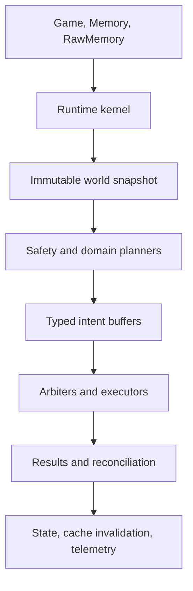

# MYRMEX Runtime Architecture

Status: **Normative target architecture**

Applies to: `packages/bot`

Last updated: 2026-07-15

This document defines the core systems of MYRMEX, the authority each system owns, and the only
supported ways those systems integrate. It is deliberately specific so that human and AI
contributors extend one bot instead of creating competing frameworks.

The Phase 0 substrate is executable: state, kernel, CPU admission, heap cache, world observation,
intent arbitration/execution contracts, telemetry, deterministic replay, and architecture checks are
implemented. Systems assigned to later roadmap phases remain normative targets. Their absence is an
implementation task, not permission to invent a different boundary. If a requirement cannot fit this
architecture, write an ADR before changing the architecture.

Normative words have their usual meanings:

- **MUST** and **MUST NOT** are architecture constraints.
- **SHOULD** is the default; deviation requires a reason in the change description.
- **MAY** is an allowed implementation choice.

When documents disagree, use this order: accepted ADRs, this document, strategy, roadmap, Wiki.
`AGENTS.md` and `loop.md` govern the engineering workflow and remain mandatory.

## 1. Architectural Objective

MYRMEX is one autonomous Screeps program that turns observed world state into bounded, explainable
game actions every tick. Its architecture must continue to function when:

- the JavaScript heap is reset without warning;
- `Memory` is empty, stale, or requires migration;
- rooms lose vision;
- CPU is constrained or the bucket is nearly empty;
- individual game commands fail;
- creeps, structures, rooms, routes, or targets disappear;
- a colony is under attack while optional planning is incomplete;
- long-range, segment, or cross-shard data is unavailable.

The runtime optimizes game outcomes, not abstraction count. It is intentionally a modular monolith:
one bundle, one composition root, one tick loop, and internal modules with strict ownership.

## 2. Non-Negotiable Invariants

1. `@myrmex/bot` is the only deployable package and produces `dist/main.js`.
2. `@myrmex/scenario-kit` is development-only and MUST NOT be imported by runtime code.
3. `main.ts` exports the Screeps loop and performs no gameplay planning.
4. `RuntimeKernel` is the only tick orchestrator and `CpuScheduler` is the only CPU admission
   authority.
5. `MemoryManager` is the only direct reader or writer of `Memory.myrmex`.
6. `CacheManager` is the only owner of reusable heap-derived data.
7. `SegmentManager` is the only caller of the RawMemory segment API.
8. `InterShardManager` is the only caller of the InterShardMemory API.
9. `WorldObserver` creates exactly one immutable `WorldSnapshot` per tick.
10. Planners read snapshots and repositories; they MUST NOT issue Screeps commands.
11. All requested game actions are typed intents. Only executors call command methods such as
    `spawnCreep`, `move`, `harvest`, `transfer`, `attack`, `activateSafeMode`, or market methods.
12. An arbiter is the sole authority for each exclusive resource: spawn time, creep action, movement
    tile, tower action, terminal cooldown, lab use, factory use, observer use, power spawn use, and
    operation authorization.
13. Persistent strategic commitments have one owner and one state machine.
14. Cross-system coordination uses typed contracts, intents, results, and read-only views. There is
    no general event bus, service locator, mutable singleton registry, or cross-domain Memory
    access.
15. All ordering and tie-breaking is deterministic. Random behavior uses an explicitly seeded PRNG.
16. An empty heap cache, missing segment, or unavailable optional planner MUST reduce quality, never
    correctness or basic survival.
17. Runtime configuration has one authority. Planners consume its detached immutable view and MUST
    NOT parse, retain, or mutate the operational candidate.
18. Configured self, ally, and NAP identities are fail-closed exclusions: optional relation data
    MUST NOT authorize an action that can target or harm them.
19. Every remote, claim, trade, and military operation has a budget, success condition, timeout, and
    exit condition.

Adding a second authority for any item above is an architecture defect, even if the duplicate is
described as temporary.

## 3. Runtime Topology



Only the kernel composition root wires these layers together. A planner does not obtain another
planner and call it. Shared decisions are represented as data owned by the appropriate authority.

### 3.1 Runtime data flow

The complete flow for a normal tick is:

1. Load and validate persistent state.
2. Resolve one immutable runtime configuration and its feature-gate view.
3. Establish CPU mode and admitted work.
4. Activate requested segments and ingest available external data.
5. Observe visible game state once.
6. Evaluate immediate survival threats.
7. Update strategic and operational objectives at their admitted cadence.
8. Produce capability contracts and typed action intents.
9. Arbitrate intents deterministically.
10. Execute accepted intents through narrow command adapters.
11. Reconcile command results and observations into staged state changes.
12. Commit persistent changes, invalidate affected caches, and emit bounded telemetry.

There are no hidden control paths. A system that needs work performed emits a contract or intent; it
does not command a creep, spawn, structure, or other system directly.

## 4. Lifetimes and Storage Classes

Every datum belongs to exactly one lifetime. Choosing the wrong lifetime is a defect.

| Lifetime    | Owner                | Suitable data                                                                   | Forbidden data                                 |
| ----------- | -------------------- | ------------------------------------------------------------------------------- | ---------------------------------------------- |
| Tick        | `TickContext`        | snapshot, intent buffers, results, budgets, diagnostics                         | anything needed after the tick                 |
| Heap        | `CacheManager`       | derived indexes, routes, static cost matrices, compiled layouts                 | strategic commitments or sole copies of facts  |
| Persistent  | `MemoryManager`      | schema version, config candidate/receipt, contracts, reputation, recovery state | live game objects, paths, duplicated snapshots |
| Segment     | `SegmentManager`     | large room intel, matrix payloads, bounded telemetry history                    | boot-critical state or unindexed commitments   |
| Cross-shard | `InterShardManager`  | heartbeats and idempotent handoff envelopes                                     | shared mutable state or locks                  |
| Source      | typed config modules | defaults, invariant thresholds, feature gates                                   | secrets and frequently changing observations   |

Rules:

- Store stable identifiers such as room names, object IDs, coordinates, and contract IDs; never
  store Screeps game objects.
- A heap value MUST be reconstructible from persistent state, segments, configuration, or a new
  observation.
- A segment payload MUST have a schema version, content kind, updated tick, and integrity check.
- A persistent field MUST have one documented owner and a migration path.
- A system MUST NOT mirror a field merely to make access convenient. Expose a read-only view or
  derive an index through `CacheManager` instead.

## 5. Tick Context and Typed Buffers

`TickContext` is created by the kernel and is the only per-tick dependency container. It is passed
explicitly; modules MUST NOT reach into a mutable global context.

The target shape is conceptually:

```ts
interface TickContext {
  readonly tick: number;
  readonly mode: CpuMode;
  readonly snapshot: WorldSnapshot;
  readonly state: StateView;
  readonly intel: IntelView;
  readonly config: RuntimeConfig;
  readonly configResolution: RuntimeConfigResolutionMetadata;
  readonly budgets: BudgetView;
  readonly buffers: TickBuffers;
  readonly services: RuntimeServices;
}
```

The executable `TickContext` began in Phase 0 with tick, shard, memory status, detached state view,
immutable snapshot, sealed arbitration result, reconcile result, and bounded tick telemetry. Phase 1
adds the resolved `RuntimeConfig` view. The context contains neither `Game`, mutable `Memory`, nor
the raw operational candidate. Later fields enter only with the roadmap system that owns them. The
aggregate `StateView` also redacts the raw `config` owner; config consumers use only
`TickContext.config`.

`RuntimeServices` contains narrow interfaces, not concrete systems. It exposes state transactions,
cache lookup, segment requests, deterministic IDs, and telemetry. Gameplay planners MUST NOT receive
executors through this interface.

`TickBuffers` has explicit channels:

- `safetyIntents`: urgent tower, safe-mode, evacuation, and defensive actions;
- `spawnDemands`: requested capability and replacement contracts;
- `workContracts`: economy, construction, repair, scouting, and combat work;
- `actionIntents`: creep and structure action requests;
- `movementIntents`: desired positions, ranges, and movement priorities;
- `stateTransitions`: validated state-machine transitions;
- `commandResults`: accepted, rejected, deferred, and executed outcomes;
- `diagnostics`: bounded structured events.

These buffers are append-only to producers. Their arbiter or reconciler is the only consumer that
may finalize them. They are not a generic publish/subscribe mechanism and never survive the tick.

## 6. Deterministic Tick Lifecycle

Every tick runs the following seven phases in order.

| Phase     | Required output                                     | Persistent writes                    | Screeps commands          |
| --------- | --------------------------------------------------- | ------------------------------------ | ------------------------- |
| Boot      | valid state, CPU mode, service readiness            | migrations and recovery markers only | none                      |
| Observe   | one immutable snapshot and observation facts        | none                                 | read-only API access only |
| Safety    | urgent safety intents and survival overrides        | staged transitions only              | safety executors only     |
| Plan      | objectives, contracts, demands, normal intents      | staged transitions only              | none                      |
| Execute   | arbitration decisions and command results           | none                                 | executors only            |
| Reconcile | updated contracts, ledgers, and cache invalidations | one staged commit                    | none                      |
| Telemetry | bounded metrics and diagnostics                     | none in Phase 0                      | visual/log output only    |

### 6.1 Boot

Boot MUST:

1. Detect first execution after a heap reset.
2. Load `Memory.myrmex` through `MemoryManager`.
3. Validate and, if required, advance schema migrations.
4. Resolve source defaults and the accepted operational config into one immutable planner view.
5. Rebuild service objects and empty heap indexes.
6. Determine CPU mode and reserve CPU for safety, execution, reconcile, and telemetry.
7. Read active segment payloads and cross-shard envelopes without blocking.
8. Mark interrupted operations or expired leases for reconciliation.

If a migration is incomplete, the bot enters `recovery` mode. Only migration work, observation,
defense, essential spawning, and essential logistics are admitted. Migrations MUST be idempotent and
bounded; progress is persisted after every step. Config resolution never authorizes owner repair
during Boot. A malformed/future ready-state owner is preserved and uses source defaults; recovery or
unsupported root state reports the owner unavailable. Both paths expose only bounded status/reason
codes for telemetry.

### 6.2 Observe

`WorldObserver` reads all visible game objects once and creates `WorldSnapshot`. Observation:

- normalizes collections into deterministic ordering;
- records visibility and freshness explicitly;
- converts game objects into immutable plain data;
- derives observation facts such as ownership changes, damage, hostile presence, and event-log
  entries;
- never makes strategic decisions;
- never mutates persistent state.

Later phases MUST use the snapshot. Direct `Game.rooms`, `Game.creeps`, or `Game.getObjectById`
reads outside `world/`, command executors, and narrowly documented validation adapters are
forbidden.

### 6.3 Safety

Safety is a short, mandatory preemption pass. `DefenseDirector` evaluates the fresh snapshot and may
emit urgent intents for tower actions, safe mode, emergency spawning, rampart policy, evacuation,
and cancellation of unsafe work.

Safety does not become a second general planner. A `SafetyExecutor` may immediately arbitrate and
issue only actions whose delay until Execute would materially weaken survival. Every such command
still produces a normal `CommandResult` and is excluded from duplicate execution later in the tick.

### 6.4 Plan

Admitted planners update objectives and emit data. Plan proceeds from widest to narrowest scope:

1. empire objectives and budgets;
2. diplomacy and threat policy;
3. remote, expansion, market, industry, and operation portfolios;
4. colony objectives and reserves;
5. capability contracts and spawn demand;
6. structure, creep-action, and movement intents.

Each planner reads the same snapshot revision. No planner may depend on another planner having
mutated hidden state earlier in the phase. Required inputs must be persistent views or explicit
outputs in a typed buffer.

### 6.5 Execute

Execute processes safety-remaining and normal intent buffers in fixed authority order. Each arbiter:

1. validates freshness, ownership, budget, and preconditions;
2. groups intents that compete for the same exclusive resource;
3. sorts by policy priority, deadline, economic value, and stable intent ID;
4. accepts at most the legal number of commands for that resource;
5. records a reason for every rejection or deferral;
6. calls its executor for accepted commands;
7. captures the Screeps return code and measured CPU.

An executor translates one accepted intent into one bounded API interaction. It contains no
long-term policy.

### 6.6 Reconcile

`Reconciler` is the only normal path that converts tick outcomes into persistent state. It:

- maps command results back to contracts and operations;
- advances or fails state machines using explicit transition tables;
- releases, renews, or expires leases;
- applies observed reputation and threat evidence;
- updates economic ledgers and budget consumption;
- generates targeted cache invalidation tags;
- stages the next tick's segment activation requests;
- commits all validated changes through `MemoryManager`.

A failed command is evidence, not an exception. Expected game return codes become typed result
reasons. Unexpected exceptions are handled by the owning system's fault boundary.

### 6.7 Telemetry

Telemetry always runs in a reserved budget, even after a system failure. It records enough data to
answer what MYRMEX decided, why, what command ran, and what outcome occurred. It MUST cap log lines,
metric cardinality, memory growth, and segment writes.

Phase 0 exposes two immutable tick-local records from `runTick`. `KernelTickReport` contains system
status, faults, mode, system/phase CPU, and unattributed kernel overhead. The bounded
`TickTelemetry` summary contains snapshot size, cache size, bucket, and environment status; its
cache measurement and construction run inside the reserved `telemetry.minimum` boundary. Together
they form the tick result. A future durable ring MUST be prepared before Reconcile or written
through `SegmentManager`; it MUST NOT add a second `Memory.myrmex` assignment after the reconcile
commit.

### 6.8 Phase 0 composition

The executable foundation registers these systems explicitly in `runtime/tick.ts`:

| System                | Phase     | Admission                       | CPU estimate |
| --------------------- | --------- | ------------------------------- | -----------: |
| `core.boot`           | Boot      | mandatory, recovery-safe        |         0.05 |
| `world.observe`       | Observe   | mandatory, recovery-safe        |         1.00 |
| `safety.foundation`   | Safety    | mandatory, recovery-safe        |         0.10 |
| `planning.foundation` | Plan      | economic                        |         0.10 |
| `cache.sweep`         | Plan      | surplus maintenance, cadence 25 |         0.25 |
| `execution.arbitrate` | Execute   | mandatory tail                  |         0.50 |
| `state.reconcile`     | Reconcile | mandatory tail                  |         1.00 |
| `telemetry.minimum`   | Telemetry | mandatory tail                  |         0.50 |

Memory opening is a bounded preflight because recovery status is an input to CPU-mode selection. It
may perform only the documented migration step budget. `RuntimeKernel` remains the sole scheduled
phase orchestrator. Phase 1 replaces foundation markers with survival policy systems; it does not
add another loop.

`runTick` captures CPU before that Memory preflight and passes the baseline into the kernel. The
kernel's final reading follows mandatory telemetry work and report collection preparation. Thus
`KernelTickReport.cpuUsed` equals the sum of per-system CPU plus `overheadCpu`; overhead includes
Memory preflight, composition, admission, and orchestration between system boundaries. Only the
constant-size return-object assembly occurs after the final meter reading.

## 7. Runtime Kernel

### 7.1 RuntimeKernel

`RuntimeKernel` owns:

- phase ordering;
- construction of `TickContext`;
- system registration at source composition time;
- calls into `CpuScheduler`;
- phase fault boundaries;
- finalization when optional work fails.

It does not own gameplay policy, creep behavior, pathfinding algorithms, or domain state.

Registration is static and explicit in the composition root. Runtime discovery, decorators,
reflection, plugin loading, and systems registering other systems are forbidden.

### 7.2 System contract

Every scheduled unit implements the conceptual contract below:

```ts
interface TickSystem {
  readonly id: SystemId;
  readonly phase: TickPhase;
  readonly criticality: Criticality;
  readonly cadence: number;
  readonly estimate: CpuEstimate;
  run(context: TickContext, budget: CpuBudget): SystemReport;
}
```

- `id` is globally unique and stable.
- `phase` is fixed at registration.
- `criticality` determines admission class, not business priority.
- `cadence` is the normal minimum ticks between full runs. A system may be awakened by an explicit
  dirty flag or deadline.
- `estimate` is updated from bounded historical measurements.
- `run` MUST honor its budget and return a report; it MUST NOT silently schedule asynchronous work.

Large computations implement resumable jobs with a persistent or segment-backed cursor. A job does
bounded work, commits progress, and yields. Generators, promises, and background timers are not a
substitute for persisted resumability in the Screeps runtime.

### 7.3 CpuScheduler

`CpuScheduler` is the sole admission authority. It chooses a `CpuMode` from bucket level, tick
limit, recent use, recovery state, and active threat level. Thresholds live in one validated
`CpuPolicy` configuration; inline bucket thresholds elsewhere are forbidden.

The modes are:

| Mode          | Admitted work                                                                   |
| ------------- | ------------------------------------------------------------------------------- |
| `recovery`    | migration, observation, safety, essential spawn/logistics, reconcile, telemetry |
| `emergency`   | mandatory survival and defense only                                             |
| `constrained` | mandatory work plus bounded colony maintenance                                  |
| `normal`      | all due operational planners and selected strategic work                        |
| `surplus`     | normal work plus backlog, route, layout, intel, and simulation jobs             |

Criticality classes are:

1. `mandatory`: boot, observation, safety, essential execution, reconcile, minimal telemetry;
2. `operational`: spawning, harvesting, hauling, local defense, contract assignment;
3. `economic`: construction, upgrading, remotes, industry, market balancing;
4. `strategic`: expansion, long-range operations, expensive intel analysis;
5. `maintenance`: cache sweeping, compaction, detailed telemetry, simulations.

The scheduler MUST reserve mandatory tail CPU before admitting optional work. Within an admission
class it orders by deadline, explicit wake reason, oldest due tick, then stable system ID. Business
priorities remain inside domain arbiters and do not change kernel criticality.

No system may read `Game.cpu.bucket` to self-admit. It receives `CpuMode` and `CpuBudget` from the
scheduler. Phase 0 records actual usage, estimate error, and explicit overruns. Repeated optional
failures or overruns enter bounded quarantine and exponential probe backoff. An adaptive estimate
policy may be added only with bounded persistence and boundary scenarios; static registered
estimates remain authoritative until then.

### 7.4 Fault boundaries

The kernel isolates scheduled systems, not individual creeps. On an unexpected exception it:

1. catches at the system boundary;
2. records system ID, phase, tick, compact error, and input revision;
3. discards that system's uncommitted buffer writes;
4. continues mandatory systems when safe;
5. increments a bounded consecutive-failure counter;
6. quarantines optional systems after the configured threshold;
7. admits a low-frequency probe to recover automatically.

Boot, observation, state commit, and core execution failures trigger degraded recovery behavior, not
quarantine. Per-creep kernels and one try/catch per creep are forbidden.

## 8. State Substrate

### 8.1 MemoryManager

`MemoryManager` owns the `Memory.myrmex` root, schema validation, migrations, transactions, and
serialization hygiene. No other module reads or writes that root directly.

The persistent root is divided by authority, not convenience:

| Subtree      | Owner                    | Contents                                                           |
| ------------ | ------------------------ | ------------------------------------------------------------------ |
| `meta`       | `MemoryManager`          | schema, migration cursor, first/last tick, shard, recovery status  |
| `config`     | `RuntimeConfigAuthority` | candidate, accepted canonical override, source/resolved revisions  |
| `kernel`     | `RuntimeKernel`          | system health, due ticks, resumable job headers, CPU estimates     |
| `empire`     | `EmpireDirector`         | objectives, budgets, colony registry, strategic policy revisions   |
| `colonies`   | `ColonyDirector`         | per-colony state machines, reserves, layout revision, local policy |
| `contracts`  | `ContractLedger`         | persistent work contracts, leases, deadlines, outcomes             |
| `diplomacy`  | `DiplomacyLedger`        | observed evidence, confidence, and optional reputation state       |
| `remotes`    | `RemotePortfolio`        | candidates, active commitments, ledgers, suspension state          |
| `expansion`  | `ExpansionDirector`      | claim candidates and bootstrap operation state                     |
| `operations` | `OperationsController`   | authorized military and strategic operation state machines         |
| `industry`   | `IndustryDirector`       | stock targets, production commitments, market risk limits          |
| `segments`   | `SegmentManager`         | manifest, generations, activation requests, corruption markers     |
| `telemetry`  | `TelemetryService`       | bounded counters, last status, ring metadata                       |

Schema v3 contains every listed owner. The v2-to-v3 migration adds `config` without rewriting the
other owner payloads. A persisted, interrupted historical v1-to-v2 cursor remains valid: the runtime
completes it, transitions to the separate v2-to-v3 cursor, and then finishes schema v3. Every later
subtree still requires an owner and migration before its first field is added.

Memory access uses typed repositories:

- views are read-only for the tick;
- a system can stage mutations only through its owned repository;
- transactions validate schema and allowed transitions;
- reconcile performs one ordered commit;
- failed validation rejects the whole owner transaction and emits a fault;
- unknown fields are removed only by an explicit migration, never opportunistically.

Migrations are sequential, idempotent, downgrade-aware only when an ADR requires rollback, and
tested from every supported schema version. Destructive migration requires a recovery strategy.

The state substrate applies these hard limits before commit: depth 64, 50,000 JSON nodes, 1,500,000
combined string/key code units, 10,000 array items, 10,000 object keys, 1,024 code units per key,
and 16 recovery diagnostics. A recovery cursor may exceed only the first two limits by the exact
fixed cursor overhead: 11 nodes and 248 code units. Such a cursor is valid only when its projected
schema-v3 root passes the original limits; completion diagnostics are omitted at the boundary rather
than displacing a valid owner payload. During root recovery, a malformed optional authority subtree
is rebuilt while valid authority subtrees and valid boot identity are salvaged. This does not
authorize repairing a malformed config owner in an otherwise valid v3 root. Future schema versions
fail closed without downgrade. Config candidate validation has intentionally smaller budgets and
remains independent of these root-storage limits; those exact limits are recorded in
[`phase1-config-evidence.md`](phase1-config-evidence.md).

### 8.2 CacheManager

`CacheManager` replaces ad hoc module globals and duplicate caches. It owns all reusable heap data
that can be discarded and rebuilt.

Every cache namespace is registered once by its canonical owner:

```ts
interface CacheNamespaceContract<Key, Value> {
  readonly id: CacheNamespaceId;
  readonly owner: SystemId;
  readonly version: number;
  readonly capacity: number;
  readonly maxKeyLength: number;
  readonly ttlTicks: number | null;
  readonly maxEncodedLength: number;
  readonly estimatedRebuildCpu: number;
  keyOf(key: Key): DeterministicCacheKey;
  readonly codec: CacheCodec<Value>;
}
```

The manager returns a typed namespace handle. `getOrCompute` accepts the deterministic loader at the
call site so the current immutable inputs remain explicit. Values cross the namespace codec boundary
on every write and hit; this detaches caller references and rejects representations beyond the
declared size budget.

Each entry records its deterministic key, creation tick, last-use tick, expiry tick, dependency
epochs, and encoded length under the registered namespace version. Required behavior:

- missing, expired, invalidated, or corrupt entries are cache misses;
- loaders are deterministic and side-effect free;
- values contain plain data, not live game objects;
- namespaces use stable keys and MUST NOT scan all entries during normal lookup;
- a bounded maintenance sweep removes expired or least-recently-used entries;
- cache statistics expose hits, misses, builds, evictions, and build CPU;
- expiry maintenance is resumable and inspects at most the caller's explicit entry budget;
- global reset correctness is tested with a completely empty manager;
- no planner changes a strategic decision solely because a cache happened to be warm.

Invalidation uses dependency epochs rather than scattered deletes. Initial epochs include:

- world topology;
- room structure layout by room;
- colony policy by colony;
- diplomacy policy;
- pathing policy;
- persistent schema;
- code build.

For example, a route cache key includes origin, destination, policy ID, and topology epoch. A static
cost matrix includes room name, structure-layout epoch, and pathing-policy epoch. Dynamic creeps are
overlaid per tick and do not invalidate static matrices.

Only `CacheManager` may own global heap maps. A tiny function-local memoization that cannot survive
the call is allowed. Anything reused across calls or ticks is a registered namespace.

### 8.3 SegmentManager

`SegmentManager` owns segment activation, serialization, integrity checks, compaction, and write
budgets. Other systems use typed stores and receive one of `ready`, `loading`, `missing`, or
`corrupt`; they never call RawMemory directly.

Segment categories are:

- room intelligence history;
- static and strategic matrix payloads;
- route and portal graph payloads;
- bounded telemetry history;
- large resumable analysis inputs or outputs.

The small manifest in persistent Memory maps logical keys to physical segment, generation, schema,
size, checksum, and last access. Activation is planned one tick ahead. Priority is safety intel,
active operations, active remote/colony data, then optional analysis.

Boot-critical behavior MUST NOT require a segment. Missing derived data is rebuilt. Corrupt
authoritative historical data is quarantined and replaced only through its owner's recovery rule.
Writes use copy-then-publish generations so an interrupted write cannot replace the last valid
payload.

### 8.4 InterShardManager

Cross-shard integration uses versioned envelopes with sender shard, sequence, created tick, expiry,
kind, payload, and idempotency key. It supports:

- shard heartbeat and capacity summary;
- portal and route observations;
- creep handoff declaration and acknowledgement;
- operation request and explicit acceptance.

There are no distributed locks and no cross-shard shared mutable objects. The shard that owns a
colony or operation remains authoritative. Stale, duplicated, out-of-order, or malformed envelopes
are ignored safely and measured.

## 9. World Model and Intelligence

### 9.1 WorldObserver

`WorldObserver` is the sole visible-world normalization pipeline. It produces:

- `WorldSnapshot`: complete immutable facts visible this tick;
- `ObservationFacts`: normalized changes or evidence for reconciliation;
- `VisibilityIndex`: visible, last-seen, and never-seen status by room.

The snapshot has stable maps and sorted ID lists for deterministic traversal. It distinguishes
unknown from absent. If a room is not visible, its current structures and creeps are unknown; an
older intel record MUST NOT be presented as current truth.

### 9.2 IntelRepository

`IntelRepository` is the read interface over current observation plus segment-backed history.
`IntelService` owns intel retention and confidence. Every record includes observed tick, source,
confidence, and expiry policy.

Consumers state their freshness requirement:

- immediate defense: current tick;
- remote operation: policy-defined recent vision;
- claim scoring: recent room and route evidence;
- offensive operation: explicit maximum age by evidence kind.

If freshness is insufficient, a planner emits a scout/observer contract or defers the decision. It
does not silently use stale information.

## 10. Strategy and Objective Hierarchy

Decisions flow down a strict hierarchy:

1. `EmpireDirector` owns global objectives, reserves, and scarce-resource budgets.
2. Portfolio authorities decide which colonies, remotes, claims, trades, industry commitments, and
   operations are funded.
3. `ColonyDirector` turns funded objectives into local capability demand.
4. Domain planners turn demand into contracts and intents.
5. Arbiters select legal commands.
6. Reconcile reports outcomes and costs back up through ledgers.

A lower layer may refuse an infeasible or unsafe objective and report the reason. It MUST NOT
silently redefine the objective or spend beyond the allocated budget.

### 10.1 Budgets

`BudgetLedger` is part of the empire/colony state boundary and represents reservations for:

- energy;
- spawn time;
- CPU;
- terminal cooldown and transaction energy;
- minerals, boosts, commodities, and power;
- GCL/room slots;
- risk and expected loss.

Planners request reservations. The owning director grants, reduces, or rejects them. Executors
consume against accepted reservations; reconciliation records actual cost and releases unused
amounts. A priority is not authorization to overspend.

## 11. Capability Contracts and Creep Control

MYRMEX does not run a parallel code path for every named creep role. It models work as capability
contracts and treats creep body designs as archetypes.

### 11.1 WorkContract

A persistent contract has:

- stable contract ID and revision;
- issuer and owning colony or operation;
- capability kind and required body capabilities;
- target room, object, position, or route;
- quantity or completion condition;
- priority, earliest start, deadline, and expiry;
- energy, spawn, CPU, and loss budget references;
- freshness and safety preconditions;
- success, cancellation, suspension, and failure conditions;
- assignment/lease policy;
- state and bounded outcome history.

The state machine is:

`proposed → funded → assigned → active → completed`

Terminal alternatives are `cancelled`, `expired`, and `failed`; `funded`, `assigned`, or `active`
may become `suspended` and later return to `funded`. Transitions not in the table are invalid.

Tick-local trivial work MAY use an ephemeral contract, but anything requiring spawn time,
replacement, multiple ticks, resource reservation, or outcome accounting MUST be persistent.

### 11.2 ContractLedger

`ContractLedger` is the sole contract state authority. It deduplicates issuer keys, expires leases,
validates transitions, and exposes indexed read views. Issuers describe desired outcomes; only the
ledger creates the canonical ID and state.

### 11.3 WorkforceAllocator and creep agents

`WorkforceAllocator` matches available creep capabilities to funded contracts. It owns assignment
leases but not spawn order or movement. Assignment considers feasibility, travel time, remaining
life, opportunity cost, and switching cost.

A creep agent reads its lease and emits at most:

- one primary action intent;
- one movement intent;
- bounded supporting intents explicitly allowed by the contract.

It does not select empire strategy. If its contract is invalid or unavailable, it requests a new
assignment or follows a safe recycle/parking policy.

## 12. Core Gameplay Authorities

The following table is the canonical ownership map.

| System                   | Sole authority                                 | Reads                                     | Emits/owns                               | Never does                        |
| ------------------------ | ---------------------------------------------- | ----------------------------------------- | ---------------------------------------- | --------------------------------- |
| `RuntimeConfigAuthority` | runtime policy resolution                      | source defaults, owned config candidate   | immutable config and gate views          | expose raw candidate to planners  |
| `EmpireDirector`         | global objectives and strategic budgets        | snapshot, ledgers, strategy config        | objective revisions, global reservations | issue creep/structure commands    |
| `ColonyDirector`         | owned-room lifecycle and local policy          | empire objective, colony view             | colony objectives, local reserves        | maintain its own world cache      |
| `EconomyPlanner`         | source/use demand model                        | colony view, contracts                    | harvest/work/upgrade/build demand        | spawn or assign creeps            |
| `SpawnBroker`            | spawn queue and body selection                 | demands, energy, deadlines                | accepted spawn intents                   | call `spawnCreep` directly        |
| `WorkforceAllocator`     | creep-to-contract leases                       | capabilities, contracts, travel estimates | assignments                              | create strategic objectives       |
| `LogisticsPlanner`       | resource-flow contracts                        | stores, stock targets, routes             | haul/transfer/withdraw intents           | move or transfer directly         |
| `MovementArbiter`        | movement reservations and move choice          | movement intents, matrices, snapshot      | accepted move intents                    | decide why a creep travels        |
| `LayoutPlanner`          | planned structure positions                    | terrain, policy, colony state             | versioned layout plan                    | create construction sites         |
| `ConstructionPlanner`    | build/repair/dismantle priorities              | layout, structures, reserves              | construction and work intents            | modify layout ownership           |
| `DefenseDirector`        | threat state and defense posture               | snapshot, intel, diplomacy                | safety intents, defense contracts        | authorize offensive war           |
| `DiplomacyLedger`        | observed relation and reputation state         | config relation policy, observed evidence | relation view, transitions               | weaken configured exclusions      |
| `RemotePortfolio`        | remote lifecycle and profitability             | intel, full-cost ledger                   | remote objectives, suspend/resume        | run remote creeps directly        |
| `ExpansionDirector`      | claim portfolio and bootstrap state            | empire budget, intel, graph               | claim/bootstrap objectives               | bypass GCL or donor budgets       |
| `IndustryDirector`       | stock targets and production commitments       | stores, market view, strategy             | lab/factory/power demands                | execute market or structure calls |
| `MarketPlanner`          | trade proposals and price/risk model           | stock targets, orders, history            | deal/order intents                       | call market methods directly      |
| `OperationsController`   | military authorization and operation lifecycle | policy, diplomacy, intel, budget          | operation contracts and transitions      | target configured allies          |
| `ExecutorRegistry`       | command adapters                               | accepted intents, live handles            | command results                          | make strategic choices            |
| `Reconciler`             | application of tick outcomes                   | results, observation facts                | staged persistent commit                 | issue game commands               |
| `TelemetryService`       | metrics, diagnostics, status                   | system reports and results                | bounded telemetry                        | become a second state store       |

### 12.1 ColonyDirector

Each owned room belongs to one colony state machine:

`discovering → bootstrapping → developing → mature → threatened → recovering`

`abandoning` and `lost` are explicit terminal paths. A colony may move between mature/developing,
threatened, and recovering only through defined evidence-based transitions. The director owns the
colony's reserve policy, RCL priorities, donor/receiver status, and which local objectives are
active.

A colony is a planning boundary, not a separate kernel. All colonies share the same global
scheduler, caches, movement authority, diplomacy ledger, and executors.

### 12.2 SpawnBroker

All spawn requests are `SpawnDemand` records containing capability vector, body constraints,
deadline, destination, lifetime value, energy cap, priority, replacement target, and budget ID.

`SpawnBroker`:

- deduplicates equivalent issuer demand;
- predicts availability across all eligible spawns;
- builds deterministic bodies from capability constraints;
- accounts for spawn time and travel/replacement lead time;
- reserves energy without starving emergency demand;
- emits one `SpawnIntent` per chosen spawn slot;
- records why a demand is deferred or impossible.

Only `SpawnExecutor` calls `spawn.spawnCreep`. Creep names encode a unique ID for diagnostics, not
behavioral role dispatch.

### 12.3 LogisticsPlanner

Logistics is a resource-flow planner. It represents sources, sinks, buffers, capacities, deadlines,
and transfer costs, then emits haul contracts or direct structure-transfer intents. It owns neither
creep assignments nor movement.

Mandatory flows are defense reserves, spawn/extensions, survival towers, and recovery. Optional
flows such as upgrading, industry, and market staging consume only unreserved surplus. Resource
requests use a common stock-policy vocabulary so labs, terminals, factories, nukers, and power
spawns cannot each invent conflicting reserve rules.

### 12.4 MovementArbiter

Every creep movement request is a `MovementIntent` with actor ID, desired position/range, deadline,
priority class, avoid policy, formation ID if any, and contract ID. Only `MovementExecutor` calls
`move`, and no module calls `moveTo` as a bypass.

The arbiter:

- validates the actor and goal;
- uses `CacheManager` path/route namespaces;
- overlays current dynamic occupancy on static matrices;
- reserves destinations and resolves swaps/chains deterministically;
- favors safety, then deadline, then stuck age, then stable actor ID;
- detects and recovers from repeated blockage;
- reports no-path and unsafe-route outcomes to the owning contract.

Room routing and intra-room movement share policy inputs but remain separate cache namespaces.
Military formations extend the same reservation authority; they do not create a second movement
system.

### 12.5 Layout and construction

`LayoutPlanner` owns a versioned desired layout. `ConstructionPlanner` compares that layout and
policy-driven repair targets with the current snapshot. `ConstructionSiteArbiter` owns the global
and per-room construction-site budget and prioritizes accepted site intents.

Emergency ramparts may be requested by defense, but they still pass through the construction-site
authority. Dismantling any owned structure requires a typed intent with owner policy, replacement
precondition, and rollback consequence.

### 12.6 DefenseDirector

Defense maintains a per-room threat state:

`peace → watch → alert → engaged → siege → recovery`

It combines current hostile capabilities, approach/position, damage, event evidence, intel,
reinforcement latency, rampart/tower condition, safe-mode availability, and diplomacy. It owns:

- threat classification;
- tower target/heal/repair priority during danger;
- rampart public/private posture;
- evacuation and remote suspension requests;
- local defender/reinforcement capability demand;
- safe-mode recommendation and immediate authorization policy;
- protected reserve escalation.

It does not create war objectives. Defense may attack present hostile actors under standing
defensive policy; retaliation outside the threatened area requires `OperationsController`.

### 12.7 DiplomacyLedger

Relations are `self`, `ally`, `nap`, `neutral`, `trespasser`, `hostile`, or `war`. Configured self,
ally, and NAP identities are authoritative policy inputs. Observation creates evidence with source,
tick, room, severity, confidence, and decay.

The relation resolver checks configured exclusions before consulting optional reputation. Self,
ally, and NAP map to the `excluded` targeting ceiling regardless of empty, stale, malformed,
future-version, future-assessed, or contradictory optional data. A malformed observed identity is
also excluded. Valid unconfigured identities are neutral when optional evidence is unavailable and
have at most the `local-defense` ceiling during Phase 1. Fresh optional evidence may reduce a
ceiling; it cannot raise one or change a configured exclusion.

`local-defense` is a ceiling, not authorization. A later defense authority must also prove fresh
owned-room threat evidence before issuing a targeted action. Irreversible offense requires an
authorized operation. Area-effect intents must prove that no configured exclusion can be harmed.
`FIND_HOSTILE_*` means “not owned” in the Screeps API; it is observation input, never diplomatic
authorization. Consumers receive a read-only decision containing relation, evidence status, policy
revision, and targeting ceiling.

### 12.8 RemotePortfolio

Each remote uses:

`candidate → scouting → trial → active → suspended → retiring`

`rejected` and `lost` are explicit outcomes. The portfolio owns the full-cost ledger: delivered
energy minus spawn amortization, reservation, roads/repair, hauling, CPU shadow cost, expected loss,
defense, and replacement disruption.

Threat, stale intel, negative expected value, donor weakness, or route failure suspends new spending
and triggers safe withdrawal. Resume requires a policy-defined cooldown plus fresh evidence. Remote
planners emit normal contracts; they do not fork the economy, spawn, movement, or defense systems.

### 12.9 ExpansionDirector

Expansion ranks claims as scarce portfolio positions. It owns candidate scoring, donor budgets,
claim reservation, bootstrap operation state, stabilization gate, and abandonment. It consumes intel
and empire graph views and emits contracts through existing spawn/logistics/operations paths.

A claim is not complete when the controller is claimed. It is complete only after the new colony
meets the configured independent-survival gate. Failure or timeout releases its GCL, energy, spawn,
and risk reservations.

### 12.10 IndustryDirector and MarketPlanner

`IndustryDirector` owns stock targets and production recipes; structure arbiters own actual lab,
factory, terminal, power-spawn, and related cooldown slots. `MarketPlanner` proposes trades within
price, inventory, credit, transaction-energy, exposure, and freshness limits.

Only `MarketExecutor` calls game market methods. Every order creation/change/cancellation and deal
is idempotently keyed, budgeted, capped per tick, and reconciled from the next observed market
state.

### 12.11 OperationsController

Every military or strategic operation has exactly one controller-owned record with:

- objective and target;
- diplomatic authorization revision;
- intelligence requirements and freshness;
- staging, route, body, boost, and logistics plan references;
- energy, spawn, CPU, mineral, time, and expected-loss budgets;
- success, retreat, abort, timeout, and cleanup conditions;
- current state, owner, and idempotency key.

The state machine is:

`proposed → authorized → mobilizing → staging → executing → withdrawing → complete`

Any active state may transition to `aborting`; final alternatives are `failed` and `cancelled`.
Authorization is revalidated before mobilizing and before the first irreversible hostile action.
Defense overrides may withdraw assets, but cannot broaden an operation's target or budget.

## 13. Intents, Arbitration, and Execution

### 13.1 Intent envelope

Every intent includes:

```ts
interface IntentEnvelope<Kind, Payload> {
  readonly id: IntentId;
  readonly kind: Kind;
  readonly issuer: SystemId;
  readonly tick: number;
  readonly actorId?: string;
  readonly contractId?: ContractId;
  readonly operationId?: OperationId;
  readonly budgetId?: BudgetId;
  readonly priority: Priority;
  readonly deadline: number;
  readonly snapshotRevision: number;
  readonly preconditions: readonly Precondition[];
  readonly payload: Payload;
}
```

IDs are deterministic for repeat proposals within a tick and include enough scope to deduplicate
retries. Intent priority uses a shared ordered enum; arbitrary numeric priority literals outside the
policy module are forbidden.

### 13.2 Exclusive authorities

| Resource                | Arbiter                   | Executor                   |
| ----------------------- | ------------------------- | -------------------------- |
| spawn slot              | `SpawnBroker`             | `SpawnExecutor`            |
| creep primary action    | `CreepActionArbiter`      | `CreepActionExecutor`      |
| creep movement          | `MovementArbiter`         | `MovementExecutor`         |
| tower action            | `TowerArbiter`            | `TowerExecutor`            |
| link action             | `LinkArbiter`             | `LinkExecutor`             |
| terminal action         | `TerminalArbiter`         | `TerminalExecutor`         |
| lab action              | `LabArbiter`              | `LabExecutor`              |
| factory action          | `FactoryArbiter`          | `FactoryExecutor`          |
| construction-site slot  | `ConstructionSiteArbiter` | `ConstructionSiteExecutor` |
| observer action         | `ObserverArbiter`         | `ObserverExecutor`         |
| market mutation         | `MarketArbiter`           | `MarketExecutor`           |
| safe mode               | `SafeModeArbiter`         | `ControllerExecutor`       |
| offensive authorization | `OperationsController`    | relevant action executor   |

New exclusive resources extend this table and require an ADR if they introduce a new authority.

### 13.3 Arbitration precedence

Unless a domain documents a stricter safety rule, conflicts resolve by:

1. ally-safety and legality validation;
2. immediate owned-room survival;
3. creep/asset preservation during withdrawal;
4. previously funded deadline commitments;
5. economic priority and expected marginal value;
6. lower resource cost;
7. older unmet demand;
8. stable intent ID.

Stable ID is always the final tie-breaker. Object iteration order, array insertion accident, and
random selection are not valid tie-breakers.

### 13.4 CommandResult

Every accepted or rejected intent produces a result with intent ID, status, reason, Screeps return
code when executed, tick, CPU used, and optional observed value. Status is one of:

- `executed`;
- `accepted-noop` for an already-satisfied idempotent outcome;
- `deferred` for a retryable capacity/deadline decision;
- `rejected` for policy, ownership, freshness, or budget failure;
- `invalid` for a malformed or impossible request;
- `failed` for an unexpected adapter failure.

Executors do not mutate contracts in response. Reconcile consumes results and owns those
transitions.

## 14. Configuration

`RuntimeConfigAuthority` constructs one `RuntimeConfig` from source defaults plus a strictly
validated, allowlisted operational override document. It alone reads and interprets the `config`
owner. Planners receive only its detached, recursively immutable typed view through `TickContext`.
Thresholds and priorities MUST NOT be scattered as anonymous literals or independently parsed in
consumers.

The owner-local schema is version 1. It separates an operator-owned candidate from a bot-owned
acceptance receipt:

- `candidate` is null or contains a safe-integer revision and one complete override document;
- `lastValid` is null or records the matching source revision, candidate revision, canonical
  accepted override, and resolved revision; and
- exact `{}` is the only shorthand that may be initialized into the owner-local schema.

The bot never rewrites candidate bytes. It may create the owner schema from exact `{}` and may stage
a new `lastValid` receipt through the config owner's transaction before the sole Reconcile commit. A
malformed non-empty or future owner is preserved and resolves with `source-defaults` plus the
bounded reason `owner-malformed` or `owner-future-schema`. `owner-unavailable` is reserved for
recovery or unsupported root state. Unknown keys, malformed identities, mixed valid/invalid fields,
and unsafe values reject the entire candidate. A rejected candidate may use `lastValid` only when
its source revision is compatible and its canonical override still passes current validation;
otherwise source defaults apply.

A null candidate is the absence of a new operator proposal. It keeps compatible `lastValid` policy
and revision evidence active without rewriting the owner; only an initial or incompatible receipt
falls back to source defaults. Null is not a rollback mechanism. Rollback publishes the complete
desired override, including `{}` for source defaults, under a newer candidate revision.

Resolution obeys these invariants:

- invariant game constraints, source availability, prerequisite edges, schemas, units, bounds, and
  safety ceilings are source-controlled and cannot be overridden at runtime;
- tunable thresholds have a name, type, unit, inclusive bound, source default, and outcome consumer;
- canonical binary key/identity ordering makes equivalent input byte-equivalent across JSON and
  global-heap round trips;
- the output and nested collections are recursively immutable;
- canonical accepted data remains the equality evidence; a compact revision is never trusted alone;
- candidate validation is bounded and is rerun only after global reset or candidate-revision change;
  and
- diagnostics and telemetry expose bounded status/reason and source/config/policy revisions, never
  identities, override values, or candidate content.

Feature gates are a source-controlled prerequisite DAG. An operational override may only disable a
known source-available gate. For gate `g`:

`effective(g) = available(g) && !disabled(g) && every prerequisite is effective`

Activation fields do not exist in the override schema and are rejected as unknown. An unavailable
gate therefore remains unavailable, and a gate with a closed prerequisite reports prerequisite
blocking. Issue #36 leaves all Phase 1 gameplay gates source-unavailable; the change that proves a
later outcome enables its own gate. Secrets never enter source, Memory, telemetry, Wiki, or
committed config.

The versioned policy fields, limits, statuses, gates, and deterministic matrix are recorded in
[`phase1-config-evidence.md`](phase1-config-evidence.md).

## 15. Observability and Explainability

`TelemetryService` provides:

- per-phase and per-system CPU with admission/skip reason;
- cache and segment health;
- colony state and reserves;
- spawn utilization and unmet capability demand;
- contract counts, age, completion, failure, and lease churn;
- energy/source/logistics outcome metrics;
- remote full-cost profit and suspension reason;
- threat, defense response, and safe-mode decisions;
- operation budget, losses, state, and exit reason;
- intent arbitration and command-result summaries;
- schema, build, source/config/policy revisions, config status/reason, and gate reason/blocker.

Structured diagnostics use bounded codes and stable entity IDs. Free-form logs are for concise human
context, not machine state. Each major decision includes a `reasonCode` and references its
objective, contract, budget, or operation when applicable.

The runtime status surface MUST answer:

1. What mode is the bot in?
2. What objectives are funded?
3. What is blocked and why?
4. What threats are active?
5. Where did CPU, spawn time, and energy go?
6. Which decisions changed this tick?

## 16. Failure and Recovery Rules

| Failure                         | Required behavior                                                                  |
| ------------------------------- | ---------------------------------------------------------------------------------- |
| global heap reset               | rebuild all services/caches; continue from persistent contracts                    |
| empty Memory                    | initialize schema; enter bootstrap; create no duplicate commitments                |
| incomplete migration            | enter recovery mode and resume bounded migration                                   |
| malformed/future config owner   | preserve owner; source-defaults with bounded malformed/future reason               |
| invalid config candidate        | reject atomically; revalidate compatible last-valid or use source defaults         |
| unavailable/prerequisite gate   | keep work disabled and report its source or prerequisite reason                    |
| missing/corrupt cache           | treat as miss and rebuild within budget                                            |
| unavailable segment             | defer optional consumer or use explicitly lower-confidence fallback                |
| corrupt segment                 | quarantine generation; load previous valid generation or rebuild                   |
| stale vision                    | request vision or defer; never treat stale as current                              |
| planner exception               | discard its writes; quarantine optional system; continue mandatory phases          |
| expected command error          | record typed result; reconcile and retry/retire by policy                          |
| executor exception              | fail intent, isolate adapter, preserve reconcile/telemetry budget                  |
| CPU pressure                    | stop optional admissions; preserve safety, essential execute, reconcile, telemetry |
| lost creep/structure            | expire leases/reservations and replan from observation                             |
| lost room                       | enter colony lost/recovery path; revoke unsafe local commitments                   |
| stale/malformed reputation      | treat as neutral; never weaken configured self/ally/NAP exclusions                 |
| operation timeout/budget breach | stop new spending and transition to withdrawal/abort                               |

Recovery MUST be automatic and idempotent. Console intervention may aid diagnosis but cannot be a
normal transition in a state machine.

## 17. Module Layout and Dependency Rules

The target internal layout is:

```text
packages/bot/src/
  main.ts                 Screeps loop export and composition only
  config/                 validated defaults, policies, feature gates
  core/                   IDs, ordering, clocks, budgets, result primitives
  runtime/                kernel, phases, CPU scheduler, tick context, faults
  state/                  schema, migrations, MemoryManager, typed repositories
  cache/                  CacheManager and registered namespaces
  segments/               SegmentManager and typed segment stores
  shards/                 InterShardManager and envelopes
  world/                  observer, immutable snapshot, intel repository
  strategy/               EmpireDirector, objectives, global budgets
  colony/                 colony state and local objectives
  contracts/              capability contracts, ledger, workforce allocation
  economy/                harvesting, upgrading, resource demand
  spawn/                  spawn demand, body builder, broker, executor adapter
  logistics/              resource-flow planning and stock policy
  movement/               route/path policy, reservations, movement execution
  construction/           layouts, build/repair/site arbitration
  defense/                threats, posture, safety intents, tower policy
  diplomacy/              configured relations, evidence, reputation
  remotes/                profitability and remote lifecycle
  expansion/              claim scoring and bootstrap lifecycle
  industry/               labs, factory, power, stock targets
  market/                 trade planning, risk, market execution
  operations/             military authorization and operation state machines
  execution/              shared intent/result types and narrow executors
  reconcile/              result application and state commit coordination
  telemetry/              metrics, diagnostics, status and visuals
```

Directories are created only when their first roadmap-gated outcome is implemented. Until then,
types may live in the nearest existing owner; empty scaffolding is forbidden.

Dependency direction is enforced:

- `core` and domain data types import no runtime systems.
- `config` may depend only on `core` and pure schema validation.
- `state`, `cache`, `segments`, and `shards` may depend on `core` and their owned schemas.
- `world` may use read-only Screeps APIs and state/segment/cache interfaces.
- planners depend on `core`, config, snapshots, read views, and typed output contracts.
- arbiters depend on intents, snapshots, config, and read views.
- executors depend on accepted intents and narrow live-object adapters.
- reconciliation depends on results and owned state repositories.
- `runtime` composition may import every registered system; systems do not import the composition
  root.

Circular imports between domain directories are forbidden. Shared types move downward to `core` or
an explicitly owned contract module; behavior does not move into a generic `utils` dumping ground.

## 18. Testing and Architecture Enforcement

Every system contract is verified at the cheapest useful layer:

1. **Pure unit tests** cover scoring, transitions, arbitration, bodies, budgets, and migrations.
2. **Kernel tests** prove deterministic phase/system order, admission, failure isolation, and tail
   CPU reservation.
3. **Reset tests** run the same outcome with warm cache, empty cache, and empty module heap.
4. **Scenario tests** assert gameplay outcomes over ticks, including recovery and hostile pressure.
5. **Property tests** are appropriate for deterministic ordering, budget conservation, state-machine
   validity, and idempotency.
6. **Bundle checks** reject scenario-kit imports, generated artifacts, and forbidden dependencies.
7. **Private-server gates** measure long-running survival, progression, profitability, and CPU
   before roadmap exits.

Required architecture assertions include:

- only state code references `Memory.myrmex`;
- only segment code calls RawMemory segment methods;
- only shard code calls InterShardMemory;
- only observer/validation adapters and executors access live game objects outside composition;
- only executors call command methods;
- all cache namespaces are registered centrally;
- every persistent subtree and state transition has one owner;
- all arbitration has a stable final tie-breaker;
- global reset does not change correctness;
- optional system failure does not prevent mandatory tail phases.

Tests assert outcomes and invariants, not merely imports or implementation call counts.

### 18.1 Deterministic replay contract

`@myrmex/scenario-kit` models only the mechanics needed to prove the active roadmap gate. A replay
definition has a stable scenario ID and seed, a JSON-safe initial world, and one consecutive
`Game.time` input per tick with an explicit CPU budget. A tick may mark a simulated global reset.

The runner passes the step adapter an immutable beginning-of-tick world and input, a seeded random
stream, and reconstructible heap state. The adapter returns the world visible on the next tick, an
explicit outcome, and modeled CPU usage. It does not mutate the input snapshot or apply commands to
the current-tick world. This mirrors Screeps' snapshot-and-deferred-command tick model without
attempting to emulate unrelated engine behavior.

Every run emits a canonical versioned transcript, a hash of the complete transcript, and a second
outcome hash that deliberately ignores heap-reset and CPU metadata. Replaying the same definition
and seed MUST reproduce the complete hash. Warm and reset runs MAY differ in complete telemetry but
MUST reproduce the outcome hash whenever heap data is reconstructible. Invalid canonical data,
non-consecutive time, CPU overrun, and failed scenario assertions fail the run.

Production code MUST NOT import the runner. Runtime integration is an adapter in tests that maps a
bounded fake world into the kernel's normal inputs and maps command results into the following
tick's world.

The versioned Phase 0 matrix and its exact limits are recorded in
[`phase0-evidence.md`](phase0-evidence.md). It covers cold/warm boot, heap reset, interrupted
migration, malformed optional state, planner/commit fault, CPU pressure, cache reset, command
results, and reordered observations.

## 19. Roadmap Activation

The architecture is implemented in dependency order, but later systems stay disabled until their
roadmap gate.

| Roadmap phase | Architecture activated                                                                   |
| ------------- | ---------------------------------------------------------------------------------------- |
| Phase 0       | kernel, scheduler contract, state schema/migrations, snapshot, telemetry, scenario DSL   |
| Phase 1       | validated config/gates/relations, contracts, workforce, spawn, economy, movement/defense |
| Phase 2       | colony lifecycle, layouts, complete structures, stock policy, industry foundations       |
| Phase 3       | segment intel, scouting, route costing, remote portfolio                                 |
| Phase 4       | empire graph, expansion portfolio, bootstrap operations                                  |
| Phase 5       | diplomacy evidence, full threat model, reinforcements, boosts, hard-target defense       |
| Phase 6       | market, MMO deployment/canary policy, richer operational telemetry                       |
| Phases 7–8    | authorized offensive operations, formations, power projection, cross-shard handoff       |

Describing a future system here does not authorize implementing it early. The earliest incomplete
roadmap gate remains the work selector.

## 20. Contributor and AI-Agent Protocol

Before implementing behavior, a contributor or AI agent MUST answer:

1. Which canonical system owns the decision?
2. Which immutable inputs does it read?
3. Which contract, intent, or transition does it emit?
4. Which arbiter resolves conflicts?
5. Which executor, if any, touches the game API?
6. Which result returns to reconciliation?
7. Which persistent subtree, if any, changes and who owns it?
8. Which cache dependencies require invalidation?
9. What happens on empty heap, stale vision, command failure, and low CPU?
10. Which outcome test proves the behavior?

Implementation rules:

- Extend an existing owner before creating a module.
- Introduce the data contract before its producer and consumer.
- Wire systems only in the runtime composition root.
- Do not add a manager whose authority overlaps this document.
- Do not create a helper that writes another system's state.
- Do not call another planner for convenience; exchange typed data.
- Do not bypass an arbiter for a “special case”; add an explicit priority/policy rule.
- Do not persist a derived value merely to avoid building a cache namespace.
- Do not use stale intel without an explicit freshness policy.
- Do not catch and ignore errors; produce a typed result or system fault.
- Update this document and add an ADR when authority or dependency direction changes.

A change is architecture-complete only when ownership, integration, failure behavior, CPU behavior,
state migration, cache invalidation, telemetry, and outcome validation are all explicit.

## 21. Deliberate Non-Goals

MYRMEX will not implement:

- a microservice or independently versioned package per domain;
- a general-purpose operating system abstraction over Screeps;
- a process/kernel instance per creep;
- a global mutable event bus;
- an entity-component-system solely to wrap game objects;
- runtime dependency injection or plugin discovery;
- multiple movement, spawn, cache, memory, diplomacy, or operation authorities;
- compatibility adapters for the predecessor bot;
- speculative modules without a roadmap-gated outcome;
- manual console commands as required gameplay transitions.

The architecture exists to keep strategy coherent and the bot recoverable. Any abstraction that does
not improve those outcomes must justify its CPU, memory, test, and maintenance cost.

## 22. External Control Plane

GitHub Actions form a narrow external control plane around the runtime. They do not become gameplay
systems and never share mutable state with `RuntimeKernel`.

| Capability             | Authority                                     | Contract                                                                        |
| ---------------------- | --------------------------------------------- | ------------------------------------------------------------------------------- |
| package distribution   | `package.yml` and `package-bot.mjs`           | build, validate, stage, and publish one immutable bundle version                |
| code deployment        | `deploy-screeps.yml` and `deploy-screeps.mjs` | upload one commit-marked module and verify exact remote content                 |
| terminal-loss recovery | `auto-respawn.yml` and `auto-respawn.mjs`     | detect loss, select a shard, respawn, place, verify, and fund one initial spawn |

The internal workspace remains `@myrmex/bot`; the generated public distribution package is
`@ralphschuler/screeps-myrmex`. The package contains the same single `main.js` runtime artifact and
does not create a second runtime architecture.

External automation MUST:

- use the protected `screeps-production` environment for Screeps credentials;
- use a dedicated auth token and never an account password;
- never place secrets or live target coordinates in source, artifacts, or logs;
- validate every HTTP status and response shape;
- recognize an allowlist of account states and fail closed on unknown state;
- prove upload or spawn placement with a read-after-write check;
- keep retries bounded and idempotent;
- leave expansion, colony bootstrapping, and all post-spawn gameplay to the runtime.

Auto-respawn is the only external authority allowed to call the account respawn and initial
place-spawn endpoints. It may act only on the Screeps `lost` or `empty` states. `normal` is
authoritative evidence of a valid spawn in a controlled room and MUST return without respawn
mutation, even when the aggregate room endpoint temporarily reports zero rooms. A `lost` state means
there is no valid spawn and remains recoverable when a controller is still owned. The adapter MUST
re-read world status immediately before `POST /user/respawn` so a concurrent or newly visible spawn
cannot be destroyed from stale health data.

A scheduled run may place only after its own guarded `POST /user/respawn` was accepted and the same
run observed the transition to `empty`. If the invocation did not submit that transition, placement
requires a manual workflow dispatch even when a preflight reread changes from `lost` to `empty`.
This one-shot gate prevents the next schedule from blindly replaying an unchanged candidate set
after an all-candidate failure while preserving a controlled recovery path for an already-empty
account.

Respawn-prohibited-room discovery is advisory. Its response is retried and normalized for qualified
MMO keys and legacy unqualified room names. If it remains unavailable, the adapter may attempt
bounded candidates because `place-spawn` remains the authoritative validator and cannot place in a
server-prohibited room. This fallback MUST NOT weaken world-status guards, expose candidate data, or
treat an unverified placement as success.

The same authority may allocate CPU only to the shard selected for a newly placed spawn. It prefers
an already funded shard because `Game.cpu.setShardLimits` has a 12-hour change cooldown. A later run
may retry missing allocation only while the account has a recent respawn timestamp and exactly one
owned shard; it MUST NOT rebalance established or multi-shard accounts. Respawn cooldown waits,
placement retries, CPU polling, and nearby-room search are bounded and covered by deterministic
tests.

The wider Screeps Web API is not a stable public contract. Its adapter and deterministic tests form
an anti-corruption boundary: endpoint or payload changes must fail safely and be revalidated against
the current official Screeps documentation, Screeps Wiki, and maintained API evidence before the
workflow is changed.
