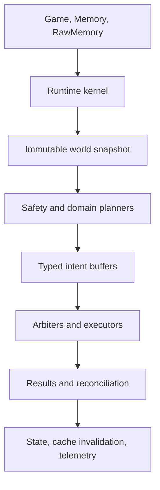

# MYRMEX Runtime Architecture

Status: **Normative target architecture**

Applies to: `packages/bot`

Last updated: 2026-07-23

This document defines the core systems of MYRMEX, the authority each system owns, and the only
supported ways those systems integrate. It is deliberately specific so that human and AI
contributors extend one bot instead of creating competing frameworks.

The Phase 0 substrate is executable: state, kernel, CPU admission, heap cache, world observation,
intent arbitration/execution contracts, telemetry, deterministic replay, and architecture checks are
implemented. Phase 1 also implements validated runtime configuration, fail-closed configured
relations, the owned-room survival lifecycle, the local budget ledger, the persistent contract
ledger, bounded workforce allocation, deterministic spawn-slot/body arbitration, narrow spawn
command execution, and atomic command-to-budget settlement. Systems assigned to later roadmap gates
remain normative targets. Their absence is an implementation task, not permission to invent a
different boundary. If a requirement cannot fit this architecture, write an ADR before changing the
architecture.

Normative words have their usual meanings:

- **MUST** and **MUST NOT** are architecture constraints.
- **SHOULD** is the default; deviation requires a reason in the change description.
- **MAY** is an allowed implementation choice.

When documents disagree, use this order: accepted ADRs, this document, strategy, roadmap, Wiki.
`AGENTS.md` and `loop.md` govern the engineering workflow and remain mandatory.

## 1. Architectural Objective

MYRMEX is one autonomous Screeps program that turns observed world state into bounded, explainable
game actions every tick. Its architecture must continue to function when:

- the JavaScript heap is reset without warning;
- `Memory` is empty, stale, or requires migration;
- rooms lose vision;
- CPU is constrained or the bucket is nearly empty;
- individual game commands fail;
- creeps, structures, rooms, routes, or targets disappear;
- a colony is under attack while optional planning is incomplete;
- long-range, segment, or cross-shard data is unavailable.

The runtime optimizes game outcomes, not abstraction count. It is intentionally a modular monolith:
one bundle, one composition root, one tick loop, and internal modules with strict ownership.

## 2. Non-Negotiable Invariants

`StaticMiningPlanner` is the sole owned-source extraction projection. It consumes visible source
facts and fresh semantic source-service placements, emits stable `mining/{colonyId}/{sourceId}`
contracts, and owns neither commands nor persistent mining state. A persisted source-service
position has continuity precedence; a newer container cannot silently change executable mining
terms. After selected-container loss, or when a different existing exact container strictly outranks
the selected exact container under the canonical source-service ordering, one fresh safe replacement
advances a bounded layout-owned issuance coordinate. `ContractLedger` atomically retires the
predecessor and admits only its exact next sequence. Population policy, SpawnBroker, movement
arbitration, and executors retain their existing authorities.

`LinkArbiter` is the sole link-transfer admission authority. Mining, logistics, and controller
policy emit funded typed proposals; only `LinkExecutor` may call `StructureLink.transferEnergy`.
Roles are ephemeral derivatives of owned-link observation and one versioned layout commitment.
`links.plan` follows layout planning, consumes only active reservations owned by existing planners,
and performs canonical classification and arbitration. Optional `migration.layout` then consumes
that public current-tick result before removal arbitration. `links.execute` revalidates the layout
dependency, issues at most one command per source, and publishes typed command settlement with
actual flow and loss attribution. Command errors never consume or release another owner's budget.

`ConstructionPlanner` is the sole mature-colony maintenance-demand and layout-migration priority
policy owner. It derives bounded road, container, ordinary-structure, wall, and rampart targets from
current observation, layout, traffic consequence, reserve posture, RCL, and threat presence. It
emits data only; ContractLedger owns funded creep work, while defense arbitration exclusively owns
tower attack, heal, and repair. Issue #308 supersedes #284's temporary-road removal: the layout diff
uses current engine-compatible road/rampart co-location, and roads never enter removal merely to
build a planned structure. Issue #286 permits one empty obsolete extension only after current full
allowance and an exact completed committed replacement are observed. Issue #288 lets the same policy
persist one bounded stocked-extension evacuation, while `LogisticsPlanner` alone routes its exact
energy to the replacement and suppresses refill competition. Removal still requires fresh
delivered/empty observation and no active evacuation flow. Issue #290 permits one empty, unselected
source-adjacent container only while a different exact committed container remains the reachable
semantic service for the same source. Issue #292 permits one empty compatible-external general
container only after committed replacement capacity exists; one compact layout-owned handoff
suppresses its refill and waits for active logistics endpoints to retire. Issue #294 extends that
handoff to exact energy-only stock. Issue #296 permits a compact binary-ordered manifest of two to
eight resource kinds and one distinct funded flow per kind. Issue #298 permits the same manifest for
one non-energy kind while preserving the legacy energy-only identity. Issue #300 reuses that bounded
evacuation for one stocked, unselected redundant source-adjacent container while preserving its
different exact selected service and static-mining identity; at most 2,000 total units move, and
fresh empty-target, every delivered replacement gain, and retired-flow evidence remain mandatory.
Issue #310 persists one compact exact receipt for every current extension/container destroy result;
`OK` waits for fresh disappearance, failures back off and stop after three attempts, and a blocked
room emits no proposal that could consume the global slot. Issue #312 reuses that authority for one
active empty obsolete tower only after committed replacement-first geometry leaves an exact active
committed tower with at least one action's energy. Issue #314 lets one stocked obsolete tower
persist an exact bounded evacuation only when that operational replacement has complete free
capacity; `LogisticsPlanner` alone routes the energy, and removal waits for fresh empty-target,
delivered-replacement, and retired-flow/endpoint evidence. Sole, over-capacity, inactive,
underfunded, unsafe, or pressured tower removals fail closed. Issue #316 restores committed RCL8
link geometry, then permits one empty idle external reserve link only while canonical current/ideal
role evidence retains exact active source, hub, and controller links plus an empty idle exact
reserve replacement. Issue #318 permits one positive energy-only reserve target to persist a bounded
creep-logistics evacuation when the exact replacement can hold the complete amount. Removal waits
for exact target emptiness, baseline-plus-amount replacement energy, retired flow/endpoints, zero
cooldown, unchanged reserve roles, and no accepted native link transfer. Productive roles, malformed
stock, capacity loss, cooldown, drift, or pressure fail closed. Issue #320 restores committed RCL8
lab geometry and permits one active empty zero-cooldown external lab only while the industry-owned
current view is quiescent, no logistics endpoint names any room lab, and the remaining nine exact
labs still derive a valid cluster. Issue #322 permits that target to hold energy only when one
bounded funded creep-logistics evacuation can deliver the complete amount to the canonical exact
replacement; removal requires fresh empty/delivered/retired-work and unchanged quiescence, cluster,
and safety evidence. Issue #324 permits one zero-energy, single-kind mineral target only when the
industry-owned view publishes one exact active owned storage with complete aggregate capacity. The
sole logistics path moves the mineral; removal requires fresh empty/delivered/retired-work and
unchanged destination, quiescence, cluster, and safety evidence. Issue #326 admits both resources in
one bounded record, atomically publishes distinct energy/replacement-lab and mineral/storage flows,
and requires both exact destination gains plus complete work retirement before removal. Issue #330
permits one active reaction commitment to rebind onto a role-identical nine-committed-lab assignment
before the unused external lab is removed. The prior Industry owner must already contain that
fingerprint. A uniquely reconstructible durable rebound enters a non-staging, non-executable blocked
view during temporary source-layout evidence loss or retained-lab staging, and layout planning pins
that source record or degrades. Issue #333 permits the initial target to contain one exact energy-
only amount, then reuses the V13 funded lab-energy evacuation during the durable ready handoff.
Issue #335 permits one zero-energy, single-kind-mineral target and reuses the V13 mineral evacuation
to the exact Industry-published active storage. Issue #337 permits one target containing both exact
forms and atomically reuses both V13 flows after the same durable handoff. Issue #341 permits one
explicit funded boost commitment to use the same role identical handoff while preserving its creep,
compound, body target, deadline, and settled part terms. The first rebound emits no staging or lab
intent; prior Industry owner plus current intent or pending attempt evidence makes it executable.
The current boost intent and any pending lab attempt block removal. Removal also waits for every
applicable exact destination gain and retired flow/endpoints. Source assignment attempts settle
before rebound; pending retained assignment attempts, unresolved explicit boost work, role drift,
malformed stock, cooldown, logistics drift, or unsafe colony evidence preserve the target. Issue
[#343](https://github.com/ralphschuler/screeps-myrmex/issues/343) permits the quiescent mineral-only
form to use one exact active idle terminal when no active storage exists. Issue
[#345](https://github.com/ralphschuler/screeps-myrmex/issues/345) reuses that V14 destination for an
exact durable `ready` reaction handoff while retained labs continue work. Issue
[#347](https://github.com/ralphschuler/screeps-myrmex/issues/347) reuses it for an exact `ready`
boost handoff while current boost intents and pending effects continue to block removal. Issue
[#349](https://github.com/ralphschuler/screeps-myrmex/issues/349) lets the quiescent mixed form send
energy to the retained lab and mineral to that terminal as one atomic pair. Issue
[#351](https://github.com/ralphschuler/screeps-myrmex/issues/351) permits that same pair during one
exact durable `ready` reaction handoff. Issue
[#353](https://github.com/ralphschuler/screeps-myrmex/issues/353) permits the exact explicit-boost
handoff; unresolved boost work remains removal-blocking until exact effect settlement. Storage
precedence, no-send evidence, fresh complete delivery, retired work, and unchanged handoff evidence
remain mandatory. Industry blocks every internal send from or to the room until removal is safe.
Issue [#355](https://github.com/ralphschuler/screeps-myrmex/issues/355) restores committed spawn
geometry at RCL7/RCL8 and permits one idle empty external spawn only when full allowance retains
allowance-minus-one active committed spawns, current SpawnBroker selection leaves the target and one
exact replacement idle, and no assigned/active contract endpoint names the target. Issue
[#357](https://github.com/ralphschuler/screeps-myrmex/issues/357) advances layouts owner-local
schema V16 with one exact 150-tick stocked-spawn evacuation. Its pure projection enters the sole
funded V3 logistics path, reserves replacement capacity once, and suppresses target refill across
both survival and general logistics. The operational agent view excludes every lease naming a
currently suppressed spawn and every stale spawn-evacuation flow; `migration.layout` re-admits only
its exact current authorized V3 lease. Missing owner terms cancel, suspend, or fail the orphaned
contract before it can resume. Removal additionally requires fresh baseline-plus-amount replacement
energy and retired exact flow/endpoints; unrelated endpoints naming either spawn fail closed.
[ADR 0067](adr/0067-stocked-obsolete-spawn-evacuation.md) records this handoff. Issue
[#359](https://github.com/ralphschuler/screeps-myrmex/issues/359) restores the one committed RCL6+
terminal position and permits one active empty zero-cooldown external terminal to use exact active
storage as local inventory continuity only while Industry publishes current terminal quiescence and
no terminal-bound layout or Logistics work remains. Layouts V17 adds only the terminal receipt
discriminator; the executor rechecks both exact general-purpose Stores before destruction.
[ADR 0068](adr/0068-empty-obsolete-terminal-relocation.md) records the bounded terminal-service
outage. Issue [#361](https://github.com/ralphschuler/screeps-myrmex/issues/361) lets one otherwise
eligible terminal containing exactly one resource kind and at most 3,000 units persist a 150-tick
V18 handoff to that storage. The sole funded V3 Logistics path moves the stock, the unexpired record
suppresses internal sends and competing terminal stock work, and removal waits for fresh exact
delivery plus complete work retirement and unchanged quiescence/safety evidence. Expiry releases
ordinary terminal service but preserves removal-blocking failure evidence.
[ADR 0069](adr/0069-single-resource-stocked-terminal-evacuation.md) records this bound. Issue
[#363](https://github.com/ralphschuler/screeps-myrmex/issues/363) advances layouts V19 with one
binary-ordered two-to-eight-resource manifest totaling at most 3,000 units. Each current row
receives a distinct funded V3 flow into the same aggregate storage-capacity reservation; runtime
admits every currently projected row atomically. Removal waits for every exact destination gain and
complete manifest work retirement.
[ADR 0070](adr/0070-mixed-resource-stocked-terminal-evacuation.md) records this composition. Issue
[#371](https://github.com/ralphschuler/screeps-myrmex/issues/371) restores committed storage
geometry only at RCL6+ and permits one active empty external storage to use one exact active
terminal as bounded local inventory continuity. The effective Logistics gate, exact current healthy
room projection, current/projected work, and persisted layout evacuations fail closed. Layouts V20
adds only the storage receipt discriminator; the executor rechecks exact 1,000,000/300,000-unit
Stores before destruction. [ADR 0071](adr/0071-empty-obsolete-storage-relocation.md) records the
temporary capacity contraction. Issue
[#373](https://github.com/ralphschuler/screeps-myrmex/issues/373) advances layouts V21 with one
fixed 150-tick storage evacuation for exactly one resource kind totaling at most 3,000 units. The
sole funded V3 Logistics path moves that stock to the exact terminal, suppresses observed and custom
work at both endpoints plus internal sends involving the room, and retains exact completion evidence
until the contract retires. Owner loss and future-owner fallback reject every prefixed orphan flow.
Exact terminal gain plus complete flow/endpoint retirement precede the unchanged storage-removal
authority. Expiry restores ordinary service but remains removal-blocking evidence.
[ADR 0072](adr/0072-single-resource-stocked-storage-evacuation.md) records the handoff. Issue
[#375](https://github.com/ralphschuler/screeps-myrmex/issues/375) advances layouts V22 with a
binary-ordered two-to-eight-resource alternative under the same 3,000-unit and 150-tick limits. Each
incomplete row receives a distinct funded V3 flow into one shared terminal-capacity reservation; the
current row set admits atomically before and after colony funding. Every exact terminal gain and
complete manifest work retirement precede the unchanged removal authority.
[ADR 0073](adr/0073-mixed-resource-stocked-storage-evacuation.md) records the composition. Issue
[#379](https://github.com/ralphschuler/screeps-myrmex/issues/379) advances layouts V23 for one
single resource totaling 3,001–6,000 units. Exactly two batch-qualified flows share one fixed
300-tick deadline; cursor advancement requires fresh first-batch delivery and complete prior-work
retirement. Suppression remains continuous, and complete original delivery plus final retirement
precedes removal. [ADR 0074](adr/0074-two-batch-single-resource-stocked-storage-evacuation.md)
records the extension. Issue [#381](https://github.com/ralphschuler/screeps-myrmex/issues/381)
advances layouts V24 by applying that same cursor to a canonical two-to-eight-resource manifest.
Binary manifest order partitions exactly 3,000 units into batch one and the remainder into batch
two; a crossing row receives distinct batch-qualified identities while complete per-resource
conservation remains mandatory.
[ADR 0075](adr/0075-two-batch-mixed-resource-stocked-storage-evacuation.md) records the composition.
Issue [#383](https://github.com/ralphschuler/screeps-myrmex/issues/383) ends the fulfilled storage
handoff's local Logistics suppression only when one matching successful receipt and fresh owned-room
observation prove the exact source absent, the retained terminal active/quiescent, and every
original gain conserved. The terminal remains an ordinary local source/sink while the existing
site/growth-contract/build path reconstructs the committed 30,000-energy storage; stale, unknown,
present, or drifted evidence preserves suppression. No owner field, schema, authority, or command
path changes. Issue [#385](https://github.com/ralphschuler/screeps-myrmex/issues/385) advances
layouts V25 by isolating fully validated older-algorithm records from every gameplay projection.
Only a quiescent record in one currently safe visible colony may atomically become one complete
current source/access-safe commitment, and that handoff tick publishes no command-bearing layout,
maintenance, site, migration, or evacuation output. Issue
[#387](https://github.com/ralphschuler/screeps-myrmex/issues/387) permits one exact `OK` site
receipt to leave that active set only after a newer owned site or completed owned structure matches
its canonical encoded room, position, type, and stale fingerprint. Issue
[#389](https://github.com/ralphschuler/screeps-myrmex/issues/389) permits one otherwise-quiescent,
safe, terminal-success non-storage removal receipt to settle only from a newer complete owned-room
observation in which its exact target ID is absent. Issue
[#391](https://github.com/ralphschuler/screeps-myrmex/issues/391) admits one exact completed
extension-evacuation pair under the same absence and safety proof only when receipt type, target,
replacement, and tick within the fixed evacuation interval match; issues
[#393](https://github.com/ralphschuler/screeps-myrmex/issues/393),
[#395](https://github.com/ralphschuler/screeps-myrmex/issues/395),
[#397](https://github.com/ralphschuler/screeps-myrmex/issues/397),
[#399](https://github.com/ralphschuler/screeps-myrmex/issues/399),
[#401](https://github.com/ralphschuler/screeps-myrmex/issues/401),
[#403](https://github.com/ralphschuler/screeps-myrmex/issues/403), and
[#405](https://github.com/ralphschuler/screeps-myrmex/issues/405) add the equivalent exact tower,
spawn, reserve-link, container-migration, lab-evacuation, terminal-evacuation, and
storage-evacuation pairs. Storage additionally requires its existing exact terminal-continuity and
full original-stock conservation proof. Both terms clear atomically. Either settlement publishes no
new layout site/removal proposal in any room and cannot perform the revision handoff until a later
tick; every mismatch preserves inert evidence. Previously authorized unrelated current-layout
Logistics and lease work is not cancelled or reclassified.
[ADR 0076](adr/0076-command-free-stale-layout-revision-handoff.md) records the boundary.
`StructureRemovalArbiter` alone authorizes removal and `StructureDestroyExecutor` alone calls
`Structure.destroy`. Every extension, container, spawn, storage, terminal, tower, link, and lab
result reuses the same fixed receipt.

1. `@myrmex/bot` is the only deployable package and produces `dist/main.js`.
2. `@myrmex/scenario-kit` is development-only and MUST NOT be imported by runtime code.
3. `main.ts` exports the Screeps loop and performs no gameplay planning.
4. `RuntimeKernel` is the only tick orchestrator and `CpuScheduler` is the only CPU admission
   authority.
5. `MemoryManager` is the only direct reader or writer of `Memory.myrmex`.
6. `CacheManager` is the only owner of reusable heap-derived data.
7. `SegmentManager` is the only caller of the RawMemory segment API.
8. `InterShardManager` is the only caller of the InterShardMemory API.
9. `WorldObserver` creates exactly one immutable `WorldSnapshot` per tick.
10. Planners read snapshots and repositories; they MUST NOT issue Screeps commands.
11. All requested game actions are typed intents. Only executors call command methods such as
    `spawnCreep`, `move`, `harvest`, `transfer`, `attack`, `activateSafeMode`, or market methods.
12. An arbiter is the sole authority for each exclusive resource: spawn time, creep action, movement
    tile, tower action, terminal cooldown, lab use, factory use, observer use, power spawn use, and
    operation authorization.
13. Persistent strategic commitments have one owner and one state machine.
14. Cross-system coordination uses typed contracts, intents, results, and read-only views. There is
    no general event bus, service locator, mutable singleton registry, or cross-domain Memory
    access.
15. All ordering and tie-breaking is deterministic. Random behavior uses an explicitly seeded PRNG.
16. An empty heap cache, missing segment, or unavailable optional planner MUST reduce quality, never
    correctness or basic survival.
17. Runtime configuration has one authority. Planners consume its detached immutable view and MUST
    NOT parse, retain, or mutate the operational candidate.
18. Configured self, ally, and NAP identities are fail-closed exclusions: optional relation data
    MUST NOT authorize an action that can target or harm them.
19. Every remote, claim, trade, and military operation has a budget, success condition, timeout, and
    exit condition.
20. `ColonyDirector` is the sole owned-room lifecycle authority and `BudgetLedger` is the sole local
    energy, spawn-time, and abstract-CPU reservation authority.
21. `SpawnBroker` is the sole spawn-slot/body/name arbiter, and `SpawnExecutor` is the sole caller
    of `StructureSpawn.spawnCreep`. Neither owns a persistent queue or resource ledger.

Adding a second authority for any item above is an architecture defect, even if the duplicate is
described as temporary.

## 3. Runtime Topology



Only the kernel composition root wires these layers together. A planner does not obtain another
planner and call it. Shared decisions are represented as data owned by the appropriate authority.

### 3.1 Runtime data flow

The complete flow for a normal tick is:

1. Load and validate persistent state.
2. Resolve one immutable runtime configuration and its feature-gate view.
3. Establish CPU mode and admitted work.
4. Activate requested segments and ingest available external data.
5. Observe visible game state once.
6. Evaluate immediate survival threats.
7. Update strategic and operational objectives at their admitted cadence, with colony survival
   posture and local reservations preceding downstream capability demand.
8. Produce capability contracts and typed action intents.
9. Arbitrate intents deterministically.
10. Execute accepted intents through narrow command adapters.
11. Reconcile command results and observations into staged state changes.
12. Commit persistent changes, invalidate affected caches, and emit bounded telemetry.

There are no hidden control paths. A system that needs work performed emits a contract or intent; it
does not command a creep, spawn, structure, or other system directly.

## 4. Lifetimes and Storage Classes

Every datum belongs to exactly one lifetime. Choosing the wrong lifetime is a defect.

| Lifetime    | Owner                | Suitable data                                                                   | Forbidden data                                 |
| ----------- | -------------------- | ------------------------------------------------------------------------------- | ---------------------------------------------- |
| Tick        | `TickContext`        | snapshot, intent buffers, results, budgets, diagnostics                         | anything needed after the tick                 |
| Heap        | `CacheManager`       | derived indexes, routes, static cost matrices, compiled layouts                 | strategic commitments or sole copies of facts  |
| Persistent  | `MemoryManager`      | schema version, config candidate/receipt, contracts, reputation, recovery state | live game objects, paths, duplicated snapshots |
| Segment     | `SegmentManager`     | large room intel, matrix payloads, bounded telemetry history                    | boot-critical state or unindexed commitments   |
| Cross-shard | `InterShardManager`  | heartbeats and idempotent handoff envelopes                                     | shared mutable state or locks                  |
| Source      | typed config modules | defaults, invariant thresholds, feature gates                                   | secrets and frequently changing observations   |

Rules:

- Store stable identifiers such as room names, object IDs, coordinates, and contract IDs; never
  store Screeps game objects.
- A heap value MUST be reconstructible from persistent state, segments, configuration, or a new
  observation.
- A segment payload MUST have a schema version, content kind, updated tick, and integrity check.
- A persistent field MUST have one documented owner and a migration path.
- A system MUST NOT mirror a field merely to make access convenient. Expose a read-only view or
  derive an index through `CacheManager` instead.

## 5. Tick Context and Typed Buffers

`TickContext` is created by the kernel and is the only per-tick dependency container. It is passed
explicitly; modules MUST NOT reach into a mutable global context.

The target shape is conceptually:

```ts
interface TickContext {
  readonly tick: number;
  readonly mode: CpuMode;
  readonly snapshot: WorldSnapshot;
  readonly state: StateView;
  readonly intel: IntelView;
  readonly config: RuntimeConfig;
  readonly configResolution: RuntimeConfigResolutionMetadata;
  readonly colony: ColonyPlanningResult;
  readonly contracts: ContractReconciliationResult | null;
  readonly spawn: SpawnRuntimeResult;
  readonly budgets: BudgetView;
  readonly buffers: TickBuffers;
  readonly services: RuntimeServices;
}
```

The executable `TickContext` began in Phase 0 with tick, shard, memory status, detached state view,
immutable snapshot, sealed arbitration result, reconcile result, and bounded tick telemetry. Phase 1
adds the resolved `RuntimeConfig`, immutable colony-plan and spawn-plan/result views, and
contract-reconciliation view. The context contains neither `Game`, mutable `Memory`, nor the raw
operational candidate. Later fields enter only with the roadmap system that owns them. The aggregate
`StateView` also redacts the raw `config`, `colonies`, and `contracts` owners; consumers use only
`TickContext.config`, `TickContext.colony`, `TickContext.spawn`, and `TickContext.contracts`. A
later planner consumes the explicit colony-plan output rather than depending on a staged `colonies`
mutation that is invisible in the beginning-of-tick state view.

`RuntimeServices` contains narrow interfaces, not concrete systems. It exposes state transactions,
cache lookup, segment requests, deterministic IDs, and telemetry. Gameplay planners MUST NOT receive
executors through this interface.

`TickBuffers` has explicit channels:

- `safetyIntents`: urgent tower, safe-mode, evacuation, and defensive actions;
- `spawnDemands`: requested capability and replacement contracts;
- `workContracts`: economy, construction, repair, scouting, and combat work;
- `actionIntents`: creep and structure action requests;
- `movementIntents`: desired positions, ranges, and movement priorities;
- `stateTransitions`: validated state-machine transitions;
- `commandResults`: accepted, rejected, deferred, and executed outcomes;
- `diagnostics`: bounded structured events.

These buffers are append-only to producers. Their arbiter or reconciler is the only consumer that
may finalize them. They are not a generic publish/subscribe mechanism and never survive the tick.

## 6. Deterministic Tick Lifecycle

Every tick runs the following seven phases in order.

| Phase     | Required output                                     | Persistent writes                    | Screeps commands          |
| --------- | --------------------------------------------------- | ------------------------------------ | ------------------------- |
| Boot      | valid state, CPU mode, service readiness            | migrations and recovery markers only | none                      |
| Observe   | one immutable snapshot and observation facts        | none                                 | read-only API access only |
| Safety    | urgent safety intents and survival overrides        | staged transitions only              | safety executors only     |
| Plan      | objectives, contracts, demands, normal intents      | staged transitions only              | none                      |
| Execute   | arbitration decisions and command results           | exact spawn settlement staging only  | executors only            |
| Reconcile | updated contracts, ledgers, and cache invalidations | one staged commit                    | none                      |
| Telemetry | bounded metrics and diagnostics                     | none in Phase 0                      | visual/log output only    |

### 6.1 Boot

Boot MUST:

1. Detect first execution after a heap reset.
2. Load `Memory.myrmex` through `MemoryManager`.
3. Validate and, if required, advance schema migrations.
4. Resolve source defaults and the accepted operational config into one immutable planner view.
5. Rebuild service objects and empty heap indexes.
6. Determine CPU mode and reserve CPU for safety, execution, reconcile, and telemetry.
7. Read active segment payloads and cross-shard envelopes without blocking.
8. Mark interrupted operations or expired leases for reconciliation.

If a migration is incomplete, the bot enters `recovery` mode. Only migration work, observation,
defense, essential spawning, and essential logistics are admitted. Migrations MUST be idempotent and
bounded; progress is persisted after every step. Config resolution never authorizes owner repair
during Boot. A malformed/future ready-state owner is preserved and uses source defaults; recovery or
unsupported root state reports the owner unavailable. Both paths expose only bounded status/reason
codes for telemetry.

### 6.2 Observe

`WorldObserver` reads all visible game objects once and creates `WorldSnapshot`. Observation:

- normalizes collections into deterministic ordering;
- records visibility and freshness explicitly;
- converts game objects into immutable plain data;
- derives observation facts such as ownership changes, damage, hostile presence, and event-log
  entries;
- projects owned spawn activity, including `isActive()` and the full nullable `spawning` record, so
  arbitration never reads `Game.spawns`;
- projects factories, power spawns, observers, and nukers as sorted detached current-tick facts,
  including activation, stores, cooldowns, levels, and bounded effects where applicable; mature
  planners never retain live structure objects;
- normalizes source-controlled commodity and mature-structure constants through a bounded pure
  catalog before deriving reset-stable capability fingerprints; malformed mechanics suppress the
  affected capability and authorize no command;
- projects only funded, current mature-structure objectives into the sole logistics graph: factory
  component fills and product/contamination drains, power-spawn energy/power fills, and capped
  one-way nuker fills share the physical store's aggregate capacity key and never republish observed
  stock as a second source;
- admits mature work through one pure policy that emits a matching industry budget for every
  objective, subtracts survival/defense/lab/terminal protected stock before selecting optional
  factory or power work, caps one-way nuker stocking, and removes readiness immediately when funding
  or logistics evidence is lost;
- never makes strategic decisions; and
- never mutates persistent state.

Later phases MUST use the snapshot. Direct `Game.rooms`, `Game.creeps`, or `Game.getObjectById`
reads outside `world/`, command executors, and narrowly documented validation adapters are
forbidden.

### 6.3 Safety

Safety is a short, mandatory preemption pass. `DefenseDirector` evaluates the fresh snapshot and may
emit urgent intents for tower actions, safe mode, emergency spawning, rampart policy, evacuation,
and cancellation of unsafe work. In Phase 1 it owns only current-room tower and safe-mode selection:
configured exclusions are filtered before target scoring, each tower has one exclusive action, and
only the defense executor resolves live IDs and issues the structure/controller command.

Safety does not become a second general planner. A `SafetyExecutor` may immediately arbitrate and
issue only actions whose delay until Execute would materially weaken survival. Every such command
still produces a normal `CommandResult` and is excluded from duplicate execution later in the tick.

### 6.4 Plan

Admitted planners update objectives and emit data. Plan proceeds from widest to narrowest scope:

1. empire objectives and budgets;
2. diplomacy and threat policy;
3. remote, expansion, market, industry, and operation portfolios;
4. colony objectives and reserves;
5. capability contracts and spawn demand;
6. structure, creep-action, and movement intents.

Each planner reads the same snapshot revision. No planner may depend on another planner having
mutated hidden state earlier in the phase. Required inputs must be persistent views or explicit
outputs in a typed buffer.

`ColonyDirector` is mandatory Plan work at cadence one because bootstrapping, threat exit, and
recovery cannot wait for optional admission. It still obeys the kernel-provided hard CPU ceiling.
When the feature gate is disabled or the owner is unavailable, malformed, or from a future schema,
it emits a bounded fail-closed status and authorizes no new work.

When `phase1.spawn` is enabled, zero-worker recovery uses one tick-local two-pass authorization. A
provisional director session exposes the derived objective and current resource view. `SpawnBroker`
then chooses a deterministic body, name, and exact local spawn interval against the one shared room
energy pool. A fresh exact director session re-arbitrates that selection as one energy/spawn/CPU
bundle. Only selections backed by the exact grant become command intents. No provisional colonies
owner is staged, and the broker cannot construct a second `BudgetLedger`.

### 6.5 Execute

Execute processes safety-remaining and normal intent buffers in fixed authority order. Each arbiter:

1. validates freshness, ownership, budget, and preconditions;
2. groups intents that compete for the same exclusive resource;
3. sorts by policy priority, deadline, economic value, and stable intent ID;
4. accepts at most the legal number of commands for that resource;
5. records a reason for every rejection or deferral;
6. calls its executor for accepted commands;
7. captures the Screeps return code and measured CPU.

An executor translates one accepted intent into one bounded API interaction. It contains no
long-term policy.

`spawn.execute` and `spawn.settle` are consecutive mandatory-tail Execute systems. `SpawnExecutor`
first rejects a malformed batch or multiple intents for one spawn slot, then resolves each selected
spawn ID, revalidates the live object's type, identity, room, ownership, busy state, and activity,
and calls `spawnCreep` at most once. All documented return codes, live mismatches, malformed return
values, and adapter exceptions become typed immutable results. `OK` means scheduled, not already
observed as a completed creep.

Execution writes its result to a private tick draft before the kernel evaluates post-run CPU. Thus
an irreversible `OK` is still available if `spawn.execute` is marked failed for budget overrun.
`spawn.settle` validates the complete result set, applies exact ledger consumption/release, stages
the sole `colonies` transaction, and publishes the settled colony and spawn views.

### 6.6 Reconcile

Reconcile is the only phase that commits the staged root. The narrow exception for pre-Reconcile
staging is mandatory-tail `spawn.settle`: it must bind an irreversible spawn result to its owning
ledger before contract funding can inspect that ledger. General `Reconciler` work:

- maps command results back to contracts and operations;
- advances or fails state machines using explicit transition tables;
- releases, renews, or expires leases;
- applies observed reputation and threat evidence;
- updates economic ledgers and budget consumption;
- generates targeted cache invalidation tags;
- stages the next tick's segment activation requests;
- commits all validated changes through `MemoryManager`.

Spawn results settle the private director session before downstream budget consumers run. A
scheduled result consumes the exact body energy, spawn use, and admitted CPU atomically, then
releases unused grant; any non-scheduled result releases its exact reservation without claiming
energy or spawn use. Mandatory-tail `spawn.settle` has already staged at most one `colonies` owner
transaction before Reconcile begins. Contract reconciliation proceeds only when that settlement was
staged. `state.reconcile` remains the sole normal path that publishes the complete root.

A failed command is evidence, not an exception. Expected game return codes become typed result
reasons. Unexpected exceptions are handled by the owning system's fault boundary.

### 6.7 Telemetry

Telemetry always runs in a reserved budget, even after a system failure. It records enough data to
answer what MYRMEX decided, why, what command ran, and what outcome occurred. It MUST cap log lines,
metric cardinality, memory growth, and segment writes.

Phase 0 exposes two immutable tick-local records from `runTick`. `KernelTickReport` contains system
status, faults, mode, system/phase CPU, and unattributed kernel overhead. The bounded
`TickTelemetry` summary contains snapshot size, cache size, bucket, and environment status; its
cache measurement and construction run inside the reserved `telemetry.minimum` boundary. Together
they form the tick result. `TelemetryService` owns the durable `telemetry` observer subtree and
stages its capped hash history before the single Reconcile commit. It reads settled receipts only,
has no gameplay readers, and exposes typed bounded status for the later ConsoleReporter rather than
rendering text itself. Its reporter owner retains only capped safe health metadata: opaque
fingerprints, fixed reason codes, counters, reminder ticks, and aggregate recovery progress.
Malformed or future reporter state is rebuilt safely. First occurrence, bounded-backoff reminder,
single resolution, and stuck-recovery transitions leave the service only as capped tick-local
records; the durable owner is not a replay queue.

Telemetry owner schema V5 contains Phase 2 owner-local schema V5. Current settled colony, spawn,
layout, mining, logistics, link, maintenance, resource, lab, mature-infrastructure, and observer
receipts produce exactly eleven authority rows, three modeled flow identities, fixed progression,
reserve, utilization, construction, and industry-accounting values, and one capped aggregate sample.
V5 also reports fixed extractor, link, terminal, lab, and factory cooldown rows. Each row contains
visible owned active structure-ticks, positive-cooldown structure-ticks, and floored utilization
basis points; the rolling projection explicitly reports whether every retained tick is consecutive.
The tick projection and compact sample field are omitted while all five current and retained rows
are zero; nested schema V5 distinguishes that canonical zero from absent legacy evidence.
Power-spawn and observer command slots remain separate authority outcomes, while the Phase
2-forbidden nuker launch is absent from the economy denominator. The complete cooldown batch admits
at most 64 owned rooms and official maxima of 64 extractors, 384 links, 64 terminals, 640 labs, and
64 factories; over-cap input fails closed before asset traversal.

The hard ring bound is 64 and the configured history and whole-owner byte ceilings may reduce it
further. Persistent samples are compact tuples aligned with the exported fixed sample-field order.
V4 introduced exact settled industry energy input, non-energy resource input, and output units;
pending, retry, cancelled, failed, or conflicting attempts contribute zero, empty aggregate rows are
omitted, and boost progress is not reaction output. V1–V3 samples are dropped and counted during V4
migration because their missing inputs cannot be reconstructed. V5 similarly drops V4 samples
because absent cooldown observations cannot become zero. RCL timing and attrition evidence survive
both migrations. V5 preserves at most 64 opaque controller baselines and exactly seven destination-
RCL duration rows. Only a continuously observed adjacent increase records elapsed ticks; missing
continuity, ownership loss, downgrade, multi-level jump, duplicate identity, or malformed state
resets evidence without success. Tick telemetry omits baseline-only timing and otherwise publishes
one compact latest-row tuple plus loss counters; the owner retains all seven aggregates.

V3 adds one attrition schema with at most 64 opaque visible-owned-colony references, 128 opaque
road/container baselines, and exactly two cumulative rows; its compact owner field is absent while
there is no baseline, aggregate, or loss counter. Consecutive complete observations report only
compared asset/capacity ticks, net hits lost/restored, and visible disappearance/addition. Missing
visibility, ownership loss, tick gaps, changed capacity, collisions, malformed evidence, or over-cap
input interrupts the batch and cannot claim loss. Disappearance accounts for the last visible
remaining hits but never claims decay, combat, dismantle, or replacement causality. Tick telemetry
omits baseline-only zero evidence. Whole-owner fitting drops the complete baseline before fixed rows
and reprojects their loss counters, current telemetry, and status hash from retained state. Samples,
timing, and attrition contain no dynamic labels or gameplay commitment. Missing or malformed
observer history reduces evidence only; `ColonyDirector` and domain-health composition continue to
consume direct owner outputs and never telemetry.

Reporter aggregation admits at most 2,000 health signals plus the already-capped telemetry details
(2,064 candidates under source defaults). Oversized arrays are rejected before element traversal,
and the sanitized candidates are deduplicated, sorted, and prefix-hashed once. The configured 64
fingerprints are retained only while the shared 8,192-byte telemetry-owner ceiling permits. Byte
fitting reuses the prepared batch without rereading source identities and makes at most 65 monotone
capacity attempts, each over no more than 64 current and 64 prior metadata entries. It evicts hash
history and Phase 2 samples before the oldest ordinary reporter entries, then recovery and reset
baselines, deterministically. When cardinality or byte fitting omits active fingerprints, one
retained opaque overflow fingerprint represents the omitted set and changes only when that set
changes. Overflow `first` and `reminder` evidence is selected before ordinary transitions. A
transition is published only after the candidate owner commits; ownerless and failed-commit fallback
telemetry cannot claim a durable first/reminder/resolution event. A thrown telemetry service
discards only its owner transaction, leaving gameplay reconciliation and command receipts intact.

Reporter status schema v2 is the redaction boundary for those transition records. It reads only the
fixed signal and recovery fields through descriptors without enumerating hostile records, re-opaques
references, bounds scalar values, and ignores unknown or player-controlled fields. Reporter
aggregation consumes the settled kernel health snapshot available at Reconcile; the final
`KernelTickReport` separately supplies the current-tick fault projection. Zero-creep recovery is
derived from fixed `bootstrapping` and `recovering` colony state counts as well as the tick-local
Memory recovery condition. This allows normal colony recovery to remain observable when Memory
itself is ready without making the observer a recovery authority. The `state.reconcile` and
`telemetry.minimum` systems cannot durably update aggregation when their own tail boundary fails, so
they remain final-report faults and are excluded from durable transition semantics rather than
emitting misleading repeated `first` records.

`ConsoleReporter` renders deterministic transition lines even when the heartbeat is not due:
`first`, `reminder`, and recovery `stuck` use warning severity, while `resolved` is informational.
The source defaults admit at most two immediate transitions, three total lines, and 1,536 UTF-8
bytes per tick. Heartbeats and optional diagnostics share those line and byte ceilings. Silent mode
and sink-failure isolation still apply, and neither projection nor rendering can change a gameplay
receipt, reconciliation result, or command.

### 6.8 Executable composition

The executable foundation registers these systems explicitly in `runtime/tick.ts`:

| System                     | Phase     | Admission                       | CPU estimate |
| -------------------------- | --------- | ------------------------------- | -----------: |
| `core.boot`                | Boot      | mandatory, recovery-safe        |         0.05 |
| `world.observe`            | Observe   | mandatory, recovery-safe        |         1.00 |
| `safety.foundation`        | Safety    | mandatory, recovery-safe        |         0.10 |
| `colony.director`          | Plan      | mandatory, recovery-safe        |         1.50 |
| `industry.publish`         | Plan      | optional economic               |         0.50 |
| `migration.layout`         | Plan      | optional economic               |         1.50 |
| `cache.sweep`              | Plan      | surplus maintenance, cadence 25 |         0.25 |
| `execution.arbitrate`      | Execute   | mandatory tail                  |         0.50 |
| `industry.execute`         | Execute   | mandatory tail                  |         0.25 |
| `spawn.execute`            | Execute   | mandatory tail, recovery-safe   |         0.75 |
| `spawn.settle`             | Execute   | mandatory tail, recovery-safe   |         0.75 |
| `industry.reconcile`       | Reconcile | mandatory before root commit    |         0.50 |
| `layout.handoff-reconcile` | Reconcile | mandatory handoff precommit     |         0.10 |
| `contracts.reconcile`      | Reconcile | operational, recovery-safe      |         0.50 |
| `state.reconcile`          | Reconcile | mandatory tail                  |         1.00 |
| `telemetry.minimum`        | Telemetry | mandatory tail                  |         0.50 |

Memory opening is a bounded preflight because recovery status is an input to CPU-mode selection. It
may perform only the documented migration step budget. `RuntimeKernel` remains the sole scheduled
phase orchestrator. The Phase 1 colony outcome replaces `planning.foundation` with
`colony.director`. The spawn outcome adds mandatory-tail `spawn.execute` followed by mandatory-tail
`spawn.settle`; the latter performs durable colony staging after command results and before
budget-consuming contract reconciliation. When admitted, operational `contracts.reconcile` stages
its owner transaction before mandatory-tail `state.reconcile`; only the latter commits the
`Memory.myrmex` root. `industry.execute` follows shared intent arbitration in the mandatory Execute
tail; `industry.reconcile` stages terminal, lab, mature, and observer effects through one industry
owner transaction before `state.reconcile`. The operational `agents.plan` pass excludes persisted
spawn-evacuation leases; optional `migration.layout` continues only its exact current
planner-authorized terms through the same Logistics/ContractLedger/lease-agent path. A skipped or
failed continuation therefore emits no new spawn-evacuation request, funding transition, or action;
ordinary Logistics retirement may still fail closed when its projected flow disappears. On the rare
explicit selected-source handoff, `layout.handoff-reconcile` stages the complete layout draft before
its root commit; the following tick's contract reconciliation consumes that durable coordinate. The
same precommit stages one observation-settled stale site or terminal-success non-storage removal
receipt before ending command-free layout planning for that tick; no separate reconciliation or
owner exists. It is a continuation of the same layout owner, not a second planner or state
authority. Later outcomes replace their own foundation markers without adding another loop.

There is exactly one literal `colonies` transaction call site in `spawn.settle` and exactly one
normal root-commit call site in `state.reconcile`. The provisional and exact Plan views are never
written directly. Command results remain in the private tick draft even if `spawn.execute` exceeds
its CPU budget and its publication is discarded, so mandatory-tail `spawn.settle` still records an
API call that already happened; an intent with no result is treated as not scheduled. If settlement
or colony staging is not staged, downstream contracts receive no invented active authorization.

`contracts.reconcile` runs only when the effective `phase1.contracts` gate is enabled and the
current colony result can supply a bounded authorization view. A disabled or prerequisite-blocked
gate does not parse or initialize the contracts owner. An unavailable colony result publishes no
contract action and preserves owner bytes; per-colony unknown visibility similarly quarantines its
commitments from assignment without treating lost vision as revocation. If a staged contracts result
is discarded at its CPU boundary, the runtime clears the tick-local publication as well as the owner
transaction. A final atomic root-commit rejection likewise clears the contract publication, so
diagnostics never claim a lease that did not reach the single root commit.

The spawn runtime view is similarly honest across failure boundaries. Disabled spawn planning
publishes `disabled`; admitted planning publishes the broker decisions and, after Execute, typed
execution results. A discarded colony stage or rejected atomic root commit clears both colony and
spawn publications. Durable success expectations are reconstructed from the settled colony ledger,
not a heap-only queue. Each tick-local expectation includes the exact creep name rederived from the
stable logical recovery identity and its durable demand revision.

`runTick` captures CPU before that Memory preflight and passes the baseline into the kernel. The
kernel's final reading follows mandatory telemetry work and report collection preparation. Thus
`KernelTickReport.cpuUsed` equals the sum of per-system CPU plus `overheadCpu`; overhead includes
Memory preflight, composition, admission, and orchestration between system boundaries. Only the
constant-size return-object assembly occurs after the final meter reading.

## 7. Runtime Kernel

### 7.1 RuntimeKernel

`RuntimeKernel` owns:

- phase ordering;
- construction of `TickContext`;
- system registration at source composition time;
- calls into `CpuScheduler`;
- phase fault boundaries;
- finalization when optional work fails.

It does not own gameplay policy, creep behavior, pathfinding algorithms, or domain state.

Registration is static and explicit in the composition root. Runtime discovery, decorators,
reflection, plugin loading, and systems registering other systems are forbidden.

### 7.2 System contract

Every scheduled unit implements the conceptual contract below:

```ts
interface TickSystem {
  readonly id: SystemId;
  readonly phase: TickPhase;
  readonly criticality: Criticality;
  readonly cadence: number;
  readonly estimate: CpuEstimate;
  run(context: TickContext, budget: CpuBudget): SystemReport;
}
```

- `id` is globally unique and stable.
- `phase` is fixed at registration.
- `criticality` determines admission class, not business priority.
- `cadence` is the normal minimum ticks between full runs. A system may be awakened by an explicit
  dirty flag or deadline.
- `estimate` is updated from bounded historical measurements.
- `run` MUST honor its budget and return a report; it MUST NOT silently schedule asynchronous work.

Large computations implement resumable jobs with a persistent or segment-backed cursor. A job does
bounded work, commits progress, and yields. Generators, promises, and background timers are not a
substitute for persisted resumability in the Screeps runtime.

### 7.3 CpuScheduler

`CpuScheduler` is the sole admission authority. It chooses a `CpuMode` from bucket level, tick
limit, recent use, recovery state, and active threat level. Thresholds live in one validated
`CpuPolicy` configuration; inline bucket thresholds elsewhere are forbidden.

The modes are:

| Mode          | Admitted work                                                                   |
| ------------- | ------------------------------------------------------------------------------- |
| `recovery`    | migration, observation, safety, essential spawn/logistics, reconcile, telemetry |
| `emergency`   | mandatory survival and defense only                                             |
| `constrained` | mandatory work plus bounded colony maintenance                                  |
| `normal`      | all due operational planners and selected strategic work                        |
| `surplus`     | normal work plus backlog, route, layout, intel, and simulation jobs             |

Criticality classes are:

1. `mandatory`: boot, observation, safety, essential execution, reconcile, minimal telemetry;
2. `operational`: spawning, harvesting, hauling, local defense, contract assignment;
3. `economic`: construction, upgrading, remotes, industry, market balancing;
4. `strategic`: expansion, long-range operations, expensive intel analysis;
5. `maintenance`: cache sweeping, compaction, detailed telemetry, simulations.

The scheduler MUST reserve mandatory tail CPU before admitting optional work. Within an admission
class it orders by deadline, explicit wake reason, oldest due tick, then stable system ID. Business
priorities remain inside domain arbiters and do not change kernel criticality.

No system may read `Game.cpu.bucket` to self-admit. It receives `CpuMode` and `CpuBudget` from the
scheduler. Phase 0 records actual usage, estimate error, and explicit overruns. Repeated optional
failures or overruns enter bounded quarantine and exponential probe backoff. An adaptive estimate
policy may be added only with bounded persistence and boundary scenarios; static registered
estimates remain authoritative until then.

### 7.4 Fault boundaries

The kernel isolates scheduled systems, not individual creeps. On an unexpected exception it:

1. catches at the system boundary;
2. records system ID, phase, tick, compact error, and input revision;
3. discards that system's uncommitted buffer writes;
4. continues mandatory systems when safe;
5. increments a bounded consecutive-failure counter;
6. quarantines optional systems after the configured threshold;
7. admits a low-frequency probe to recover automatically.

Boot, observation, state commit, and core execution failures trigger degraded recovery behavior, not
quarantine. Per-creep kernels and one try/catch per creep are forbidden.

## 8. State Substrate

### 8.1 MemoryManager

`MemoryManager` owns the `Memory.myrmex` root, schema validation, migrations, transactions, and
serialization hygiene. No other module reads or writes that root directly.

The persistent root is divided by authority, not convenience:

| Subtree      | Owner                    | Contents                                                           |
| ------------ | ------------------------ | ------------------------------------------------------------------ |
| `meta`       | `MemoryManager`          | schema, migration cursor, first/last tick, shard, recovery status  |
| `config`     | `RuntimeConfigAuthority` | candidate, accepted canonical override, source/resolved revisions  |
| `kernel`     | `RuntimeKernel`          | system health, due ticks, resumable job headers, CPU estimates     |
| `empire`     | `EmpireDirector`         | objectives, budgets, colony registry, strategic policy revisions   |
| `colonies`   | `ColonyDirector`         | per-colony state machines, reserves, layout revision, local policy |
| `contracts`  | `ContractLedger`         | persistent work contracts, leases, deadlines, outcomes             |
| `diplomacy`  | `DiplomacyLedger`        | observed evidence, confidence, and optional reputation state       |
| `remotes`    | `RemotePortfolio`        | candidates, active commitments, ledgers, suspension state          |
| `expansion`  | `ExpansionDirector`      | claim candidates and bootstrap operation state                     |
| `operations` | `OperationsController`   | authorized military and strategic operation state machines         |
| `industry`   | `IndustryDirector`       | stock targets, production commitments, market risk limits          |
| `segments`   | `SegmentManager`         | manifest, generations, activation requests, corruption markers     |
| `telemetry`  | `TelemetryService`       | bounded counters, last status, ring metadata                       |

Schema v3 contains every listed owner. The v2-to-v3 migration adds `config` without rewriting the
other owner payloads. A persisted, interrupted historical v1-to-v2 cursor remains valid: the runtime
completes it, transitions to the separate v2-to-v3 cursor, and then finishes schema v3. Every later
subtree still requires an owner and migration before its first field is added.

The existing `colonies` owner uses owner-local schema v1 once the Phase 1 colony gate is active. It
contains canonical colony records and the latest bounded ledger entry for each issuer. Exact `{}` is
its only initialization shorthand. A non-empty malformed or future owner is preserved unchanged and
authorizes no objective or reservation. This owner-local initialization does not change the root
schema because schema v3 already reserved the owner.

Memory access uses typed repositories:

- views are read-only for the tick;
- a system can stage mutations only through its owned repository;
- transactions validate schema and allowed transitions;
- reconcile performs one ordered commit;
- failed validation rejects the whole owner transaction and emits a fault;
- unknown fields are removed only by an explicit migration, never opportunistically.

Migrations are sequential, idempotent, downgrade-aware only when an ADR requires rollback, and
tested from every supported schema version. Destructive migration requires a recovery strategy.

The state substrate applies these hard limits before commit: depth 64, 50,000 JSON nodes, 1,500,000
combined string/key code units, 10,000 array items, 10,000 object keys, 1,024 code units per key,
and 16 recovery diagnostics. A recovery cursor may exceed only the first two limits by the exact
fixed cursor overhead: 11 nodes and 248 code units. Such a cursor is valid only when its projected
schema-v3 root passes the original limits; completion diagnostics are omitted at the boundary rather
than displacing a valid owner payload. During root recovery, a malformed optional authority subtree
is rebuilt while valid authority subtrees and valid boot identity are salvaged. This does not
authorize repairing a malformed config owner in an otherwise valid v3 root. Future schema versions
fail closed without downgrade. Config candidate validation has intentionally smaller budgets and
remains independent of these root-storage limits; those exact limits are recorded in
[`phase1-config-evidence.md`](phase1-config-evidence.md).

The reserved `contracts` owner uses owner-local schema v1 once the contract gate is active. Exact
`{}` is its only initialization shorthand. Malformed v1 content and future owner-local schema
versions are preserved byte-for-byte and authorize no transition or assignment; they are never
opportunistically rewritten or downgraded.

### 8.2 CacheManager

`CacheManager` replaces ad hoc module globals and duplicate caches. It owns all reusable heap data
that can be discarded and rebuilt.

Every cache namespace is registered once by its canonical owner:

```ts
interface CacheNamespaceContract<Key, Value> {
  readonly id: CacheNamespaceId;
  readonly owner: SystemId;
  readonly version: number;
  readonly capacity: number;
  readonly maxKeyLength: number;
  readonly ttlTicks: number | null;
  readonly maxEncodedLength: number;
  readonly estimatedRebuildCpu: number;
  keyOf(key: Key): DeterministicCacheKey;
  readonly codec: CacheCodec<Value>;
}
```

The manager returns a typed namespace handle. `getOrCompute` accepts the deterministic loader at the
call site so the current immutable inputs remain explicit. Values cross the namespace codec boundary
on every write and hit; this detaches caller references and rejects representations beyond the
declared size budget.

Each entry records its deterministic key, creation tick, last-use tick, expiry tick, dependency
epochs, and encoded length under the registered namespace version. Required behavior:

- missing, expired, invalidated, or corrupt entries are cache misses;
- loaders are deterministic and side-effect free;
- values contain plain data, not live game objects;
- namespaces use stable keys and MUST NOT scan all entries during normal lookup;
- a bounded maintenance sweep removes expired or least-recently-used entries;
- cache statistics expose hits, misses, builds, evictions, and build CPU;
- expiry maintenance is resumable and inspects at most the caller's explicit entry budget;
- global reset correctness is tested with a completely empty manager;
- no planner changes a strategic decision solely because a cache happened to be warm.

Invalidation uses dependency epochs rather than scattered deletes. Initial epochs include:

- world topology;
- room structure layout by room;
- colony policy by colony;
- diplomacy policy;
- pathing policy;
- persistent schema;
- code build.

For example, a route cache key includes origin, destination, policy ID, and topology epoch. A static
cost matrix includes room name, structure-layout epoch, and pathing-policy epoch. Dynamic creeps are
overlaid per tick and do not invalidate static matrices.

Only `CacheManager` may own global heap maps. A tiny function-local memoization that cannot survive
the call is allowed. Anything reused across calls or ticks is a registered namespace.

### 8.3 SegmentManager

`SegmentManager` owns segment activation, serialization, integrity checks, compaction, and write
budgets. Other systems use typed stores and receive one of `ready`, `loading`, `missing`, or
`corrupt`; they never call RawMemory directly.

Segment categories are:

- room intelligence history;
- static and strategic matrix payloads;
- route and portal graph payloads;
- bounded telemetry history;
- large resumable analysis inputs or outputs.

The small manifest in persistent Memory maps logical keys to physical segment, generation, schema,
size, checksum, and last access. Activation is planned one tick ahead. Priority is safety intel,
active operations, active remote/colony data, then optional analysis.

Boot-critical behavior MUST NOT require a segment. Missing derived data is rebuilt. Corrupt
authoritative historical data is quarantined and replaced only through its owner's recovery rule.
Writes use copy-then-publish generations so an interrupted write cannot replace the last valid
payload.

### 8.4 InterShardManager

Cross-shard integration uses versioned envelopes with sender shard, sequence, created tick, expiry,
kind, payload, and idempotency key. It supports:

- shard heartbeat and capacity summary;
- portal and route observations;
- creep handoff declaration and acknowledgement;
- operation request and explicit acceptance.

There are no distributed locks and no cross-shard shared mutable objects. The shard that owns a
colony or operation remains authoritative. Stale, duplicated, out-of-order, or malformed envelopes
are ignored safely and measured.

## 9. World Model and Intelligence

### 9.1 WorldObserver

`WorldObserver` is the sole visible-world normalization pipeline. It produces:

- `WorldSnapshot`: complete immutable facts visible this tick;
- `ObservationFacts`: normalized changes or evidence for reconciliation;
- `VisibilityIndex`: visible, last-seen, and never-seen status by room.

The snapshot has stable maps and sorted ID lists for deterministic traversal. It distinguishes
unknown from absent. If a room is not visible, its current structures and creeps are unknown; an
older intel record MUST NOT be presented as current truth.

`Game.creeps` is the canonical inventory of owned creep actors. The observer validates its
name-keyed entries and projects them into the appropriate room snapshots; room-local creep searches
are not a competing owned-actor registry. Capability counts are derived from each body part's
current hit points, so fully damaged parts do not satisfy a contract.

### 9.2 IntelRepository

`IntelRepository` is the read interface over current observation plus segment-backed history.
`IntelService` owns intel retention and confidence. Every record includes observed tick, source,
confidence, and expiry policy.

Consumers state their freshness requirement:

- immediate defense: current tick;
- remote operation: policy-defined recent vision;
- claim scoring: recent room and route evidence;
- offensive operation: explicit maximum age by evidence kind.

If freshness is insufficient, a planner emits a scout/observer contract or defers the decision. It
does not silently use stale information.

## 10. Strategy and Objective Hierarchy

Decisions flow down a strict hierarchy:

1. `EmpireDirector` owns global objectives, reserves, and scarce-resource budgets.
2. Portfolio authorities decide which colonies, remotes, claims, trades, industry commitments, and
   operations are funded.
3. `ColonyDirector` turns funded objectives into local capability demand.
4. Domain planners turn demand into contracts and intents.
5. Arbiters select legal commands.
6. Reconcile reports outcomes and costs back up through ledgers.

A lower layer may refuse an infeasible or unsafe objective and report the reason. It MUST NOT
silently redefine the objective or spend beyond the allocated budget.

### 10.1 Budgets

`BudgetLedger` is part of the empire/colony state boundary and represents reservations for:

- energy;
- spawn time;
- CPU;
- terminal cooldown and transaction energy;
- minerals, boosts, commodities, and power;
- GCL/room slots;
- risk and expected loss.

Planners request reservations. The owning director grants, reduces, or rejects them. Executors
consume against accepted reservations; reconciliation records actual cost and releases unused
amounts. A priority is not authorization to overspend.

The Phase 1 local ledger implements energy, exact spawn-time intervals, and abstract CPU units. Its
canonical category order is emergency spawning, defense, replacement, harvesting/filling, controller
survival, critical maintenance, discretionary maintenance, then optional growth. Existing
commitments and new requests compete together by category, deadline or expiry, colony ID, issuer,
and revision. Every normalized request receives one grant, retained result, or denial with a bounded
reason.

Energy capacity is current spawn/extension energy, not storage or expected future income. Only
emergency, defense, and replacement commitments may consume the configured protected spawn-energy
tranche. Harvesting/filling, controller survival, critical maintenance, discretionary maintenance,
and optional growth must leave its remaining balance intact. Spawn reservations are half-open
intervals, include the observed live spawning interval, and never overlap on one spawn. CPU values
are integer milli-CPU derived from the system's admitted `CpuBudget`; they partition that admission
and never become a second scheduler.

Consumption uses cumulative totals, so retrying the same consume, release, expiry, or reconciliation
is idempotent. Visible colony loss releases active local reservations. Observation-unknown colonies
retain durable ledger bytes unchanged but expose no live authorization or totals; expiry is
reconciled when current ownership becomes known again. Exact owner shape, limits, operation
semantics, and proof cases are recorded in [`phase1-colony-evidence.md`](phase1-colony-evidence.md).

## 11. Capability Contracts and Creep Control

MYRMEX does not run a parallel code path for every named creep role. It models work as capability
contracts and treats creep body designs as archetypes. Contract state is persistent; allocation is a
pure, reconstructible policy decision over the current immutable world snapshot.

### 11.1 WorkContract

A persistent contract has:

- stable contract ID and revision;
- issuer, monotonic issuer sequence, issuer-local key, and owning colony or operation;
- capability kind and required body capabilities;
- target room, object, position, or route;
- quantity or completion condition;
- priority, earliest start, deadline, and expiry;
- a stable BudgetLedger category and issuer binding under the owning colony;
- freshness and safety preconditions;
- success, cancellation, suspension, and failure conditions;
- assignment/lease policy;
- state and bounded outcome history.

The complete legal transition table is:

| From        | Allowed next states                                        |
| ----------- | ---------------------------------------------------------- |
| `proposed`  | `funded`, `cancelled`, `expired`                           |
| `funded`    | `assigned`, `suspended`, `cancelled`, `expired`            |
| `assigned`  | `active`, `suspended`, `cancelled`, `expired`, `failed`    |
| `active`    | `completed`, `suspended`, `cancelled`, `expired`, `failed` |
| `suspended` | `funded`, `cancelled`, `expired`, `failed`                 |

`completed`, `cancelled`, `expired`, and `failed` are terminal. `assigned` and `active` require a
lease; every other active state forbids one. Lease loss is an explicit
`assigned|active → suspended → funded` sequence before optional reassignment only while current
BudgetLedger authorization remains valid. Authorization loss stops at `suspended`. Transitions not
in the table are invalid.

`deadline` is inclusive: modeled travel and work may finish on that tick. `expiresAt` is exclusive
and names the first tick on which unfinished work is invalid. A lease's `expiresAt` has the same
exclusive meaning. Issuers retry with the same `(issuer, issuerSequence, issuerKey)` tuple;
`ContractLedger` derives a collision-free, length-prefixed contract ID. Identical terms are
idempotent, while changed terms under the same identity are an explicit conflict. Each issuer owns a
strictly increasing sequence. Its persistent retirement frontier rejects every coordinate at or
below the highest terminal sequence even after the compact outcome record is evicted, so heap reset
or bounded-history eviction cannot resurrect completed work. Skipped or late lower coordinates fail
closed; producers advance rather than recycle a sequence.

Tick-local trivial work MAY use an ephemeral contract, but anything requiring spawn time,
replacement, multiple ticks, resource reservation, or outcome accounting MUST be persistent.

### 11.2 ContractLedger

`ContractLedger` is the sole contract state-machine and persistence authority. It deduplicates
issuer coordinates, maintains bounded retirement frontiers, creates canonical IDs, validates
transitions, assigns, releases, and expires leases, retires terminal outcomes, and exposes immutable
read views. Issuers describe desired outcomes and propose transitions through a bounded tick-local
channel; they never mutate contract records. A producer batch reserves aggregate channel capacity
atomically when its staged system result commits. If it would overflow either cap, that producer
fails without publishing a prefix; earlier committed work remains available and contract lifecycle
reconciliation still runs. Fixed phase/system order places safety producers before optional planning
producers.

The persistent root remains Memory schema v3. Inside its `contracts` owner, the ledger owns this
independent owner-local schema v1:

```ts
interface ContractLedgerStateV1 {
  readonly schemaVersion: 1;
  readonly active: readonly WorkContractRecord[];
  readonly issuerFrontiers: readonly ContractIssuerFrontier[];
  readonly outcomes: readonly ContractOutcome[];
}
```

Exact `{}` is the only initialization sentinel. A valid v1 subtree is preserved and advanced only
through ledger operations. Malformed content or any future owner-local version fails closed, leaves
the subtree unchanged, and produces a bounded system fault. The ledger stages its complete validated
draft with `MemoryManager`; it never assigns `Memory.myrmex`, and `state.reconcile` remains the only
root commit.

Retained terminal request signatures are parsed as exact canonical contract requests when the owner
opens. Their issuer, sequence, and issuer key must match the terminal outcome identity; malformed,
non-canonical, or mismatched signatures invalidate the owner instead of becoming trusted idempotency
evidence.

Funding is current authorization, not a producer-owned state label. A contract persists the stable
BudgetLedger issuer key `(owner colony, category, budget issuer)`. The runtime adapter maps the
current `ColonyDirector` result into a bounded funding view; the rotating reservation ID and
revision remain tick-local and outside the immutable contract signature. A requested transition to
`funded` is accepted only for an exact, active, unexpired reservation belonging to a currently
visible owner colony. One stable grant identity may authorize at most one active contract; a second
contract using the same binding is rejected until the first becomes terminal. Missing, pending,
consumed, released, or expired entries deny funding. Known authorization loss moves
`funded|assigned|active` work to `suspended` and removes any lease without automatic refunding.
Unknown colony observation authorizes no funding or assignment but preserves the commitment because
absence of vision is not revocation evidence.

General systems cannot inspect raw `config`, `colonies`, or `contracts` owner bytes through
`StateView`. The composition adapter alone reads detached owner views; `ContractLedger` alone stages
the contracts transaction.

Hard bounds are part of the schema and runtime contract:

| Resource                             | Limit |
| ------------------------------------ | ----: |
| Active contracts                     |   256 |
| Terminal outcomes                    |   128 |
| Persistent issuer frontiers          |   128 |
| Transition history per active record |    16 |
| Issuer requests per tick             |   128 |
| Requested transitions per tick       |   128 |
| Active contracts per budget binding  |     1 |

When the terminal-outcome ring is full, the oldest terminal records are evicted deterministically.
The monotonic issuer frontier remains, so an evicted identity cannot re-enter the active set. Active
contracts are never silently evicted. Request and transition counters advance by tick and reset only
when the ledger moves to a later tick; reusing one heap object does not turn per-tick quotas into
object-lifetime quotas, and repeated reconciliation of the same tick cannot reset them.

### 11.3 WorkforceAllocator and creep agents

`WorkforceAllocator` is a pure, bounded policy that proposes matches between owned creep
capabilities and funded contracts. It receives plain immutable records plus an injected travel
estimate and has no access to `MemoryManager`, live Screeps objects, spawn order, movement commands,
or contract persistence. `ContractLedger` alone turns accepted proposals into leases.

The allocator canonicalizes inputs before applying limits. It considers at most 64 contracts, 64
actors, and 4,096 contract-actor pairs per pass, and emits at most 64 data-only safe-idle
dispositions. Contract order is priority class, `harvest` then `fill` then remaining work-kind rank,
higher numeric priority, earlier deadline, and finally contract ID. Actor bids prefer, in order:

1. lower switching cost;
2. shorter known travel;
3. the smallest sufficient capability surplus;
4. the smallest sufficient remaining-life slack; and
5. actor ID.

Actors come from the snapshot derived from canonical `Game.creeps`. Only active body parts count. A
spawning actor or one with null `ticksToLive` is ineligible. For a known travel estimate, a bid is
viable only when:

```text
remainingModeledTicks = travelTicks + estimatedWorkTicks
tick + remainingModeledTicks <= deadline
ticksToLive - 1 - remainingModeledTicks >= ttlSafetyMargin
```

The one-tick subtraction is required because assignment occurs in Reconcile after Execute, so the
current observed lifetime cannot supply a new action. For an incumbent lease, elapsed modeled
travel/work opportunities reduce `remainingModeledTicks`. Its travel estimate comes from the
pre-Execute Observe snapshot, so reconciliation applies one modeled current Execute opportunity
before comparing that evidence with the post-Execute lease schedule; only worse aligned evidence
adds a detected delay. Equality is viable at both boundaries, and an exact-boundary lease therefore
remains feasible as its lifetime and modeled work decrease together. Unknown travel fails closed.
Runtime composition adapts the canonical local-path service into one tick-local
`TravelEstimateView`. Cached route cost is converted from PathFinder's terrain weights to a
fatigue-safe upper bound using current fatigue, active `MOVE`, and conservative non-`MOVE` body
weight; direction count alone is never called travel time. Cold search is admitted in 0.5 CPU
increments only from scheduler allowance above the enclosing system's base estimate. Geometry
memoization is capped by the 4,096-pair allocator bound, while cross-room, deferred, malformed, or
unavailable routes remain unknown. `WorkforceAllocator` does not pathfind and never receives live
Screeps objects. Issue [#25](https://github.com/ralphschuler/screeps-myrmex/issues/25) retains
pathfinding and movement authority. Issue
[#27](https://github.com/ralphschuler/screeps-myrmex/issues/27) makes this deadline executable: the
colony treats a worker as no longer sustaining the room when its remaining lifetime is no more than
the nine spawn ticks for the minimal `WORK,CARRY,MOVE` successor plus
`policy.spawn.replacementSafetyMarginTicks`. It then reuses the colony director's stable recovery
objective and the spawn authority's tick-local authorization/settlement sequence. The runtime
declares the visible expiring incumbent as predecessor and the broker gives the successor a distinct
revision-qualified generated identity. A predecessor never satisfies its successor demand, while a
scheduled successor remains deduplicated through the durable ledger after a heap reset. This
intentionally does not create a second replacement queue or per-creep Memory. Issue #24's spawn
authority still handles the zero-worker order. No task or lease is mirrored into per-creep Memory.

A creep agent reads its lease and emits at most:

- one primary action intent;
- one movement intent;
- bounded supporting intents explicitly allowed by the contract.

It does not select empire strategy. If its contract is invalid or unavailable, it requests a new
assignment or follows an executor-owned safe disposition. The current `safeIdle` output is data
only; it does not itself park, recycle, move, or issue another command.

Before an agent is admitted, runtime composition receives `ContractLedger.executionView()`: a
bounded immutable projection of only leased records that carry explicit execution terms. A term
specifies one scoped primary action, its completion disposition, optional source/sink counterpart,
and resource type where required. It includes contract revision, target/range, amount, and
deadlines, but never raw contract-owner bytes, live objects, budget authority, role state,
occupancy, or command capabilities. Records without explicit terms, including legacy contracts, fail
closed to no command. Issue [#114](https://github.com/ralphschuler/screeps-myrmex/issues/114) owns
this projection; issue [#38](https://github.com/ralphschuler/screeps-myrmex/issues/38) consumes it
as a pure producer.

Repair terms may additionally declare an observed `completionHits` threshold. The threshold is
repair-only and optional, retaining full-hit completion for older terms. ContractLedger derives
repair retry eligibility from its bounded transition history; the agent reconciliation producer uses
that projection for capped exponential retry after normalized executor failures. No repair queue,
retry cache, or per-creep Memory is introduced. ADR 0011 records this boundary.

The Phase 1 `EconomyPlanner` alternates recovery workers between visible sources and active owned
spawn/extension sinks through stable endpoint-demand `harvesting-filling` contracts. The allocator,
not an actor-shaped issuer, selects the eligible lease holder. Partial cargo retains that actual
lease holder's phase from `ContractExecutionView`: harvest batches until full and continuous fill
omits the Screeps transfer amount so all available cargo is offered. `ContractPlanningView` remains
the renewal/endpoint-retirement projection. This introduces no role Memory or flow ledger. Tick
telemetry reports owned-room refill demand and scheduled harvest/delivery in energy units; observed
cargo/drops remain stock gauges, successful command receipts are not treated as settled world
deltas, and boosted harvest explicitly marks its base-yield total as a lower bound. ADR 0009 records
the projection boundary.

The Phase 1 `CriticalMaintenancePlanner` has no durable owner. It reads one current room snapshot
and can emit budgeted repair contracts only for a critically damaged spawn, sole container, or
directly adjacent decaying/critical road. `ColonyDirector` and `ContractLedger` retain their sole
budget and contract authorities. During an active local offensive threat it emits no creep repair;
DefenseDirector retains the only tower repair command path and reserve enforcement. ADR 0012 records
this boundary.

The Phase 1 `SurvivalGrowthPlanner` is likewise a pure snapshot selector with no layout, placement,
or durable queue. A downgrade-risk controller may request `controller-risk` upgrade work; optional
controller upgrading and owned spawn, extension, container, road, and tower construction sites need
both the protected spawn reserve and configured surplus. `ColonyDirector` remains the sole budget
authority, so controller risk is admitted ahead of optional construction and constrained CPU,
threat, or recovery posture fails optional growth closed. Lease agents and executors retain the only
Screeps work-command path.

Lease agents retain no task or role Memory. They correlate each proposal with contract ID and
revision; the runtime's Reconcile phase feeds typed executor evidence through the existing contract
request channel, while only `ContractLedger` validates and persists a transition. Current snapshot
facts—not a successful command return—prove target completion. ADR 0008 records this boundary.

## 12. Core Gameplay Authorities

The following table is the canonical ownership map.

| System                     | Sole authority                                 | Reads                                     | Emits/owns                               | Never does                          |
| -------------------------- | ---------------------------------------------- | ----------------------------------------- | ---------------------------------------- | ----------------------------------- |
| `RuntimeConfigAuthority`   | runtime policy resolution                      | source defaults, owned config candidate   | immutable config and gate views          | expose raw candidate to planners    |
| `EmpireDirector`           | global objectives and strategic budgets        | snapshot, ledgers, strategy config        | objective revisions, global reservations | issue creep/structure commands      |
| `ColonyDirector`           | owned-room lifecycle and local policy          | empire objective, colony view             | colony objectives, local reserves        | maintain its own world cache        |
| `BudgetLedger`             | local resource reservations                    | requests, capacity, colony posture        | grants, denials, consumption             | admit kernel work or overspend      |
| `ContractLedger`           | contract state, leases, and persistence        | requests, live budget grants, actors      | records, outcomes, staged owner state    | mint budgets or issue commands      |
| `EconomyPlanner`           | source/use demand model                        | colony view, contracts                    | harvest/work/upgrade/build demand        | spawn or assign creeps              |
| `SpawnBroker`              | spawn-slot, body, and name arbitration         | demands, snapshot, expectations, policy   | deterministic spawn selections           | persist a queue or construct ledger |
| `SpawnExecutor`            | live spawn command boundary                    | authorized intents, narrow ID resolver    | typed command results                    | select bodies or own retry policy   |
| `WorkforceAllocator`       | bounded creep-to-contract allocation policy    | capabilities, contracts, travel estimates | assignment and safe-idle proposals       | mutate contracts or issue commands  |
| `LogisticsPlanner`         | resource-flow contracts                        | stores, stock targets, routes             | haul/transfer/withdraw intents           | move or transfer directly           |
| `MovementArbiter`          | movement reservations and move choice          | movement intents, matrices, snapshot      | accepted move intents                    | decide why a creep travels          |
| `LayoutPlanner`            | planned structure positions                    | terrain, policy, colony state             | versioned layout plan                    | create construction sites           |
| `ConstructionPlanner`      | build/repair/migration priorities              | layout, structures, reserves              | construction, work, removal proposals    | issue commands                      |
| `StructureRemovalArbiter`  | owned-structure removal authorization          | typed proposals, current safety evidence  | at most one accepted removal intent      | call the game API                   |
| `StructureDestroyExecutor` | direct owned-structure destroy command         | one accepted intent, narrow live adapter  | typed destroy result                     | select migration policy             |
| `DefenseDirector`          | threat state and defense posture               | snapshot, intel, diplomacy                | safety intents, defense contracts        | authorize offensive war             |
| `DiplomacyLedger`          | observed relation and reputation state         | config relation policy, observed evidence | relation view, transitions               | weaken configured exclusions        |
| `RemotePortfolio`          | remote lifecycle and profitability             | intel, full-cost ledger                   | remote objectives, suspend/resume        | run remote creeps directly          |
| `ExpansionDirector`        | claim portfolio and bootstrap state            | empire budget, intel, graph               | claim/bootstrap objectives               | bypass GCL or donor budgets         |
| `IndustryDirector`         | stock targets and production commitments       | stores, market view, strategy             | lab/factory/power demands                | execute market or structure calls   |
| `MarketPlanner`            | trade proposals and price/risk model           | stock targets, orders, history            | deal/order intents                       | call market methods directly        |
| `OperationsController`     | military authorization and operation lifecycle | policy, diplomacy, intel, budget          | operation contracts and transitions      | target configured allies            |
| `ExecutorRegistry`         | command adapters                               | accepted intents, live handles            | command results                          | make strategic choices              |
| `Reconciler`               | application of tick outcomes                   | results, observation facts                | staged persistent commit                 | issue game commands                 |
| `TelemetryService`         | metrics, diagnostics, status                   | system reports and results                | bounded telemetry                        | become a second state store         |

### 12.1 ColonyDirector

Each owned room belongs to one colony state machine:

`discovering → bootstrapping → developing → mature → threatened → recovering`

`lost` is the Phase 1 terminal path; a later portfolio may add an explicit abandoning operation
without taking lifecycle ownership from the director. A colony may move between mature/developing,
threatened, and recovering only through defined evidence-based transitions. The director owns the
colony's reserve policy, RCL priorities, donor/receiver status, and which local objectives are
active.

A legal recovery worker is one non-spawning owned creep with active `WORK`, `CARRY`, and `MOVE`.
Before RCL8, lifecycle evidence is an owned controller, an owned spawn, a legal worker, no
controller downgrade risk, and no active threat. RCL8 maturity additionally requires one current
canonical projection from the direct layout, mining, logistics, links, maintenance, resources, labs,
and industry outputs. Missing, stale, failed, duplicate, malformed, or source-disabled domain
evidence prevents maturity and returns an established mature room to recovery; an incomplete room
remains developing. Runtime composition derives the fixed projection from immutable observation and
domain outputs; it never reads telemetry or persists a copy. Current unowned creeps become threat
evidence only after configured self/ally/NAP exclusions are applied and active offensive parts meet
policy. A bootstrapping or recovering colony with an owned spawn but no legal worker derives one
deterministic restore-workforce objective; the ledger funds it only when its atomic minimum fits.

Threat clears into recovering for at least the transition tick. Recovery exits only after mandatory
capability and the protected energy floor are restored. Optional growth is preempted during
bootstrapping, threat, recovery, or brownout. The narrow RCL8 domain-recovery exception admits only
owned construction-site build funding when current workforce, threat, controller, and protected
reserve evidence is safe; controller upgrading and unrelated optional work remain blocked. Layout
planning evaluates at most two colonies per tick through a deterministic rotating window so a later
colony cannot be starved by stable room ordering. A visible room with no owned controller becomes
lost and releases active local reservations. A room absent from the current snapshot is unknown,
never proof of loss, and authorizes no new live commitment.

A colony is a planning boundary, not a separate kernel. All colonies share the same global
scheduler, caches, movement authority, diplomacy ledger, and executors.

The director's spawn integration is a same-tick continuation, not delegated budget ownership. A
provisional session may expose a recovery objective, but an exact session admits only the
broker-selected body cost and half-open spawn interval. The session keeps its replacement owner
private until `SpawnExecutor` results reach mandatory-tail `spawn.settle`. Exact settlement is
validated as a complete set before the ledger changes, is idempotent for an identical replay, and
advances the owner revision at most once. External requests cannot impersonate the director-owned
restore-workforce issuer. When adding the exact spawn claim advances a retained provisional
reservation, the director projects that revision and reservation ID into the detached demand and
then rederives both during admission. It uses the same maximum of current colony revision and prior
ledger revision plus one as exact request construction. A mismatch fails before an intent exists.

### 12.2 SpawnBroker

All spawn requests are detached `SpawnDemand` records containing stable identity/revision, issuer,
owner colony, category, capability vector, earliest tick, inclusive deadline, destination, energy
cap, priority, replacement target, and budget ID. `SpawnBroker` owns no persistent queue: callers
resubmit desired work, while settled colony-ledger entries provide bounded success or failure
expectations across heap reset.

`SpawnBroker`:

- collapses byte-equivalent demand retries and rejects conflicting reuse of one demand ID;
- orders emergency recovery, replacement, upgrading, then construction before numeric priority,
  deadline, required body energy, and stable demand ID;
- considers only active, idle, owned spawns in the demand's currently observed local room;
- canonicalizes eligible spawns by ID and name;
- builds deterministic bodies from official costs, configured movement ratio, and policy/engine
  limits;
- debits every selection from one tick-local copy of the room's shared `energyAvailable` balance;
- assigns an exact half-open interval of three ticks per body part;
- reserves a unique generated or explicit name within the batch; and
- records typed satisfaction, deferral, impossibility, or invalid-input reasons for every logical
  demand.

The canonical demand order is stricter than the general arbitration precedence because survival
spawning and proactive replacement must precede upgrading and construction. Within that policy,
priority never authorizes an energy, spawn-slot, name, or structural-cap overcommit. With two idle
spawns, 300 shared energy schedules one 200-energy recovery body and 400 schedules two.

Generated recovery names encode `(demand ID, issuer, colony, demand revision)` as a fixed logical
hash plus a base-36 revision suffix. Successive generations are distinct, budget IDs and behavioral
roles remain excluded, and the terminal ledger revision reconstructs the exact bounded name after
reset. Revision qualification applies only to emergency recovery; other generated-name producers
keep their logical identity across budget-only revisions. Generated names never use collision suffix
retries; explicit caller-selected name bases retain configured bounded suffix attempts.

The broker adopts the expectation's exact observed creep name as satisfied only while that creep
retains every active capability required by the demand, including policy-required movement, and is
not the declared predecessor. During proactive handoff, the runtime first reconstructs a prior
generated incumbent from its successful terminal revision, then falls back to the canonical
last-surviving expiring WCM worker. That predecessor cannot erase the successor demand. Exact
expected successor spawning defers even at zero remaining time; unrelated spawn activity is not
success. A failed command observes bounded backoff, then the next durable demand revision supplies
one new reconstructible name without collision retries. For a bounded deployment transition,
expectation reconstruction accepts the previous logical-only recovery name only when that exact name
is currently visible as a creep or spawn activity; current format wins when both are observed, and
the previous name is never a fresh allocation candidate. Observation retains only the bounded
candidate names derived from terminal recovery entries rather than indexing the whole snapshot.

Only `SpawnExecutor` calls `spawn.spawnCreep`. It revalidates the live object's type, ID, name,
room, ownership, busy state, and activity before issuing the already-authorized body/name once. It
normalizes `OK`, `ERR_NOT_OWNER`, `ERR_NAME_EXISTS`, `ERR_BUSY`, `ERR_NOT_ENOUGH_ENERGY`,
`ERR_INVALID_ARGS`, and `ERR_RCL_NOT_ENOUGH`; live mismatches, unknown values, and adapter faults
remain typed failures. The full batch is validated before live resolution: duplicate intent IDs,
inconsistent body cost/duration, or multiple intents targeting one spawn slot reject without a
partial command. The complete bounds and proof matrix are in
[`phase1-spawn-evidence.md`](phase1-spawn-evidence.md).

### 12.3 LogisticsPlanner

`LogisticsPlanner` is the sole resource-flow admission authority. Its PR A observation adapter reads
only detached, fresh, visible, owned `RoomSnapshot` facts and emits canonical resource-specific
nodes plus stable fail-closed blockers. The pure planner accepts caller-supplied normalized nodes
and edges, reserves each observed source amount and sink capacity exactly once, admits mandatory
deadlines first, and emits only projections, reservations, blockers, and bounded per-colony
`CARRY`/`MOVE` recommendations. Room, node, edge, admitted-flow, and blocker caps bound all work.

Mandatory flows are defense reserves, spawn/extensions, survival towers, and recovery. Optional
flows such as upgrading, industry, and market staging consume only unreserved surplus. Resource
requests use a common stock-policy vocabulary so labs, terminals, factories, nukers, and power
spawns cannot each invent conflicting reserve rules.

Unknown, stale, foreign, inactive, empty, full, or unobserved facts authorize no optimistic
capacity. Generic later-phase stores expose contents only when represented by the snapshot;
resource-specific sink acceptance remains blocked unless the snapshot proves it. PR B owns funded
haul contracts, population demand, lease execution/reconciliation, and runtime activation. PR C owns
telemetry, composed scenario evidence, and gate activation. Link commands remain #48, repair remains
issue #49, and PR A never infers terminal sends, market value, hostile safety, or runtime commands.
The authority decision and exact consulted Store/storage/terminal/transfer/withdraw and Wiki
mechanics pages are recorded in [ADR 0018](adr/0018-logistics-planner-authority.md).

Lab staging uses that same authority rather than a lab-local hauling planner. `IndustryDirector`
emits bounded resource-specific fill/drain demands with a derived cluster fingerprint and active
industry budget binding. The adapter projects current lab and storage/terminal facts into ordinary
logistics nodes, endpoints, and edges. Logistics admits shared stock and grouped lab/general-store
capacity exactly once; contamination drains preempt incompatible fills. Existing contracts and lease
executors perform withdraw/transfer work, and later observation settles partial progress, loss, lab
removal, or completion. No lab API command is introduced by this path.

Extension migration uses the same authority. One layout-owned persisted evacuation projects at most
one source and one exact replacement sink per room under a length-prefixed external
`optional-growth` budget binding. It suppresses ordinary refill nodes for both physical targets
during acquisition so the graph cannot reserve the same extension capacity twice. Once the source is
empty, only source refill remains suppressed; ordinary replacement refill may restore completion
evidence after spawn use. The fixed 64-record projection remains inside the existing node, edge,
flow, and contract bounds. Logistics owns admission and execution terms; layout owns only the
migration commitment and consumes only fresh completion evidence.

Container stock migration uses the same authority. An energy-only record keeps one legacy flow
identity. A resource-specific record carries one to eight compact binary-ordered tuples and projects
one resource-specific flow and distinct `optional-growth` budget binding per tuple; a one-tuple
record must not contain energy. Every sink node uses the same aggregate replacement-capacity key.
The specialized sources replace the ordinary target source, and both endpoint refill sinks are
suppressed, so one physical Store cannot publish duplicate stock or competing capacity. A
source-specific record additionally names one bounded source identity; projection requires the
target beside that exact source and a different persisted `exact` selected service at the
replacement position. Source/sink suppression IDs are each capped at 128; the complete projection
admits at most 64 resource flows and 128 nodes, otherwise it publishes nothing. V3 contracts,
leases, and executors remain Logistics-owned; layout consumes only fresh target, replacement, flow,
and endpoint evidence.

Reserve-link stock migration uses the same authority only after the canonical link-role boundary
revalidates every productive anchor plus the exact external/reserve-replacement relation from
current observation. The target and replacement IDs are excluded from native link-transfer proposals
while one energy-only evacuation is active. One externally funded creep flow suppresses competing
target and replacement refill and requires exact delivery plus flow/endpoint retirement. If adding
any optional demand batch would exceed the bounded observed graph's node, endpoint, or edge cap, the
complete demand batch is omitted before graph admission so optional work cannot displace observed
survival logistics.

Lab stock migration also uses that authority. One layouts-owned V14 record projects one or two
`optional-growth` edges while the current Industry migration view is quiescent or exposes the exact
supported durable handoff and replacement assignment. Energy moves to that replacement lab while
both labs' ordinary sources and refill sinks are suppressed. One mineral kind normally moves to the
exact active owned storage published by Industry. When no active storage exists, the mineral-only
form may instead use one exact active idle terminal only while no eligible internal send involves
that room; the persisted commitment then blocks every internal send from or to the room. Issues #345
and #347 permit that terminal form during an exact `ready` reaction or explicit-boost handoff. Issue
[#349](https://github.com/ralphschuler/screeps-myrmex/issues/349) permits the quiescent mixed form
to use the same terminal for its mineral while energy still moves to the retained lab. Issues #351
and #353 permit that mixed pair during an exact durable `ready` reaction or explicit-boost handoff,
respectively. Either general-purpose sink shares its Store aggregate-capacity key while the obsolete
lab's ordinary source/refill projections are suppressed. A mixed target atomically admits both
distinct flow identities, or neither when the complete bounded batch cannot fit. After persistence,
exact terminal availability remains published when the mineral leg completes first so the remaining
energy leg can continue. Loss of quiescence or exact handoff, destination continuity, either
baseline, capacity, or graph admission excludes the projection from same-tick agent execution;
removal waits for fresh empty/delivered evidence and all V3 work to retire. The supported records
from issues `#333/#335/#337/#341/#345/#347/#351/#353` may continue during one exact durable `ready`
reaction or explicit-boost handoff; every destination, role, layout, and safety proof remains
current, mixed admission remains atomic, and a pending lab effect blocks only removal rather than
evacuation.

### 12.4 MovementArbiter

Every creep movement request is a `MovementIntent` with actor ID, desired position/range, deadline,
priority class, avoid policy, formation ID if any, and contract ID. Only `MovementExecutor` calls
`move`, and no module calls `moveTo` as a bypass.

Planning systems receive only bounded tick-local movement/action proposal channels and a local path
service. The path service accepts only same-room positions and a static-matrix builder, applies the
configured operation and cost ceilings to its narrow search adapter, and refuses a cold rebuild or
search when the enclosing system's `CpuScheduler` budget is insufficient. Static matrices and local
direction lists are reconstructible heap-cache values; live objects, creep occupancy, reservations,
and task state are never cached. The Execute-phase arbiter overlays current-tick occupancy and
reservations only after cache lookup.

Observe is the only live terrain/structure reader for that service. It publishes a compact immutable
per-visible-room traversal projection; runtime's local path adapter is the only code that creates
`RoomPosition`, `PathFinder`, or `CostMatrix` engine objects. The adapter is local-room-only and
returns only direction/cost/incomplete data. Agent planners get neither the adapter nor an observed
room object. Issue [#115](https://github.com/ralphschuler/screeps-myrmex/issues/115) owns this
runtime composition. Issue [#369](https://github.com/ralphschuler/screeps-myrmex/issues/369) aligns
that executable projection with layout access: a private foreign rampart is a static blocker, while
an owned or public rampart remains walkable. When changed public state changes effective tile
passability, it changes the traversal revision, so cached matrices and paths cannot reuse prior
evidence.

The arbiter:

- validates the actor and goal;
- uses `CacheManager` path/route namespaces;
- overlays current dynamic occupancy on static matrices;
- reserves destinations and resolves swaps/chains deterministically;
- favors safety, then deadline, then stuck age, then stable actor ID;
- detects and recovers from repeated blockage;
- reports no-path and unsafe-route outcomes to the owning contract.

Room routing and intra-room movement share policy inputs but remain separate cache namespaces.
Military formations extend the same reservation authority; they do not create a second movement
system.

### 12.4.1 ObserverArbiter

`ObserverArbiter` is the sole observer-slot request authority. It consumes at most 64 versioned
requests, 64 separate current authorizations, 128 detached mature capabilities including at most 32
observers, current visibility, and 64 pending receipts. A request states its stable identity and
revision, issuer, first-request tick, deadline, minimum acceptable observation tick, priority,
authorization identity/revision, and source snapshot revision. It cannot authorize itself.

Malformed, duplicate, stale, expired, unauthorized, missing, inactive, insufficient-RCL, and
out-of-range requests fail closed. Policy classes start in 101-point bands and each wait tick adds
one point before deadline, first-request tick, and stable-identity tie-breaks. A waiting request can
therefore overtake every newly submitted class within 707 ticks when its deadline permits.
Deterministic augmenting-path matching keeps assignments work-conserving. The arbiter emits at most
one intent for each observer under the canonical `observer/{observerId}` exclusive key. Current
`PWR_OPERATE_OBSERVER` evidence removes the normal source-controlled range restriction; otherwise
room range uses deterministic world coordinates and the official Chebyshev distance.

Only `ObserverExecutor` may call `StructureObserver.observeRoom`. It revalidates current mechanics,
capability, object identity, ownership, activity, RCL8, room syntax, range, and active power effect
before one call. `OK` is pending, not success: exact next-tick target visibility settles the
receipt, while no effect has a fixed retry cap. Fixed-cardinality telemetry observes dispositions,
commands, and settlements without owning work.
[ADR 0027](adr/0027-observer-request-command-authority.md) records the authority. Issue #267
composes it into the static tick graph and persists pending receipts in `IndustryOwnerV5`; Phase 3
still owns every production observer target request.

### 12.5 Layout and construction

`LayoutPlanner` owns a versioned desired layout. `ConstructionPlanner` compares that layout and
policy-driven repair targets with the current snapshot. `ConstructionSiteArbiter` owns the global
and per-room construction-site budget and prioritizes accepted site intents.

Emergency ramparts may be requested by defense, but they still pass through the construction-site
authority. Dismantling any owned structure requires a typed intent with owner policy, replacement
precondition, and rollback consequence.

PR A of issue #45 activates `LayoutPlanner` as a pure authority behind `phase2.layout`, dependent on
`phase2.colony`. `WorldObserver` remains the sole live-room reader and normalizes the 2,500 terrain
cells, exits, mineral, every visible structure (including walls and ramparts), owned/foreign sites,
and the shard-global owned-site count. The planner consumes the exact `ColonyView.rclPolicy`
projection, evaluates at most two rooms per tick, 256 anchors, eight transforms, and 2,500 flood
cells per candidate geometry. A compatible external spawn relocation permits one second 2,500-cell
flood over committed geometry; the planner publishes only complete `owned-room-layout-v1` plans.

The distinct `layouts` persistent owner stores only algorithm revision, anchor/transform,
fingerprint, bounded blocker/commitment metadata, at most one compact extension, spawn, tower,
reserve-link, and lab-energy evacuation, and at most one compact container handoff per room; the
latter may identify a general target or one redundant source target. Reconstructible placements
remain heap data. `layout.compiled.v1` is a `CacheManager` namespace stamped by exact algorithm,
terrain, policy, and normalized-facts revisions. Failed or exhausted planning preserves the prior
commitment and emits no partial plan, command, construction-site intent, or dismantle suggestion.

PR B adds a pure layout diff and makes `ConstructionSiteArbiter` the sole site-slot authority.
Exact/adopted structures and matching owned sites suppress duplicates; stale observation, lost
ownership, foreign occupancy, policy/RCL denial, over-allowance, and commitment conflicts fail
closed. Canonical policy, colony, placement, structure, coordinate, and stable-ID ordering applies.
The arbiter keeps five slots below the official 100-site cap, accepts at most two globally and one
per room per tick, inspects 64 proposals per room, and pauses rooms with ten active sites.

Up to 32 attempt receipts per room introduced with owner-local schema V2 remain in the current V20
`layouts` owner. V3 adds the optional source-migration identity, V4 adds one optional source-service
issuance coordinate, and V5 adds one generic bounded removal receipt. Site `OK` waits for observed
world change; full and unexpected faults back off; RCL, target, and ownership failures wait for the
relevant fresh fingerprint; invalid arguments stay failed closed until layout revision. PR B emits
detached create-site intent data only. Live API execution and reconciliation remain PR C.

PR C completes the chain with `layout.plan` after colony publication, mandatory-tail
`layout.execute`, mandatory-tail `layout.reconcile`, and the existing atomic `state.reconcile`.
Optional `migration.layout` follows public `links.plan` evidence before Execute; its stable system
ID orders it after both `layout.plan` and `links.plan`. A skipped link planner authorizes no
reserve-link removal, and a skipped migration planner authorizes no removal. Only
`ConstructionSiteExecutor` receives a live room and calls `Room.createConstructionSite`. Complete
commitments and bounded receipts stage through the owner-local schema V25 layouts owner; V8 adds
`link` to the existing removal-receipt discriminator, V9 adds one optional fixed-shape reserve-link
evacuation, V10 adds `lab` to the fixed receipt discriminator, V11 adds one optional fixed-shape
lab-energy evacuation, V12 adds its single-kind mineral/storage variant, V13 adds the paired
energy/mineral variant, V14 adds one terminal destination discriminator to either mineral-bearing
form, V15 adds `spawn` to the fixed removal-receipt discriminator, V16 adds one optional fixed-shape
spawn evacuation, V17 adds `terminal` to the fixed removal-receipt discriminator, V18 adds one
optional fixed-shape single-resource terminal evacuation, V19 adds its bounded two-to-eight-row
manifest alternative, V20 adds `storage` to the fixed removal-receipt discriminator, V21 adds one
optional fixed-shape single-resource storage evacuation, V22 adds its bounded two-to-eight-row
manifest alternative, V23 adds the exact settled-batch cursor for one 3,001–6,000-unit
single-resource continuation, V24 permits that cursor on a canonical two-to-eight-resource manifest
under the same total, and V25 isolates validated stale-algorithm records in a separate inert
collection until one command-free safe handoff. Degraded, unknown, lost, stale, denied, or
CPU-skipped work preserves prior commitments and authorizes no command. Every observed owned layout
site enters the existing funded survival-growth build flow, while controller risk, recovery,
maintenance, and protected reserves retain precedence.

Issue #308 supersedes #284's temporary-road convergence path after current engine verification.
`diffOwnedRoomLayout` admits a planned primary structure over existing roads/ramparts and admits a
planned road/rampart over another buildable structure. A matching structure still suppresses a site;
any current construction site or incompatible different primary structure remains blocked. The
existing site arbiter/executor, receipt, funding, and build chain retain authority and all
visibility, policy, RCL, allowance, and site-cap guards. `ConstructionPlanner` emits no road-removal
proposal, and the removal proposal/intent contracts contain no road variant. No owner schema or
persistent state changes.

Issue #286 adds one extension-only replacement-first step. Compatible external extensions remain in
the current usable layout, while a pure convergence projection gives only primary extensions their
committed geometry for ordinary site diffing. Spare controller allowance therefore builds the first
canonical missing desired extension through the existing site, funding, contract, and executor
chain. Only after current owned extension count equals allowance, exactly allowance minus one active
extensions occupy committed geometry, and one active empty unshared external extension remains may
`ConstructionPlanner` propose that target with an exact completed replacement ID. The same removal
arbiter retains its 128-candidate and one-command ceilings. The destroy executor additionally
revalidates the target's owned empty Store and the exact owned replacement in the current room. No
Memory field is added; next observation proves removal and ordinary site diffing can fill the final
position.

Issue #288 extends only that extension path. A stocked target persists one compact source,
replacement, amount/baseline, start, and expiry commitment in its existing layout record. On the
following tick, runtime composition projects one externally funded `optional-growth` logistics flow;
the sole logistics graph reserves exact target/replacement capacity, suppresses both refill sinks
during acquisition, and keeps the empty source suppressed through delivery. Existing V3 contracts
and lease agents issue the only withdraw/transfer actions. Removal requires an empty target,
observed replacement gain, no active flow, and unexpired terms. Threat, reserve/RCL/layout drift,
malformed Store evidence, missing prerequisites, timeout, or CPU pressure authorizes no destruction.

Issue #290 adds one container-to-container convergence step without changing the selected source
service. `ConstructionPlanner` may classify only an empty, unshared, unselected container adjacent
to exactly one visible source when a different current `exact` semantic container remains selected
for that source. The complete source-service projection already proves bounded reachability; the
target is walkable before and after removal. The existing removal arbiter keeps its 128-input
fail-closed and one-command ceilings, while the executor rechecks owned-room control, hostile
absence, exact target/position/empty Store, and exact active same-room replacement. No persistent
state or mining-contract revision is added; next observation proves disappearance and static mining
retains its issuer and work position.

Issue #292 adds one replacement-first general-container step. The convergence projection restores
committed geometry only for non-service primary containers while preserving current exact source
services. A canonical general tile adjacent to any source blocks this convergence rather than
changing source-service selection. Existing site/funding/build authorities create one missing safe
general container under spare allowance. Once all five containers exist with exactly four on
distinct committed positions, `ConstructionPlanner` may persist one compact empty, unshared, non-
source target/replacement handoff. The following tick's sole logistics graph suppresses ordinary
refill of that exact target without creating a flow or budget, while retaining the old edge only as
reconciliation evidence. Removal requires ready contract views and waits until assigned/active V3
work no longer names the target, then reuses the existing container-to-container arbiter/executor
checks. Layout drift, stock, replacement loss, timeout, target disappearance, threat, resource
pressure, or unavailable contract evidence authorizes no command. Next observation clears the
handoff and exposes the final committed site.

Issue #294 extends only that general-container handoff. An energy-only target whose exact amount
fits the replacement persists paired amount and replacement-baseline evidence. On following ticks,
one externally funded `optional-growth` edge enters the sole logistics graph, replaces the target's
ordinary source projection so stock is reserved once, and suppresses ordinary refill sinks for both
endpoints. Existing V3 contracts and lease agents perform the transfer. Removal waits for the target
to be empty, replacement energy to gain the committed amount, and exact flow plus target/replacement
work to retire. Legacy handoffs without the paired fields retain #292's empty-target semantics.
[ADR 0040](adr/0040-stocked-general-container-evacuation.md) records this extension.

Issue #296 extends the same handoff to two through eight exact positive resource kinds. Layouts
owner-local schema V2 stores one binary-ordered tuple per kind with amount and replacement baseline;
V1 empty/energy records migrate without changing commitments, while old code sees V2 as future and
fails closed. Following ticks project one resource-specific flow and distinct budget binding per
tuple while sharing aggregate replacement capacity. Removal waits for every gain and every exact
flow/endpoint to retire. Duplicate, malformed, over-eight-kind, over-2,000, capacity-lost, refilled,
threatened, expired, or over-64-flow input fails closed without a prefix. Existing empty and
energy-only records remain valid. [ADR 0041](adr/0041-mixed-general-container-stock-evacuation.md)
records this extension.

Issue #298 permits the same V2 manifest to carry one exact positive non-energy resource while a
one-row energy manifest remains invalid and ADR 0040's legacy energy identity stays unchanged. The
same resource-specific budget, flow, suppression, delivery, retirement, and removal checks apply; no
owner schema version or runtime authority changes.
[ADR 0042](adr/0042-single-non-energy-general-container-evacuation.md) records this extension.

Issue #300 extends that evacuation to one stocked, unselected redundant container beside exactly one
source. A different current `exact` source-service container for the same source remains the
static-mining work position and exact replacement. Layouts-owner schema V3 adds one optional bounded
source identity; V1/V2 general commitments migrate unchanged and older code sees V3 as future.
Runtime projection revalidates target adjacency and the persisted selected replacement before the
sole logistics graph suppresses the redundant target source and both refill sinks. Removal still
requires fresh empty-target, every replacement gain, and retired flow/endpoint evidence under the
existing one-command authority. A compact source-migration result receipt permits at most three
destroy attempts under capped exponential backoff; `OK` or exhausted attempts wait fail-closed for
fresh disappearance evidence. [ADR 0043](adr/0043-stocked-redundant-source-container-evacuation.md)
records this extension.

Issue #302 closes the implicit-switch path before selected source-service migration exists. The
bounded selector consumes the existing persisted source-service projection and keeps its position
when that source-adjacent tile remains legal and reachable, even if a new exact container or site
would otherwise rank first or the selected container disappears. Current observation still derives
`exact`, `matching-site`, or `planned` offload quality, so container loss first degrades to dropped
energy without changing issuer sequence, request signature, or work position. Invalid, ambiguous,
conflicting, or unreachable continuity evidence is ignored; source and structure reorder plus heap
reconstruction remain deterministic.

Issue #304 adds the explicit successor path after selected-container loss. Issue #306 extends that
same path to a still-existing selected exact container only when a different current exact
legal/reachable candidate strictly precedes it under the existing adoption, route-distance, terrain,
y, and x ordering. Worse/equal alternates and matching sites stay pinned, so repeated observation
cannot oscillate the selection. Persisted positions remain reserved to their own source throughout
the bounded selection pass, preventing overlapping source candidate sets from stealing another
source's executable service. Both paths require fresh owned-room, no-threat, no-controller-risk,
legal-workforce, and restored-reserve evidence. Layouts-owner V4 migrates V1-V3 records without
inventing the optional source-service issuance coordinate. Static mining emits one bounded
replacement request; `ContractLedger` validates the same issuer, source, owner, kind, target, and
funding binding plus the exact next sequence before atomically cancelling the predecessor and
creating the successor. Rejection restores byte-identical predecessor state.
`layout.handoff-reconcile` stages only this complete layout continuation before the sole root
commit. The current predecessor remains executable; on the following tick, the successor can be
funded and assigned during the same Reconcile that atomically retires it.
[ADR 0044](adr/0044-selected-source-service-handoff.md) records the boundary.

Issue #310 advances the layouts owner to V5 and moves ADR 0043's nested source-specific destroy
receipt to one generic fixed-shape per-room field. Every current extension/container removal result
binds exact target, replacement, type, layout, attempt, code, and eligibility evidence. `OK` and
`TARGET_ABSENT` wait for fresh target disappearance; other results use capped exponential backoff
and stop after attempt three. A blocked room publishes no removal proposal, allowing another room to
use the unchanged global one-command slot. V1-V4 migrate deterministically, no live-API scan or
unbounded history exists, and rollback to V4 preserves future-owner bytes.
[ADR 0045](adr/0045-bounded-structure-destroy-receipts.md) records the boundary.

Issue #312 adds one replacement-first tower step. The convergence projection restores committed
primary tower geometry through the existing site/funding/build chain while current adopted towers
remain usable observation. Removal requires current full allowance of at least two, exactly
allowance minus one active committed towers, one active empty unshared obsolete target, and one
exact active committed replacement retaining at least the official 10-energy action cost. The
executor freshly rechecks those target and replacement terms before the sole destroy call. Layouts
owner V6 adds only `tower` to the existing fixed receipt discriminator; V1-V5 migrate without
inventing tower evidence, rollback preserves future-owner bytes, and retry/backoff limits do not
change. [ADR 0046](adr/0046-replacement-first-empty-tower-removal.md) records the boundary.

Issue #314 extends only that tower path. One exact positive target amount persists for 150 ticks
only when the same active committed replacement begins with at least 10 energy and can hold the
complete amount. Following ticks project one externally funded `optional-growth` energy flow into
the sole logistics graph, suppress target refill, and reserve replacement capacity once. Existing V3
contracts, leases, agents, and executors perform withdraw/transfer work. Removal requires fresh
empty target, baseline-plus-amount replacement energy, retired exact flow and endpoints, and the
unchanged operational-replacement and colony-safety evidence. Layouts owner V7 adds one optional
fixed-shape tower evacuation; V1-V6 migrate without invented terms and older code preserves V7
bytes. [ADR 0047](adr/0047-stocked-obsolete-tower-evacuation.md) records the boundary.

Issue #316 adds one replacement-first reserve-link step. At RCL8, the convergence projection
restores all six committed primary link positions through the ordinary site/funding/build chain. At
full allowance, `ConstructionPlanner` reuses canonical `LinkArbiter` role derivation and
classification to require five active exact links, one reserve-only missing ideal anchor, an active
external reserve target, and one active exact reserve replacement while every source, hub, and
controller anchor remains exact. Both reserve structures must have an exact empty 800-capacity Store
and zero cooldown; assigned/active V3 logistics endpoints may name neither. The executor rechecks
the same live structure facts before the sole destroy call. Layouts owner V8 adds only `link` to the
existing fixed receipt discriminator; V1-V7 migrate without invented link evidence, and rollback
preserves future owner bytes. [ADR 0048](adr/0048-replacement-first-empty-reserve-link-removal.md)
records the boundary.

Issue #318 extends only that reserve-link path. One exact positive target amount persists for 150
ticks only when both reserve links are active, zero-cooldown, exact 800-capacity energy-only Stores
and the replacement can hold the complete amount. Following ticks first reuse the canonical link
role boundary to validate exact productive-anchor and reserve continuity. Only that current result
projects one externally funded `optional-growth` energy flow through the sole LogisticsPlanner and
existing V3 creep contract path, while both evacuation IDs are excluded from native link proposals.
Loss of current authorization removes that flow's lease from same-tick agent planning. Removal
requires exact target emptiness, exact baseline-plus-amount replacement energy, retired flow and
endpoints, unchanged reserve classification, and no accepted native link transfer. The removal
intent carries exact replacement energy for immediate executor revalidation. Layouts owner V9 adds
one optional fixed-shape link evacuation; V1-V8 migrate without invented terms and older code
preserves V9 bytes. [ADR 0049](adr/0049-stocked-reserve-link-evacuation.md) records the boundary.

Issue #320 adds one quiescent empty-lab path. The convergence projection restores committed RCL8
primary lab geometry through the ordinary site/funding/build chain while external labs remain usable
current facts. Removal requires all ten observed owned labs, exactly nine active labs on distinct
committed positions, one active empty zero-cooldown external target, current matching industry
assignment evidence, no commitment/pending attempt/intent/staging demand, and no assigned/active
logistics endpoint naming any room lab. The sole deterministic lab-cluster authority must still
produce a valid assignment from the nine post-removal exact labs. The executor rechecks the target's
exact 2,000-energy/3,000-mineral empty Store, null mineral type, cooldown, ownership, activity, and
one exact active same-room lab before the sole destroy call. Layouts owner V10 adds only `lab` to
the fixed receipt discriminator; V1-V9 migrate without invented lab evidence and rollback preserves
future owner bytes. [ADR 0050](adr/0050-quiescent-empty-lab-migration.md) records the boundary.

Issue #322 extends only that path to one positive energy-only target. The canonical post-removal
cluster member remains the exact replacement and must have complete independent energy capacity.
Layouts owner V11 persists one 150-tick amount/baseline record. Following ticks require matching
quiescent industry evidence before one funded logistics flow is published; suppression of both labs'
ordinary sources and sinks reserves stock/capacity once. Removal waits for fresh empty target,
baseline-plus-amount replacement energy, retired flow/endpoints, and unchanged cluster and safety
evidence. Lost quiescence or graph admission removes the persisted flow from same-tick agent
execution. [ADR 0051](adr/0051-quiescent-lab-energy-evacuation.md) records the boundary.

Issue #324 permits one zero-energy target containing one positive mineral kind. Industry publishes
one exact active owned storage; Layouts owner V12 persists the destination, resource, amount, and
resource baseline without changing V11 energy terms. Following ticks publish one funded mineral flow
through the same V3 path, using the storage aggregate-capacity key and suppressing the obsolete
lab's ordinary source/refill projections. Removal waits for fresh empty target, baseline-plus-amount
storage stock, retired flow/endpoints, and unchanged destination, quiescence, assignment, cluster,
and safety evidence. Inactive/duplicate/malformed storage, terminal-only capacity, consumption,
drift, mixed stock, or graph omission fails closed.
[ADR 0052](adr/0052-quiescent-lab-mineral-evacuation.md) records the boundary.

Issue #326 composes those two destinations for one target containing energy and one mineral kind.
Layouts owner V13 persists both amounts and baselines in one fixed record. The sole logistics
projection validates the complete record before admitting two distinct funded flows and rejects the
whole projection above 64 flows/128 nodes. Independent partial delivery remains resumable, while
removal requires an empty target, both baseline-plus-amount gains, every flow and source,
replacement-lab, and storage endpoint retired, and unchanged quiescence, assignment, cluster, and
safety evidence. [ADR 0053](adr/0053-quiescent-lab-mixed-stock-evacuation.md) records the boundary.

Issue #330 adds one active reaction-only continuation. Runtime reconstructs the current committed
RCL8 lab positions without persisting placements. Industry may replace only a reaction commitment's
assignment fingerprint when exactly nine active committed labs plus one zero-cooldown external lab
produce byte-identical reagent, product, and boost role IDs before and after removal. Objective,
chemistry, deadline, batch amount, and settled progress remain unchanged. The rebound tick emits no
lab or destroy command; a later tick requires the new fingerprint in prior `IndustryOwnerV5`
evidence before the retained-lab reaction and existing one-command removal path may proceed. The
layout owner pins that exact durable fingerprint and emits no unrelated site proposal until the
handoff ends, preventing same-tick layout replacement from invalidating Industry evidence. A pending
predecessor attempt settles first; a post-handoff attempt continues exact settlement even while
destroy observation is pending. [ADR 0054](adr/0054-active-reaction-lab-assignment-handoff.md)
records the boundary.

Issue #333 permits only one exact positive energy-only initial target under that same role-identical
reaction handoff. After the rebound is durable, `ConstructionPlanner` persists the existing V13
energy evacuation and the sole LogisticsPlanner admits its funded V3 creep flow despite current
reaction activity only while the handoff is exact, ready, and layout-bound. A pending post-handoff
reaction effect retains flow authorization and endpoint suppression while blocking removal. Retained
labs may continue exact reaction settlement. Removal still requires fresh target emptiness,
baseline-plus-amount replacement energy, retired flow/endpoints, unchanged roles and safety, and no
pending attempt. [ADR 0055](adr/0055-active-reaction-lab-energy-evacuation.md) records the boundary.

Issue #335 permits the mutually exclusive zero-energy, single-kind-mineral form under that same
handoff. `ConstructionPlanner` persists the existing V13 mineral/storage terms only after exact
active-storage and aggregate-capacity validation. The sole LogisticsPlanner admits one funded V3
resource flow while retained labs continue reaction work. Removal requires fresh target emptiness,
baseline-plus-amount storage stock, retired flow/endpoints, unchanged destination/roles/safety, and
no pending attempt. [ADR 0056](adr/0056-active-reaction-lab-mineral-evacuation.md) records the
boundary.

Issue #337 composes the active energy and mineral forms. The same durable handoff may persist the
existing V13 mixed record only when both destinations have complete capacity. Logistics admits the
two existing funded V3 flows atomically while retained labs continue reaction work. Removal waits
for both exact gains, all flow/endpoint retirement, unchanged destination/roles/safety, and no
pending attempt. [ADR 0057](adr/0057-active-reaction-lab-mixed-stock-evacuation.md) records the
boundary.

Issue #341 extends only the assignment continuation to one existing explicit funded boost
commitment. Current and post-removal reagent, product, and boost IDs remain byte-identical; only the
assignment fingerprint advances. Objective, creep/body, compound, part count, deadline, and settled
part terms remain unchanged. The rebound tick emits no staging demand or boost intent; durable prior
Industry owner evidence plus one current executable intent or matching pending attempt enables the
handoff, and exact next-observation body plus 30-mineral/20-energy deltas retain settlement
authority. Existing commitments advance only through that corroborated attempt, exactly once;
conflicting deltas preserve unchanged progress. A current boost intent and its kind matched pending
attempt both block removal. An unresolved funded manifest cannot become quiescent merely because
invalid evidence suppresses its commitment.
[ADR 0059](adr/0059-obsolete-lab-boost-assignment-handoff.md) records the boundary.

Issue #343 permits one quiescent, mineral-only external lab to use an exact active terminal when no
active storage exists. Issues #345 and #347 permit the same existing V14 destination during an exact
`ready` reaction or explicit-boost handoff with zero target energy and role-identical retained labs.
Issue #349 lets one quiescent mixed target use that terminal for mineral while its energy still
moves to the retained lab; both flows remain atomic. Issues #351 and #353 reuse that mixed record
during an exact durable reaction or explicit-boost handoff, respectively. Industry withholds the
terminal while an eligible internal send involves the room and suppresses all sends from or to the
room once the commitment persists. The sole funded LogisticsPlanner/V3 path reserves exact 300,000-
unit aggregate capacity; current boost intents and pending effects permit continued mineral-only or
mixed evacuation, and pending reaction effects permit continued mixed evacuation, but all block
removal. Removal requires fresh target emptiness, every baseline-plus-amount destination gain,
retired work, unchanged quiescence or handoff/destination/cluster/safety evidence, and no timeout.
[ADR 0060](adr/0060-idle-terminal-lab-mineral-evacuation.md) records the original quiescent
boundary; [ADR 0061](adr/0061-active-reaction-idle-terminal-lab-mineral-evacuation.md) records the
active reaction continuation;
[ADR 0062](adr/0062-boost-handoff-idle-terminal-lab-mineral-evacuation.md) records the
explicit-boost continuation; and
[ADR 0063](adr/0063-quiescent-idle-terminal-lab-mixed-stock-evacuation.md) records the quiescent
mixed composition; and
[ADR 0064](adr/0064-active-reaction-idle-terminal-lab-mixed-stock-evacuation.md) records its exact
reaction continuation; and
[ADR 0065](adr/0065-boost-handoff-idle-terminal-lab-mixed-stock-evacuation.md) records the
equivalent explicit-boost continuation. Autonomous boost manifest production, defensive migration,
general multi-step migration, and creep dismantling remain issue #99 and fail closed.

Issue #355 restores source-defined primary spawn geometry only when current allowance is at least
two. At full allowance, `ConstructionPlanner` may remove one active idle empty external spawn only
while exactly allowance minus one active spawns occupy distinct committed positions, one exact
replacement remains idle and absent from the current SpawnBroker selections, the target was not
selected, and no assigned/active contract endpoint names it. `StructureDestroyExecutor` rechecks
both idle states and the target's exact empty 300-energy Store. Layouts owner V15 adds only the
spawn receipt discriminator; observed disappearance exposes the final committed spawn site through
the ordinary construction chain. [ADR 0066](adr/0066-replacement-first-idle-spawn-removal.md)
records this cross-authority evidence boundary.

Issue #359 restores the sole source-defined terminal position at RCL6-RCL8. `IndustryDirector`
publishes one bounded tick-local terminal-work view after send planning; current sends mark both
source and destination active, while an unmatched active/backoff receipt makes the view unavailable.
`ConstructionPlanner` may remove one active empty zero-cooldown external terminal only while exactly
one active exact-capacity storage preserves local inventory service, no terminal-bound lab
evacuation or Logistics endpoint remains, and every existing colony/layout/site safety gate passes.
The arbiter's exact `terminal → storage` continuity form does not weaken same-type replacement
checks or the later inverse storage form. `StructureDestroyExecutor` rechecks the exact 300,000-unit
empty terminal Store and exact active 1,000,000-unit same-room storage. Layouts V17 adds only the
terminal receipt discriminator, and observed disappearance exposes the committed terminal site
through the ordinary construction chain. [ADR 0068](adr/0068-empty-obsolete-terminal-relocation.md)
records the intentional bounded terminal-service outage.

Issue #361 extends only that terminal path. One exact positive resource row of at most 3,000 units
may persist for 150 ticks when the same exact active storage has complete aggregate capacity. While
unexpired, following ticks suppress internal sends involving the room and replace ordinary terminal
stock publication with one resource-specific, externally funded V3 creep-logistics flow into
storage. Removal requires fresh terminal emptiness, storage exactly at baseline plus amount, retired
exact flow/endpoints, zero cooldown, unchanged Industry quiescence, and every existing
geometry/safety term. Expiry restores ordinary terminal work but keeps the failed attempt as
removal-blocking evidence. Layouts V18 adds one optional fixed-shape terminal evacuation; V17
migrates without invented terms and old code preserves future bytes.
[ADR 0069](adr/0069-single-resource-stocked-terminal-evacuation.md) records the bounded handoff.

Issue #363 composes two through eight exact positive resource rows totaling at most 3,000 units in
one canonical V19 manifest. Each row receives a distinct budget and flow while every sink shares the
storage's aggregate-capacity key. Projection and post-budget authorization admit every currently
active row or none; completed rows leave the atomic group so asymmetric delivery can continue.
Removal requires every baseline-plus-amount gain and retirement of every manifest flow/endpoint. V18
migrates without inventing terms; V18 code preserves future V19 bytes and disables layout work.
[ADR 0070](adr/0070-mixed-resource-stocked-terminal-evacuation.md) records the composition.

Issue #371 adds the inverse critical-inventory continuation. The convergence projection restores the
sole committed storage position only when policy unlocks exactly one storage and one terminal.
`ConstructionPlanner` may remove one active external storage only at RCL6-RCL8 when it is the sole
owned storage with an exact empty 1,000,000-unit Store, one exact active same-room terminal retains
a 300,000-unit general-purpose Store, and every colony/layout/site safety gate passes. The Logistics
gate must be effective, exactly one healthy room row must match current observation, and ready
contract evidence must show no assigned/active primary or counterpart and no projected V3 Logistics
request naming the storage. Durable lab or terminal evacuation terms using it as destination also
block. The arbiter accepts only the exact `storage → terminal` pair; the executor freshly rechecks
both Stores and activity before one call. Layouts V20 adds only the storage receipt discriminator;
V1-V19 migrate without invented evidence, rollback preserves future bytes, and observed
disappearance exposes the ordinary committed storage site.
[ADR 0071](adr/0071-empty-obsolete-storage-relocation.md) records the bounded service and capacity
reduction.

Issue #373 permits that exact path to stage one sole external storage containing one positive
resource kind totaling at most 3,000 units. Current Industry terminal-work evidence must be
quiescent, and the exact active 300,000-unit terminal must have complete aggregate free capacity.
Layouts V21 persists source/terminal IDs, resource, amount, terminal baseline, start, and exclusive
150-tick expiry. Following ticks inject one externally funded `optional-growth` V3 flow through the
sole LogisticsPlanner, reserve terminal aggregate capacity once, suppress observed/custom
source/sink work at both endpoints, and block internal sends involving the room. Partial delivery
survives reset and fact reordering; exact completion remains projected until its prior contract
retires. Owner loss or future-owner fallback rejects every prefixed orphan contract and lease.
Removal requires fresh source emptiness, terminal baseline plus exact amount, exact flow retirement,
no assigned/active primary or counterpart naming either endpoint, current terminal quiescence, and
every unchanged #371 safety term. Drift or missing funding suppresses executable work; expiry
restores ordinary endpoint/send service but remains removal-blocking. V20 migration invents no
record, while V20 rollback treats V21 as future and preserves it byte-for-byte with no layout
authorization. [ADR 0072](adr/0072-single-resource-stocked-storage-evacuation.md) records the bound.

Issue #375 composes two through eight exact positive resource rows totaling at most 3,000 units in
one canonical V22 manifest. Each currently incomplete row receives a distinct budget and flow while
every sink shares the terminal's aggregate-capacity key. The complete current row set admits
atomically through Logistics and colony funding; completed rows leave the group so asymmetric
delivery remains resumable. Removal requires every baseline-plus-amount terminal gain and retirement
of every manifest flow/endpoint. V21 migrates without inventing terms; V21 rollback preserves future
V22 bytes and authorizes no layout work.
[ADR 0073](adr/0073-mixed-resource-stocked-storage-evacuation.md) records the composition.

Issue #379 permits one 3,001–6,000-unit single-resource target to persist a V23 cursor. The first
flow moves exactly 3,000 units; the second moves the exact remainder under a different flow and
budget identity. Fresh first-batch conservation and retirement of every prior contract, lease, flow,
and endpoint advance the cursor once. The 300-tick total deadline never renews, suppression remains
continuous, and removal requires the advanced cursor, complete original terminal gain, empty source,
and final work retirement. V22 migrates without inventing a cursor; V22 rollback preserves V23 bytes
and authorizes no layout work.
[ADR 0074](adr/0074-two-batch-single-resource-stocked-storage-evacuation.md) records the extension.

Issue #381 composes that cursor with the V22 manifest. Canonical resource order partitions the
original 3,001–6,000 units into a first exact 3,000-unit interval and one exact remainder. A
resource crossing the boundary receives distinct batch-qualified flow and budget identities; rows
outside the current interval publish no work. Runtime caps every acquire lease tick-locally by its
fresh Logistics admission; absent or zero admission suppresses acquire execution while delivery
remains available. A stale contract therefore cannot withdraw deferred stock after actor loss or
partial withdrawal. Cursor advancement requires fresh exact per-resource conservation and complete
prior-work retirement. V23 migrates without inventing a manifest cursor, while V23 rollback
preserves V24 bytes and authorizes no layout work.
[ADR 0075](adr/0075-two-batch-mixed-resource-stocked-storage-evacuation.md) records the composition.

Issue #383 composes the post-removal continuation. `projectLayoutStorageEvacuations` keeps both
physical Stores suppressed through optional-work skip, drift, threat, and graph pressure while the
exact source remains present or current absence is unknown. One matching successful receipt plus
fresh current owned-room absence, exact active/quiescent terminal identity, complete generic/store
views, and every conserved destination gain ends that projection before the sole Logistics graph is
merged. The terminal resumes ordinary source/sink service in the disappearance tick rather than
waiting for the layouts transaction to commit. Runtime passes that same strict completion projection
to `ConstructionPlanner`; it cannot clear the receipt or evacuation terms from ID absence alone.
Ordinary site arbitration then exposes one committed storage site, and the existing growth contract,
lease-agent, action arbiter, and `Creep.build` executor remain the only reconstruction path. Checked
warm/reset/reordered evidence models the official 30,000 build energy at at most 100 energy per tick
with one site and no repeated destroy command.

Issue #385 adds one quiescent stale-algorithm continuation. Layouts V25 migrates a fully validated
older-algorithm V24 record into an inert `staleRecords` collection under the existing aggregate
64-room cap. Current gameplay, mining, Logistics, industry, health, site, and removal projections
consume only current `records`. A handoff requires visible owned-room evidence, developing or mature
state, no threat/controller risk, legal workforce, restored reserve, authorized RCL2-RCL8 policy, no
evacuation/migration/site/removal/source-issuance activity, and one complete current source/access
proof. The old record is replaced through the existing owner precommit, while that tick emits no
site, migration, removal, evacuation, or dismantle command. Reset/reorder produces identical owner
bytes; unsafe or incomplete evidence preserves the inert record. V24 rollback preserves future V25
bytes and authorizes no layout work.
[ADR 0076](adr/0076-command-free-stale-layout-revision-handoff.md) records the boundary.

Issue #387 adds one observation-only continuation for a stale record blocked solely or partly by
construction-site receipts. Reconciliation inspects at most the existing 32 receipts after one
bounded room observation. Only the first canonical `site-v1` identity in deterministic order whose
result is `OK`, fingerprint equals the stale record, observation is newer, and exact room/position/
type is now an owned site or completed owned structure may settle. It removes only that receipt,
precommits the existing layouts owner, and ends layout planning for the tick without a site,
migration, evacuation, dismantle, or destroy proposal. Settlement itself reaches no command
boundary; previously authorized unrelated current-layout Logistics or lease work remains outside
this reconciliation. Non-`OK`, foreign, absent, malformed, mismatched, same-tick, or uncertain
evidence remains inert. If that was the final active term, the unchanged issue #385 safety and
source/access proof may hand off no earlier than the next eligible tick. No owner field, schema,
command authority, queue, or resource budget changes.

Issue #389 adds the equivalent bounded continuation for one stale removal receipt. Only `OK` or
`TARGET_ABSENT` on an otherwise-quiescent record may settle, and only when the same safe handoff
policy holds and a newer complete visible owned-room structure projection omits the exact target ID.
A bare storage receipt remains excluded; issue #405 admits only its exact completed pair. The paired
issues #391, #393, #395, #397, #399, #401, #403, and #405 permit one completed extension, tower,
spawn, reserve-link, container, lab, terminal, or storage evacuation/migration, respectively, to
accompany that receipt only when the receipt type, target and replacement IDs, and receipt tick
within its fixed interval match. Every canonical energy-only, mineral-only, or mixed lab record
shares those source, replacement, and interval terms regardless of storage or terminal mineral
destination. Scalar and manifest terminal records likewise share source, storage replacement, and
interval identity. Every scalar, manifest, and two-batch storage form shares source, terminal
replacement, and interval identity, then additionally requires current Industry quiescence, complete
terminal facts, and exact conservation of every original resource gain. Settlement then atomically
removes both terms. Present, same-tick, incomplete, unsafe, unrelated-active, mismatched, unpaired
storage, failed, or conservation/terminal drift evidence preserves every byte. Settlement precommits
the existing layouts owner, suppresses all rooms' new site and removal output for that tick, and
leaves the separate revision handoff until a later tick. No owner field, schema, command authority,
queue, scan outside the two-room planning window, or resource budget changes.

Issue #46 PR A advances the clean-room algorithm to `owned-room-layout-v2-source-services` without
activating mining execution. `WorldObserver` carries each detached Source ID on its source position,
and `LayoutPlanner` commits at most one semantic `source-container` placement per source. Sources
use binary ID order; each source inspects exactly eight adjacent positions in y/x order. Exact legal
containers and matching owned sites precede bounded static route distance from committed storage or
the primary spawn, then plain terrain, swamp terrain, y, and x. Walls, borders, incompatible primary
placements, structures, sites, and duplicate assignments fail closed; roads and ramparts may
overlap. Dynamic creeps, congestion, movement reservations, and role state never enter commitment or
cache identity. A source without a legal reachable work tile produces a bounded source-specific
blocker without invalidating safe assignments for other sources. Old algorithm commitments are
discarded as stale rebuild work rather than corrupting the `layouts` owner, and placements remain
heap-only.

Issue #367 makes source access a production layout-admission invariant. A constant eight-position
preflight rejects any observed source with no legal adjacent terrain/current-occupancy tile; private
foreign ramparts and future nonwalkable sites are blocked, while owned or public ramparts remain
walkable. No planned layer may overlap an observed Source tile. The existing candidate flood must
then reach at least one legal adjacent work coordinate for every source while treating Source
objects, planned primaries, current structures, and current sites as obstacles.
`selectSourceServices` must return one distinct service per source and zero blockers before the
candidate may become a complete commitment; each selected position must belong to that same flood.
When compatible adoption relocates the committed spawn, one conditional second flood proves the
adopted origin can reach the selected services. An incomplete result continues the bounded candidate
search. Failure preserves an eligible prior commitment and publishes no placements; it adds no path
authority, cache, persistent field, or dynamic traffic claim.

Issue #46 PR C composes those source-service commitments with `StaticMiningPlanner`, the existing
budget/contract/workforce/spawn chain, and observer-only mining telemetry. One stable extraction
identity is evaluated per visible owned source, with at most eight adjacent service candidates per
source. Heap reset and source reordering preserve work positions and contract identities. Container
site, absence, fullness, decay, destruction, temporary blockage, miner loss, spawn delay, RCL
downgrade, link candidacy, and regeneration are checked in
[`phase2-mining-evidence.md`](phase2-mining-evidence.md). The planner emits no hauling, link,
repair, or direct Screeps commands; #47, #48, and #49 retain those authorities.

Mechanics grounding: official
[`Room.createConstructionSite`](https://docs.screeps.com/api/#Room.createConstructionSite),
[`ConstructionSite`](https://docs.screeps.com/api/#ConstructionSite),
[`Room.Terrain`](https://docs.screeps.com/api/#Room.Terrain), the
[Control guide](https://docs.screeps.com/control.html) (May 29, 2026), and the Screeps Wiki
[Automatic Base Building](https://wiki.screepspl.us/Automatic_base_building/) guidance. Community
stamp/bunker terminology informed only the problem framing; the MYRMEX layout is source-defined and
clean-room. Reserve-link convergence additionally follows official
[`StructureLink`](https://docs.screeps.com/api/#StructureLink),
[`StructureLink.transferEnergy`](https://docs.screeps.com/api/#StructureLink.transferEnergy),
[`Structure.destroy`](https://docs.screeps.com/api/#Structure.destroy), and
[`Structure.isActive`](https://docs.screeps.com/api/#Structure.isActive) contracts. The Screeps Wiki
[`StructureLink`](https://wiki.screepspl.us/StructureLink/) role names are terminology only.
Quiescent lab convergence and stock evacuation additionally follow official
[`StructureLab`](https://docs.screeps.com/api/#StructureLab) capacities, RCL allowance, range-two
cluster, and cooldown contracts, official
[`StructureStorage`](https://docs.screeps.com/api/#StructureStorage),
[`Store`](https://docs.screeps.com/api/#Store),
[`Creep.withdraw`](https://docs.screeps.com/api/#Creep.withdraw), and
[`Creep.transfer`](https://docs.screeps.com/api/#Creep.transfer), plus Screeps Wiki
[`StructureLab`](https://wiki.screepspl.us/StructureLab/) operational terminology.

Source-service mechanics additionally follow the official
[`Source`](https://docs.screeps.com/api/#Source),
[`Creep.harvest`](https://docs.screeps.com/api/#Creep.harvest),
[`StructureContainer`](https://docs.screeps.com/api/#StructureContainer), and
[`Room.Terrain`](https://docs.screeps.com/api/#Room.Terrain) contracts. The community
[`Static Harvesting`](https://wiki.screepspl.us/Static_Harvesting/) article supplies terminology
only; MYRMEX selection and authority boundaries are independently derived.

### 12.6 DefenseDirector

Defense maintains a per-room threat state:

`peace → watch → alert → engaged → siege → recovery`

It combines current hostile capabilities, approach/position, damage, event evidence, intel,
reinforcement latency, rampart/tower condition, safe-mode availability, and diplomacy. It owns:

- threat classification;
- tower target/heal/repair priority during danger;
- rampart public/private posture;
- evacuation and remote suspension requests;
- local defender/reinforcement capability demand;
- safe-mode recommendation and immediate authorization policy;
- protected reserve escalation.

It does not create war objectives. Defense may attack present hostile actors under standing
defensive policy; retaliation outside the threatened area requires `OperationsController`.

### 12.7 DiplomacyLedger

Relations are `self`, `ally`, `nap`, `neutral`, `trespasser`, `hostile`, or `war`. Configured self,
ally, and NAP identities are authoritative policy inputs. Observation creates evidence with source,
tick, room, severity, confidence, and decay.

The relation resolver checks configured exclusions before consulting optional reputation. Self,
ally, and NAP map to the `excluded` targeting ceiling regardless of empty, stale, malformed,
future-version, future-assessed, or contradictory optional data. A malformed observed identity is
also excluded. Valid unconfigured identities are neutral when optional evidence is unavailable and
have at most the `local-defense` ceiling during Phase 1. Fresh optional evidence may reduce a
ceiling; it cannot raise one or change a configured exclusion.

`local-defense` is a ceiling, not authorization. A later defense authority must also prove fresh
owned-room threat evidence before issuing a targeted action. Irreversible offense requires an
authorized operation. Area-effect intents must prove that no configured exclusion can be harmed.
`FIND_HOSTILE_*` means “not owned” in the Screeps API; it is observation input, never diplomatic
authorization. Consumers receive a read-only decision containing relation, evidence status, policy
revision, and targeting ceiling.

### 12.8 RemotePortfolio

Each remote uses:

`candidate → scouting → trial → active → suspended → retiring`

`rejected` and `lost` are explicit outcomes. The portfolio owns the full-cost ledger: delivered
energy minus spawn amortization, reservation, roads/repair, hauling, CPU shadow cost, expected loss,
defense, and replacement disruption.

Threat, stale intel, negative expected value, donor weakness, or route failure suspends new spending
and triggers safe withdrawal. Resume requires a policy-defined cooldown plus fresh evidence. Remote
planners emit normal contracts; they do not fork the economy, spawn, movement, or defense systems.

### 12.9 ExpansionDirector

Expansion ranks claims as scarce portfolio positions. It owns candidate scoring, donor budgets,
claim reservation, bootstrap operation state, stabilization gate, and abandonment. It consumes intel
and empire graph views and emits contracts through existing spawn/logistics/operations paths.

A claim is not complete when the controller is claimed. It is complete only after the new colony
meets the configured independent-survival gate. Failure or timeout releases its GCL, energy, spawn,
and risk reservations.

### 12.10 IndustryDirector and MarketPlanner

`IndustryDirector` owns stock targets and production recipes; structure arbiters own actual lab,
factory, terminal, power-spawn, and related cooldown slots. `MarketPlanner` proposes trades within
price, inventory, credit, transaction-energy, exposure, and freshness limits.

Its stock-policy boundary is pure: detached mineral, extractor, storage, terminal, commitment, and
transaction-cost facts produce bounded extraction and internal-send proposals. Explicit
`min`/`target`/`max` bands, protected energy, shared capacity, cooldowns, deadlines, and stable
identities fail closed before proposals reach budgets, contracts, logistics, or structure arbiters.

Funded extraction proposals become ordinary harvest contracts. Funded internal-send proposals become
typed intents with one exclusive terminal key; only `TerminalSendExecutor` may call `send`. Expected
game errors and adapter faults reconcile into bounded retry state and mined, hauled, reserved, sent,
transaction-energy, consumed, and unmet accounting.

Runtime composition observes visible owned mineral, extractor, storage, and terminal facts before
`ColonyDirector`. Source policy creates bounded per-mineral stock commitments and deterministic
below-minimum rebalance requests; the director admits their industry budgets after survival and
maintenance. Only active reservations may publish extraction contracts or terminal intents into the
shared channels. A layouts V14 terminal-bound lab evacuation removes every send proposal whose
source or destination is that reserved room before any terminal intent or budget can publish.
Accepted terminal intents execute in the common execute phase, then the dedicated `industry` Memory
owner records capped retry state before observer-only telemetry is emitted.

Lab facts follow the same detached boundary. The observer records current owned-lab activity,
cooldown, resource-specific amounts/capacities, and bounded exact creep boost compounds. A bounded
reaction catalog normalizes runtime `REACTIONS` and cooldown facts. Lab cluster roles are derived,
not persisted: sorted current lab IDs and positions plus the versioned layout fingerprint select two
reagent labs and only range-two product/boost-capable labs. Missing, inactive, duplicate,
non-adjacent, malformed, or over-cap facts fail closed.
[ADR 0022](adr/0022-derived-lab-cluster-roles.md) records this reconstructible boundary; it
introduces no lab command authority.

Production policy may request staging only through the bounded logistics demand boundary. Each
demand names one current cluster fingerprint, lab, storage/terminal endpoint, resource, desired or
drain amount, deadline, and existing industry budget. Logistics remains the sole flow admission
owner; survival and mandatory flows preempt these normal-priority demands, shared stock/capacity
cannot be oversubscribed, and incompatible mineral is drained before a requested fill.

One bounded lab policy arbitrates reaction objectives and explicit boost manifests before staging.
Funded boosts precede discretionary reactions; one canonical forward dependency chain may be active
per room. `IndustryOwnerV2` persists only objective terms, assignment/catalog fingerprints, and
settlement counters while preserving terminal-send retry state through an owner-local V1 migration.
Lab roles, expanded chains, observations, logistics reservations, and readiness remain derived. Each
remaining staging requirement receives its own industry budget issuer and ordinary #251 resource
demand. A `ready` disposition is data only: it cannot enter the intent channel or authorize a lab
API call, and aggregate stock changes cannot settle an active reaction commitment. This boundary is
recorded in [ADR 0023](adr/0023-industry-lab-commitments.md).

Current `ready` commitments project typed reaction or boost intents under one fingerprinted
lab-cluster exclusive key; boosts use defense priority while discretionary reactions remain
speculation. The shared intent arbiter is final authority, and the sole `LabExecutor` revalidates
the exact live preconditions before one Screeps API call. Normalized `OK` records only a pending
attempt in `IndustryOwnerV5`; exact next-observation body/resource deltas settle the effect, while
drift, timeout, and retry exhaustion fail closed. The boost manifest and executor bind one canonical
creep ID/name/body-part-count fingerprint. Mutable boost annotations are excluded because they are
the expected effect evidence; settlement instead requires their exact target-group increase plus 30
mineral and 20 energy consumed per part. Immutable actor/body drift still rejects the command or
attempt. [ADR 0058](adr/0058-boost-insensitive-creep-fingerprint.md) records this correction.
[ADR 0024](adr/0024-lab-execution-and-settlement.md) records the command and settlement authority
without activating the industry gate.

The complete lab path is composed by one pure projection before static tick publication. Current
layout/lab facts derive cluster roles, detached reaction constants derive the catalog, source-owned
stock bands create bounded funded objectives, and policy demands enter the existing logistics graph
before readiness. Forward, explicitly funded reverse, and boost intents share one cluster key and
the common arbiter. `IndustryOwnerV5` preserves the V4 lab boundary and distinguishes pending
observation from durable retry-ready state, while bounded observer telemetry reports commands,
blockers, exact settlement, retries, and cancellations. Each exact settlement also emits one fixed
energy-input/resource-input/resource-output row: forward and reverse reaction ratios remain
distinct, and boost mineral/energy consumption cannot be mislabeled as produced compound. Checked
`phase2-labs-results.json` schema 3 evidence includes composed reaction, reverse-reaction, boost,
and boost-assignment-handoff commands plus exact boost settlement across reset/reordered
observation. It keeps `phase2.labs` source-available under `runtime-config-source-v26` without
enabling factory behavior.

For issues #330, #333, #335, #337, and #341 only, the same policy consumes a tick local committed
lab geometry view from runtime composition. A role identical nine lab result may advance one
existing reaction or explicit funded boost commitment's assignment fingerprint without changing its
objective or settlement counters. First publication is nonexecutable; prior Industry owner evidence
makes a reaction ready, while a boost additionally requires one current executable intent or its
matching pending attempt. Old assignment attempts settle before rebinding, while kind matched post
handoff attempts remain bound to the retained assignment during structure removal retry or
observation. Exact boost progress is projected into policy only from the matching attempt and is not
added a second time during reconciliation; conflicting deltas preserve the commitment. A current
boost intent also blocks same tick removal. An initial target may be empty, contain one exact
energy-only amount, contain one exact zero-energy mineral kind, or contain both exact forms; the
stocked forms use their existing layout/logistics evacuation after durable rebound. An unresolved
supplied boost manifest remains nonquiescent even when invalid current creep or objective evidence
suppresses its commitment. Runtime adds no autonomous boost manifest producer.

Funded `ready` factory and power-processing commitments enter one bounded mature command projection.
Both intent kinds claim the canonical physical-structure exclusive key before the shared channel's
final arbitration. The sole `MatureStructureExecutor` revalidates current mechanics, ownership,
activation, RCL, cooldown, level/effect, exact stock, and factory capacity before calling `produce`
or `processPower`. Only normalized `OK` creates one of at most 64 mature attempts in
`IndustryOwnerV5`; exact next-tick recipe/store/cooldown or operated-power/energy deltas settle it.
The settlement splits factory components into energy and non-energy inputs and accounts processed
power plus its effect-adjusted energy cost; every non-settled disposition reports zero accounting.
An issued attempt may record its exact irreversible effect after its objective disappears, but that
receipt authorizes no retry. No effect retries within a fixed cap, while stale, conflicting,
missing, unfunded, or late retry evidence fails closed. A fixed-cardinality observer projection
reports intent, command, retry, cancellation, and settled factory/power totals without becoming an
authorization input. [ADR 0026](adr/0026-mature-command-execution-and-settlement.md) records the
command boundary. Issue #267 composes mature budgets, shared logistics demands, intents, sole
executors, telemetry, and one V5 owner transaction behind `phase2.mature` and
`runtime-config-source-v27`; [ADR 0028](adr/0028-mature-runtime-composition-and-receipts.md) records
that integration. Normal/surplus CPU and current mechanics are required. Lower modes preserve
commitments and attempts without authorizing commands. Observer target production and every nuke
command path remain absent.

Only `MarketExecutor` calls game market methods. Every order creation/change/cancellation and deal
is idempotently keyed, budgeted, capped per tick, and reconciled from the next observed market
state.

### 12.11 OperationsController

Every military or strategic operation has exactly one controller-owned record with:

- objective and target;
- diplomatic authorization revision;
- intelligence requirements and freshness;
- staging, route, body, boost, and logistics plan references;
- energy, spawn, CPU, mineral, time, and expected-loss budgets;
- success, retreat, abort, timeout, and cleanup conditions;
- current state, owner, and idempotency key.

The state machine is:

`proposed → authorized → mobilizing → staging → executing → withdrawing → complete`

Any active state may transition to `aborting`; final alternatives are `failed` and `cancelled`.
Authorization is revalidated before mobilizing and before the first irreversible hostile action.
Defense overrides may withdraw assets, but cannot broaden an operation's target or budget.

## 13. Intents, Arbitration, and Execution

### 13.1 Intent envelope

Every intent includes:

```ts
interface IntentEnvelope<Kind, Payload> {
  readonly id: IntentId;
  readonly kind: Kind;
  readonly issuer: SystemId;
  readonly tick: number;
  readonly actorId?: string;
  readonly contractId?: ContractId;
  readonly operationId?: OperationId;
  readonly budgetId?: BudgetId;
  readonly priority: Priority;
  readonly deadline: number;
  readonly snapshotRevision: number;
  readonly preconditions: readonly Precondition[];
  readonly payload: Payload;
}
```

IDs are deterministic for repeat proposals within a tick and include enough scope to deduplicate
retries. Intent priority uses a shared ordered enum; arbitrary numeric priority literals outside the
policy module are forbidden.

### 13.2 Exclusive authorities

| Resource                | Arbiter                   | Executor                   |
| ----------------------- | ------------------------- | -------------------------- |
| spawn slot              | `SpawnBroker`             | `SpawnExecutor`            |
| creep primary action    | `CreepActionArbiter`      | `CreepActionExecutor`      |
| creep movement          | `MovementArbiter`         | `MovementExecutor`         |
| tower action            | `TowerArbiter`            | `TowerExecutor`            |
| link action             | `LinkArbiter`             | `LinkExecutor`             |
| terminal action         | `TerminalArbiter`         | `TerminalExecutor`         |
| lab action              | `LabArbiter`              | `LabExecutor`              |
| factory action          | `MatureStructureArbiter`  | `MatureStructureExecutor`  |
| power-spawn action      | `MatureStructureArbiter`  | `MatureStructureExecutor`  |
| construction-site slot  | `ConstructionSiteArbiter` | `ConstructionSiteExecutor` |
| owned structure removal | `StructureRemovalArbiter` | `StructureDestroyExecutor` |
| observer action         | `ObserverArbiter`         | `ObserverExecutor`         |
| market mutation         | `MarketArbiter`           | `MarketExecutor`           |
| safe mode               | `SafeModeArbiter`         | `ControllerExecutor`       |
| offensive authorization | `OperationsController`    | relevant action executor   |

New exclusive resources extend this table and require an ADR if they introduce a new authority.

### 13.3 Arbitration precedence

Unless a domain documents a stricter safety rule, conflicts resolve by:

1. ally-safety and legality validation;
2. immediate owned-room survival;
3. creep/asset preservation during withdrawal;
4. previously funded deadline commitments;
5. economic priority and expected marginal value;
6. lower resource cost;
7. older unmet demand;
8. stable intent ID.

Stable ID is always the final tie-breaker. Object iteration order, array insertion accident, and
random selection are not valid tie-breakers.

### 13.4 CommandResult

Every accepted or rejected intent produces a result with intent ID, status, reason, Screeps return
code when executed, tick, CPU used, and optional observed value. Status is one of:

- `executed`;
- `accepted-noop` for an already-satisfied idempotent outcome;
- `deferred` for a retryable capacity/deadline decision;
- `rejected` for policy, ownership, freshness, or budget failure;
- `invalid` for a malformed or impossible request;
- `failed` for an unexpected adapter failure.

Executors do not mutate contracts in response. Reconcile consumes results and owns those
transitions.

## 14. Configuration

`RuntimeConfigAuthority` constructs one `RuntimeConfig` from source defaults plus a strictly
validated, allowlisted operational override document. It alone reads and interprets the `config`
owner. Planners receive only its detached, recursively immutable typed view through `TickContext`.
Thresholds and priorities MUST NOT be scattered as anonymous literals or independently parsed in
consumers.

The owner-local schema is version 1. It separates an operator-owned candidate from a bot-owned
acceptance receipt:

- `candidate` is null or contains a safe-integer revision and one complete override document;
- `lastValid` is null or records the matching source revision, candidate revision, canonical
  accepted override, and resolved revision; and
- exact `{}` is the only shorthand that may be initialized into the owner-local schema.

The bot never rewrites candidate bytes. It may create the owner schema from exact `{}` and may stage
a new `lastValid` receipt through the config owner's transaction before the sole Reconcile commit. A
malformed non-empty or future owner is preserved and resolves with `source-defaults` plus the
bounded reason `owner-malformed` or `owner-future-schema`. `owner-unavailable` is reserved for
recovery or unsupported root state. Unknown keys, malformed identities, mixed valid/invalid fields,
and unsafe values reject the entire candidate. A rejected candidate may use `lastValid` only when
its source revision is compatible and its canonical override still passes current validation;
otherwise source defaults apply.

A null candidate is the absence of a new operator proposal. It keeps compatible `lastValid` policy
and revision evidence active without rewriting the owner; only an initial or incompatible receipt
falls back to source defaults. Null is not a rollback mechanism. Rollback publishes the complete
desired override, including `{}` for source defaults, under a newer candidate revision.

Resolution obeys these invariants:

- invariant game constraints, source availability, prerequisite edges, schemas, units, bounds, and
  safety ceilings are source-controlled and cannot be overridden at runtime;
- tunable thresholds have a name, type, unit, inclusive bound, source default, and outcome consumer;
- canonical binary key/identity ordering makes equivalent input byte-equivalent across JSON and
  global-heap round trips;
- the output and nested collections are recursively immutable;
- canonical accepted data remains the equality evidence; a compact revision is never trusted alone;
- candidate validation is bounded and is rerun only after global reset or candidate-revision change;
  and
- diagnostics and telemetry expose bounded status/reason and source/config/policy revisions, never
  identities, override values, or candidate content.

Feature gates are a source-controlled prerequisite DAG. An operational override may only disable a
known source-available gate. For gate `g`:

`effective(g) = available(g) && !disabled(g) && every prerequisite is effective`

Activation fields do not exist in the override schema and are rejected as unknown. An unavailable
gate therefore remains unavailable, and a gate with a closed prerequisite reports prerequisite
blocking. Issue `#37` made `phase1.colony` source-available under `runtime-config-source-v2`; issue
`#23` makes `phase1.contracts` source-available under `runtime-config-source-v3`, with the colony
gate as its prerequisite. Issue `#24` makes `phase1.spawn` source-available under
`runtime-config-source-v4`, also with the colony gate as its prerequisite. Every later gameplay gate
remains unavailable until its own outcome is proved; issue `#257` makes `phase2.labs` available
under `runtime-config-source-v26` with `phase2.industry` as its prerequisite, and issue `#267` makes
`phase2.mature` available under `runtime-config-source-v27` with `phase2.labs` as its prerequisite.
Operational Memory may disable an available gate but cannot activate another gate. A source-v3
receipt is incompatible under v4 and is reissued only after a present candidate revalidates; an
incompatible receipt with no candidate falls back to source defaults without rewriting operator
bytes. Secrets never enter source, Memory, telemetry, Wiki, or committed config.

The versioned policy fields, limits, statuses, gates, and deterministic matrices are recorded in
[`phase1-config-evidence.md`](phase1-config-evidence.md) and
[`phase1-colony-evidence.md`](phase1-colony-evidence.md), with current contract-gate integration in
[`phase1-contracts-evidence.md`](phase1-contracts-evidence.md) and spawn-gate integration in
[`phase1-spawn-evidence.md`](phase1-spawn-evidence.md).

## 15. Observability and Explainability

`TelemetryService` provides:

- per-phase and per-system CPU with admission/skip reason;
- cache and segment health;
- colony planning status, owner revision, and fixed-cardinality state and budget-reason counts;
- objective, active-reservation, and pending-reservation counts;
- total reserved energy, spawn ticks, and abstract CPU;
- spawn utilization and unmet capability demand;
- contract counts, age, completion, failure, and lease churn;
- energy/source/logistics outcome metrics;
- fixed Phase 2 controller progress, reset-safe adjacent-RCL durations, bounded road/container net
  attrition, reserves, spawn and cooldown utilization, construction backlog, authority outcomes,
  modeled flow residuals, and a bounded aggregate window;
- remote full-cost profit and suspension reason;
- threat, defense response, and safe-mode decisions;
- operation budget, losses, state, and exit reason;
- intent arbitration and command-result summaries;
- schema, build, source/config/policy revisions, config status/reason, and gate reason/blocker.

Structured diagnostics use bounded codes and stable opaque entity references. The pure
`security/redaction` boundary converts any player-controlled value or exception text before it
reaches telemetry, diagnostics, or a later console reporter; raw operational snapshots remain inside
typed execution paths only. Free-form logs are for concise human context, not machine state. Each
major decision includes a `reasonCode` and references its objective, contract, budget, or operation
when applicable. Reporter transition health is durable only as capped aggregation metadata;
schema-v2 projected transitions are tick-local and are never retained as a console replay queue.

General metrics MUST NOT use room names, issuers, objective IDs, reservation IDs, or request
payloads as unbounded labels. Detailed immutable tick results may retain those stable IDs for direct
consumers and tests.

The runtime status surface MUST answer:

1. What mode is the bot in?
2. What objectives are funded?
3. What is blocked and why?
4. What threats are active?
5. Where did CPU, spawn time, and energy go?
6. Which decisions changed this tick?

## 16. Failure and Recovery Rules

| Failure                         | Required behavior                                                                    |
| ------------------------------- | ------------------------------------------------------------------------------------ |
| global heap reset               | rebuild all services/caches; continue from persistent contracts                      |
| empty Memory                    | initialize owners; derive one bootstrap objective; create no duplicate commitments   |
| incomplete migration            | enter recovery mode and resume bounded migration                                     |
| malformed/future config owner   | preserve owner; source-defaults with bounded malformed/future reason                 |
| malformed/future colonies owner | preserve owner; authorize no objective or reservation; report bounded reason         |
| invalid config candidate        | reject atomically; revalidate compatible last-valid or use source defaults           |
| unavailable/prerequisite gate   | keep work disabled and report its source or prerequisite reason                      |
| missing/corrupt cache           | treat as miss and rebuild within budget                                              |
| unavailable segment             | defer optional consumer or use explicitly lower-confidence fallback                  |
| corrupt segment                 | quarantine generation; load previous valid generation or rebuild                     |
| stale/unknown colony vision     | preserve durable state; authorize no new live commitment; never infer room loss      |
| planner exception               | discard its writes; quarantine optional system; continue mandatory phases            |
| expected command error          | record typed result; reconcile and retry/retire by policy                            |
| executor exception              | fail intent, isolate adapter, preserve reconcile/telemetry budget                    |
| duplicate spawn-slot commands   | reject complete batch before resolving a live spawn or issuing a partial command     |
| spawn command not scheduled     | release exact energy/spawn grant; retain bounded failed-attempt retry evidence       |
| scheduled creep not yet visible | rederive its revision-qualified expectation; suppress duplicate until bounded expiry |
| spawn Execute CPU overrun       | keep private API result; mandatory-tail settlement persists command and actual cost  |
| CPU pressure                    | stop optional admissions; preserve safety, essential execute, reconcile, telemetry   |
| lost creep/structure            | expire leases/reservations and replan from observation                               |
| visibly lost owned room         | enter terminal colony lost path; release active local reservations                   |
| stale/malformed reputation      | treat as neutral; never weaken configured self/ally/NAP exclusions                   |
| operation timeout/budget breach | stop new spending and transition to withdrawal/abort                                 |

Recovery MUST be automatic and idempotent. Console intervention may aid diagnosis but cannot be a
normal transition in a state machine.

## 17. Module Layout and Dependency Rules

The target internal layout is:

```text
packages/bot/src/
  main.ts                 Screeps loop export and composition only
  config/                 validated defaults, policies, feature gates
  core/                   IDs, ordering, clocks, budgets, result primitives
  runtime/                kernel, phases, CPU scheduler, tick context, faults
  state/                  schema, migrations, MemoryManager, typed repositories
  cache/                  CacheManager and registered namespaces
  segments/               SegmentManager and typed segment stores
  shards/                 InterShardManager and envelopes
  world/                  observer, immutable snapshot, intel repository
  strategy/               EmpireDirector, objectives, global budgets
  colony/                 colony state and local objectives
  contracts/              capability contracts, ledger, workforce allocation
  economy/                harvesting, upgrading, resource demand
  spawn/                  spawn demand, body builder, broker, executor adapter
  logistics/              resource-flow planning and stock policy
  movement/               route/path policy, reservations, movement execution
  observer/               observer request arbitration, execution, settlement, telemetry
  construction/           layouts, build/repair/site arbitration
  defense/                threats, posture, safety intents, tower policy
  diplomacy/              configured relations, evidence, reputation
  remotes/                profitability and remote lifecycle
  expansion/              claim scoring and bootstrap lifecycle
  industry/               labs, factory, power, stock targets
  market/                 trade planning, risk, market execution
  operations/             military authorization and operation state machines
  execution/              shared intent/result types and narrow executors
  reconcile/              result application and state commit coordination
  telemetry/              metrics, diagnostics, status and visuals
```

Directories are created only when their first roadmap-gated outcome is implemented. Until then,
types may live in the nearest existing owner; empty scaffolding is forbidden.

Dependency direction is enforced:

- `core` and domain data types import no runtime systems.
- `config` may depend only on `core` and pure schema validation.
- `state`, `cache`, `segments`, and `shards` may depend on `core` and their owned schemas.
- `world` may use read-only Screeps APIs and state/segment/cache interfaces.
- planners depend on `core`, config, snapshots, read views, and typed output contracts.
- arbiters depend on intents, snapshots, config, and read views.
- executors depend on accepted intents and narrow live-object adapters.
- reconciliation depends on results and owned state repositories.
- `runtime` composition may import every registered system; systems do not import the composition
  root.

Circular imports between domain directories are forbidden. Shared types move downward to `core` or
an explicitly owned contract module; behavior does not move into a generic `utils` dumping ground.

## 18. Testing and Architecture Enforcement

Every system contract is verified at the cheapest useful layer:

1. **Pure unit tests** cover scoring, transitions, arbitration, bodies, budgets, and migrations.
2. **Kernel tests** prove deterministic phase/system order, admission, failure isolation, and tail
   CPU reservation.
3. **Reset tests** run the same outcome with warm cache, empty cache, and empty module heap.
4. **Scenario tests** assert gameplay outcomes over ticks, including recovery and hostile pressure.
5. **Property tests** are appropriate for deterministic ordering, budget conservation, state-machine
   validity, and idempotency.
6. **Bundle checks** reject scenario-kit imports, generated artifacts, and forbidden dependencies.
7. **Outcome gates** combine deterministic scenario matrices, reset/property/architecture checks,
   exact production-bundle validation, and bounded replay soaks before roadmap exits. Controlled MMO
   canary evidence is required only at the Phase 6 production gate.

The repository does not provision or embed a Screeps engine. `packages/scenario-kit` is the sole
development-only gameplay harness, and runtime code must never import it. Engine integration is
validated through exact-bundle checks, inactive code-branch uploads where appropriate, and the
controlled Phase 6 MMO canary rather than a repository-owned server workspace or control adapter.

The Phase 1 colony gate additionally proves its survival lifecycle edges, exact-empty owner
initialization, malformed/future preservation, configured threat exclusions, protected energy
floors, elastic energy/CPU conservation, half-open spawn intervals, cumulative consumption,
idempotent terminal operations, published persistent/request/interval cap boundaries, and
byte-equivalent output under reordered input and heap reconstruction. The transition ceiling is
greater than the maximum reachable work from all other bounded valid inputs; tests do not fabricate
an invalid owner merely to reach it.

The Phase 1 spawn gate additionally proves official body costs and limits, temporary versus terminal
body failure, deterministic emergency/replacement precedence, shared room-energy conservation across
multiple spawns, exact half-open claims, bounded names and expectations, every documented
`spawnCreep` result, live-object and adapter faults, same-tick atomic settlement, successful
200-of-300 consumption with unused release, non-scheduled release, exact-name heap-reset
deduplication, duplicate-slot batch rejection, zero-creep 199-energy denial, expected-creep present
and absent paths, and settlement after an executor CPU overrun.

Required architecture assertions include:

- only state code references `Memory.myrmex`;
- only segment code calls RawMemory segment methods;
- only shard code calls InterShardMemory;
- only observer/validation adapters and executors access live game objects outside composition;
- only executors call command methods;
- all cache namespaces are registered centrally;
- every persistent subtree and state transition has one owner;
- `ColonyDirector` and `BudgetLedger` each have one canonical declaration;
- `BudgetLedger` is constructed only inside the canonical colony authority;
- raw `colonies` owner transactions occur only in the runtime state adapter;
- exactly one literal `colonies` transaction and one root reconciliation commit call site exist;
- `ContractLedger` and `WorkforceAllocator` each have one canonical declaration;
- raw `contracts` owner reads occur only in the runtime adapter and writes only in `ContractLedger`;
- funding and assignment require the tick-local BudgetLedger authorization view;
- `SpawnBroker` and `SpawnExecutor` each have one declaration at their canonical `spawn/` path;
- direct or aliased `spawnCreep` calls occur only in `SpawnExecutor`;
- direct or aliased `observeRoom` calls occur only in `ObserverExecutor`;
- direct or aliased `destroy` calls occur only in `StructureDestroyExecutor`;
- the sole observed traversal projection and layout access share one rampart rule: private foreign
  ramparts block production local paths, owned/public ramparts remain walkable, and an effective
  passability change changes the cache revision without persistent invalidation state;
- engine-compatible road/rampart layering uses the ordinary construction-site chain, while current
  sites and incompatible primary occupants block and no road-removal intent exists;
- a complete production layout requires one distinct semantic service on a legal
  spawn-flood-reachable adjacent work coordinate for every observed owned source; Source objects,
  private foreign ramparts, planned primaries, and future nonwalkable sites cannot prove access;
  impossible static access preserves the prior commitment and publishes no placements, while
  source/fact reorder and heap reconstruction remain byte-equivalent;
- obsolete-extension removal requires current full allowance, allowance-minus-one active committed
  extensions, an exact owned replacement, an empty unshared target, and the same global one-command
  ceiling;
- a stocked obsolete extension persists at most one bounded layout-owned evacuation, uses the sole
  funded logistics/lease path, suppresses ordinary target refill, and cannot authorize removal
  before fresh delivered/empty evidence and flow retirement;
- obsolete-spawn removal requires RCL7/RCL8 full allowance, allowance-minus-one active committed
  spawns, an active idle external target, current SpawnBroker evidence that selects neither
  migration spawn and leaves retained service executable, no unrelated assigned/active endpoint
  naming either spawn, and the same global one-command and reset-safe receipt ceilings; stocked
  targets first use one exact bounded funded V3 evacuation and require fresh target-empty,
  baseline-plus-amount replacement energy, retired exact work/endpoints, and live replacement-energy
  revalidation;
- obsolete-terminal removal requires RCL6-RCL8 full allowance, one active exact empty zero-cooldown
  external terminal, one exact active same-room storage, a current quiescent Industry terminal-work
  view, no terminal-bound unrelated Logistics work, current colony/site safety, and the same global
  one-command/reset-safe receipt ceilings; one positive single-resource target or canonical
  two-to-eight-resource manifest of at most 3,000 aggregate units first uses one 150-tick funded V3
  evacuation into that storage, suppresses internal sends and competing terminal stock work while
  unexpired, atomically admits every currently active manifest row, and requires fresh target-empty,
  every exact baseline-plus-amount storage gain, and retired exact flows/endpoints; expiry restores
  ordinary terminal service but remains removal-blocking; the narrow `terminal → storage` continuity
  form cannot weaken same-type replacement checks for another structure kind;
- a validated older-algorithm layout record is isolated from every gameplay projection; one exact
  successful stale construction-site receipt may settle only from newer matching owned-site or
  completed-owned-structure evidence, and one otherwise-quiescent terminal-success removal receipt
  may settle only from newer complete exact-target absence under the same safe policy; a bare
  storage receipt remains excluded, while one completed container migration or extension, lab, link,
  spawn, terminal, storage, or tower evacuation may clear atomically with that receipt only when
  exact type, target, replacement, and receipt-within-interval evidence match; lab energy, mineral,
  mixed, storage-destination, and terminal-destination forms, scalar and manifest terminal forms,
  and scalar, manifest, and two-batch storage forms share their respective identity contracts;
  storage additionally requires current exact retained-terminal/quiescence and complete
  original-resource conservation evidence; either settlement is command-free, and only a
  then-quiescent record under fresh safe visible- colony and complete current source/access evidence
  may enter the separate command-free current- revision handoff on a later tick, while
  unrelated-active, unsafe, blocked, reset, reordered, malformed, failed, foreign, unpaired storage,
  conservation drift, or mismatched evidence remains bounded and fail-closed;
- obsolete-storage removal requires RCL6-RCL8 full storage/terminal allowance, one sole active exact
  empty 1,000,000-unit external storage, one exact active 300,000-unit same-room terminal, an
  effective Logistics gate with one exact current healthy room row, no current/projected Logistics
  work or durable layout evacuation naming the storage, current colony/site safety, and the same
  global one-command/reset-safe receipt ceilings; one positive single-resource target or canonical
  two-to-eight-resource manifest of at most 3,000 aggregate units first uses one 150-tick funded V3
  evacuation into that terminal, suppresses internal sends and competing work at both endpoints,
  atomically admits every currently active manifest row, and requires fresh target-empty, every
  exact baseline-plus-amount terminal gain, and retired exact flows/endpoints; one single-resource
  target or canonical two-to-eight-resource manifest totaling 3,001–6,000 units instead uses exactly
  two aggregate batch-qualified projections under one nonrenewing 300-tick deadline, with fresh
  per-resource first-batch delivery and complete prior-work retirement required before cursor
  advancement and second-batch publication; expiry restores ordinary storage/terminal service but
  remains removal-blocking; fresh execution rechecks both Stores, V23 rollback preserves V24 bytes,
  and only the same strict completion projection may clear receipt/evacuation state, immediately
  release local terminal Logistics, and expose one committed storage site; checked storage-specific
  evidence models its official 30,000 build energy without a repeated destroy command while the
  generic production row proves the existing build authority; the narrow `storage → terminal`
  continuity form cannot weaken any same-type or inverse check;
- obsolete-tower removal requires full allowance of at least two, allowance-minus-one active
  committed towers, an active empty unshared target, an exact active committed replacement with at
  least 10 energy, current safety, and the same global one-command ceiling; stocked targets first
  use one exact bounded funded logistics evacuation and require fresh delivery plus flow/endpoint
  retirement;
- obsolete reserve-link removal requires RCL8 full allowance, five active exact committed links,
  complete canonical source/hub/controller continuity, one reserve missing ideal anchor, an active
  external reserve target and exact reserve replacement with empty 800-capacity Stores and zero
  cooldown, no active logistics endpoint, current safety, and the same global one-command ceiling;
  stocked targets first use one exact bounded funded creep-logistics evacuation and require exact
  target-empty, baseline-plus-amount replacement energy, retired flow/endpoints, zero cooldown, and
  no accepted native link transfer;
- obsolete-lab removal requires RCL8 full allowance, nine active exact committed labs, one active
  zero-cooldown external target, matching quiescent industry evidence, valid post-removal cluster
  assignment, current safety, and the same global one-command and reset-safe receipt ceilings; an
  energy-only target first uses one bounded funded logistics evacuation and requires fresh
  empty-target, baseline-plus-amount replacement energy, and retired flow/endpoints; a zero-energy,
  single-kind mineral target instead requires the Industry-published exact active storage or, only
  while quiescent or under an exact `ready` reaction or explicit-boost handoff with no storage/send
  contention, one exact active terminal; one funded mineral flow, exact aggregate capacity,
  baseline-plus-amount destination stock, retired work, and unchanged destination evidence remain
  mandatory, and a terminal commitment suppresses internal sends from or to its room; while
  quiescent, a target holding both resources may use that same terminal for mineral and the retained
  lab for energy, atomically admits both flow forms, and requires both exact destination gains plus
  all flow/endpoint retirement; exact durable reaction and explicit-boost handoffs may reuse that
  mixed terminal pair; one empty, exact energy-only, exact zero-energy single-kind-mineral, or exact
  mixed external target may remain under active reaction or explicit funded boost work only when
  Industry durably rebinds the same role IDs and commitment progress to the nine retained labs
  before any command or migration; each stocked path additionally requires its existing exact funded
  evacuation, every applicable destination gain, retired flow/ endpoints, unchanged destination
  evidence, and no pending attempt before removal;
- redundant source-container removal requires a different exact committed service for the same
  source, an empty unshared target, unchanged static-mining identity/work position, current safety,
  and the existing one-command ceiling;
- obsolete general-container removal requires committed replacement-first capacity, one bounded
  layout-owned handoff, ordinary-refill suppression, retirement of active V3 target endpoints,
  preserved source services, and the existing one-command ceiling;
- a stocked general- or redundant-source-container handoff accepts exact legacy energy or a
  canonical one-to-eight-kind resource manifest, forbids energy as the only manifest row, fits
  aggregate replacement capacity, replaces its ordinary source projection, uses distinct
  sole-authority funded logistics flows, and requires fresh empty-target, every delivered
  replacement gain, and retired flow/endpoint evidence before removal; a source-specific handoff
  additionally preserves one different exact selected service and static-mining identity;
- every extension/container/spawn/tower destroy result persists at most one exact receipt per room,
  `OK` waits for fresh disappearance, failures retry only at capped eligibility ticks and stop after
  three attempts, reset/reorder preserves evidence, and a blocked room leaves the global slot
  available;
- observer selection admits at most one intent per observer and `OK` settles only from exact
  next-tick visibility;
- executor batches target each spawn ID at most once and validate complete body cost/duration before
  live resolution;
- mandatory-tail `spawn.execute` precedes mandatory-tail `spawn.settle`, and contract funding cannot
  proceed until settlement is staged;
- spawn collection is observed only in `world/`, with narrow live ID resolution captured only by
  runtime composition;
- all arbitration has a stable final tie-breaker;
- global reset does not change correctness;
- optional system failure does not prevent mandatory tail phases.

Tests assert outcomes and invariants, not merely imports or implementation call counts.

### 18.1 Deterministic replay contract

`@myrmex/scenario-kit` models only the mechanics needed to prove the active roadmap gate. A replay
definition has a stable scenario ID and seed, a JSON-safe initial world, and one consecutive
`Game.time` input per tick with an explicit CPU budget. A tick may mark a simulated global reset.

The runner passes the step adapter an immutable beginning-of-tick world and input, a seeded random
stream, and reconstructible heap state. The adapter returns the world visible on the next tick, an
explicit outcome, and modeled CPU usage. It does not mutate the input snapshot or apply commands to
the current-tick world. This mirrors Screeps' snapshot-and-deferred-command tick model without
attempting to emulate unrelated engine behavior.

Every run emits a canonical versioned transcript, a hash of the complete transcript, and a second
outcome hash that deliberately ignores heap-reset and CPU metadata. Replaying the same definition
and seed MUST reproduce the complete hash. Warm and reset runs MAY differ in complete telemetry but
MUST reproduce the outcome hash whenever heap data is reconstructible. Invalid canonical data,
non-consecutive time, CPU overrun, and failed scenario assertions fail the run.

Production code MUST NOT import the runner. Runtime integration is an adapter in tests that maps a
bounded fake world into the kernel's normal inputs and maps command results into the following
tick's world.

The versioned Phase 0 matrix and its exact limits are recorded in
[`phase0-evidence.md`](phase0-evidence.md). It covers cold/warm boot, heap reset, interrupted
migration, malformed optional state, planner/commit fault, CPU pressure, cache reset, command
results, and reordered observations.

The versioned Phase 1 colony matrix is recorded in
[`phase1-colony-evidence.md`](phase1-colony-evidence.md). Its replay covers discovery, zero-creep
bootstrap, stable development, threat entry and exit, brownout, replacement versus growth, unknown
vision, visible room loss, collection reordering, and heap reset while asserting complete resource
accounting every tick.

The Phase 1 contract and workforce matrix is recorded in
[`phase1-contracts-evidence.md`](phase1-contracts-evidence.md). It proves the contract/lease
foundation only; the Phase 1 zero-creep recovery exit remains gated on the economy, agents,
replacement, movement, and construction slices that consume it.

The Phase 2 colony-health matrix is recorded in
[`phase2-colony-health-evidence.md`](phase2-colony-health-evidence.md). It proves direct RCL8
maturity, fixed domain-failure precedence, reserve and workforce recovery, reset/reorder
equivalence, and one restored exit without persistent health state or duplicate domain commitments.

The Phase 2 RCL-transition matrix is recorded in
[`phase2-rcl-transition-evidence.md`](phase2-rcl-transition-evidence.md). It proves one exact
continuously observed adjacent transition across JSON/global-heap reconstruction, deterministic room
reordering and same-tick replay, fail-closed interrupted timing, V1-to-V3 observer-state migration
that preserves the V2 timing contract, and fixed cardinality, identity, and byte ceilings without a
telemetry gameplay reader.

The Phase 2 road/container attrition matrix is recorded in
[`phase2-attrition-evidence.md`](phase2-attrition-evidence.md). It proves bounded adjacent-snapshot
net hit loss/restoration, disappearance/addition, reset/reorder equivalence, interruption safety,
complete over-cap rejection, V2-to-V3 observer-state migration, and atomic baseline byte eviction
without causal labels or a telemetry gameplay reader.

The Phase 2 progression and steady-state pass boundaries are predeclared in
[`phase2-gate-thresholds.md`](phase2-gate-thresholds.md) and its versioned JSON manifest.
`@myrmex/scenario-kit` alone validates and evaluates that manifest; missing issue #54 measurements
block rather than defaulting to zero. A structurally valid measurement set is bound to canonical
manifest/measurement SHA-256 receipts, pinned seeds, an exact production-bundle SHA-256, and equal
warm/reset/reordered outcome hashes. Zero blockers means `within-thresholds`, not a gate pass; the
[issue #54](https://github.com/ralphschuler/screeps-myrmex/issues/54) collector must derive and
reproduce the artifacts. The manifest is not bundled, persisted, or exposed to `ColonyDirector`,
telemetry, or another gameplay authority.

The Phase 1 spawn authority matrix is recorded in
[`phase1-spawn-evidence.md`](phase1-spawn-evidence.md). It proves the exclusive broker/executor,
shared-energy arbitration, atomic colony-ledger settlement, and reset-safe recovery-order boundary.
Its replay compares ordered and reversed two-spawn worlds at 300 and 400 energy and reconstructs the
broker/executor heap while carrying an exact-name expectation after an acknowledged command, without
changing outcome bytes or issuing a duplicate. Runtime tests separately prove terminal-ledger
expectation derivation, exact-name presence and bounded-absence behavior, and mandatory settlement
after Execute overrun. The resulting creep still needs economy, agent, and movement behavior before
zero-creep recovery is an end-to-end Phase 1 exit.

## 19. Roadmap Activation

The architecture is implemented in dependency order, but later systems stay disabled until their
roadmap gate.

| Roadmap phase | Architecture activated                                                                     |
| ------------- | ------------------------------------------------------------------------------------------ |
| Phase 0       | kernel, scheduler contract, state schema/migrations, snapshot, telemetry, scenario DSL     |
| Phase 1       | config/relations, survival lifecycle/ledger, contracts, workforce, spawn, economy, defense |
| Phase 2       | complete-colony layouts, structures, stock policy, industry, and RCL8 optimization         |
| Phase 3       | segment intel, scouting, route costing, remote portfolio                                   |
| Phase 4       | empire graph, expansion portfolio, bootstrap operations                                    |
| Phase 5       | diplomacy evidence, full threat model, reinforcements, boosts, hard-target defense         |
| Phase 6       | market, MMO deployment/canary policy, richer operational telemetry                         |
| Phases 7–8    | authorized offensive operations, formations, power projection, cross-shard handoff         |

Describing a future system here does not authorize implementing it early. The earliest incomplete
roadmap gate remains the work selector.

## 20. Contributor and AI-Agent Protocol

### Phase 2 complete-colony policy projection

`ColonyDirector` owns a versioned, read-only RCL2-RCL8 policy projection on each existing
`ColonyView`. It is derived from immutable current-tick observation, CPU posture, source policy, and
at RCL8 the fixed direct domain-health projection; it is never persisted and emits no contracts,
spawn demand, layouts, construction, domain work, telemetry, or commands. Unknown observation
authorizes nothing. It publishes current-RCL unlock allowances, the complete spawn-pool target,
protected reserve state, canonical capability postures, and one precedence-ordered progression
decision. [#44](https://github.com/ralphschuler/screeps-myrmex/issues/44) owns the policy seam;
[#225](https://github.com/ralphschuler/screeps-myrmex/issues/225) makes `sustaining` reachable only
with current bounded layout, mining, logistics, links, maintenance, resource, lab, and mature
industry evidence. No new authority or persistent schema is added.

Sources consulted: the official [control guide](https://docs.screeps.com/control.html) (last updated
May 29, 2026), [`StructureController`](https://docs.screeps.com/api/#StructureController),
[`StructureSpawn`](https://docs.screeps.com/api/#StructureSpawn), and the community
[RCL reference](https://wiki.screepspl.us/Room_Control_Level/).

Before implementing behavior, a contributor or AI agent MUST answer:

1. Which canonical system owns the decision?
2. Which immutable inputs does it read?
3. Which contract, intent, or transition does it emit?
4. Which arbiter resolves conflicts?
5. Which executor, if any, touches the game API?
6. Which result returns to reconciliation?
7. Which persistent subtree, if any, changes and who owns it?
8. Which cache dependencies require invalidation?
9. What happens on empty heap, stale vision, command failure, and low CPU?
10. Which outcome test proves the behavior?

Implementation rules:

- Extend an existing owner before creating a module.
- Introduce the data contract before its producer and consumer.
- Wire systems only in the runtime composition root.
- Do not add a manager whose authority overlaps this document.
- Do not create a helper that writes another system's state.
- Do not call another planner for convenience; exchange typed data.
- Do not bypass an arbiter for a “special case”; add an explicit priority/policy rule.
- Do not persist a derived value merely to avoid building a cache namespace.
- Do not use stale intel without an explicit freshness policy.
- Do not catch and ignore errors; produce a typed result or system fault.
- Update this document and add an ADR when authority or dependency direction changes.

A change is architecture-complete only when ownership, integration, failure behavior, CPU behavior,
state migration, cache invalidation, telemetry, and outcome validation are all explicit.

## 21. Deliberate Non-Goals

MYRMEX will not implement:

- a microservice or independently versioned package per domain;
- a general-purpose operating system abstraction over Screeps;
- a process/kernel instance per creep;
- a global mutable event bus;
- an entity-component-system solely to wrap game objects;
- runtime dependency injection or plugin discovery;
- multiple movement, spawn, cache, memory, diplomacy, or operation authorities;
- compatibility adapters for the predecessor bot;
- speculative modules without a roadmap-gated outcome;
- manual console commands as required gameplay transitions.

The architecture exists to keep strategy coherent and the bot recoverable. Any abstraction that does
not improve those outcomes must justify its CPU, memory, test, and maintenance cost.

## 22. External Control Plane

GitHub Actions form a narrow external control plane around the runtime. They do not become gameplay
systems and never share mutable state with `RuntimeKernel`.

| Capability             | Authority                                     | Contract                                                                        |
| ---------------------- | --------------------------------------------- | ------------------------------------------------------------------------------- |
| package distribution   | `package.yml` and `package-bot.mjs`           | build, validate, stage, and publish one immutable bundle version                |
| code deployment        | `deploy-screeps.yml` and `deploy-screeps.mjs` | upload one commit-marked module and verify exact remote content                 |
| terminal-loss recovery | `auto-respawn.yml` and `auto-respawn.mjs`     | detect loss, select a shard, respawn, place, verify, and fund one initial spawn |

The internal workspace remains `@myrmex/bot`; the generated public distribution package is
`@ralphschuler/screeps-myrmex`. The package contains the same single `main.js` runtime artifact and
does not create a second runtime architecture.

External automation MUST:

- use the protected `screeps-production` environment for Screeps credentials;
- use a dedicated auth token and never an account password;
- never place secrets or live target coordinates in source, artifacts, or logs;
- validate every HTTP status and response shape;
- recognize an allowlist of account states and fail closed on unknown state;
- prove upload or spawn placement with a read-after-write check;
- keep retries bounded and idempotent;
- leave expansion, colony bootstrapping, and all post-spawn gameplay to the runtime.

Auto-respawn is the only external authority allowed to call the account respawn and initial
place-spawn endpoints. It may act only on the Screeps `lost` or `empty` states. `normal` is
authoritative evidence of a valid spawn in a controlled room and MUST return without respawn
mutation, even when the aggregate room endpoint temporarily reports zero rooms. A `lost` state means
there is no valid spawn and remains recoverable when a controller is still owned. The adapter MUST
re-read world status immediately before `POST /user/respawn` so a concurrent or newly visible spawn
cannot be destroyed from stale health data.

A scheduled run may place only after its own guarded `POST /user/respawn` was accepted and the same
run observed the transition to `empty`. If the invocation did not submit that transition, placement
requires a manual workflow dispatch even when a preflight reread changes from `lost` to `empty`.
This one-shot gate prevents the next schedule from blindly replaying an unchanged candidate set
after an all-candidate failure while preserving a controlled recovery path for an already-empty
account.

Respawn-prohibited-room discovery is advisory. Its response is retried and normalized for qualified
MMO keys and legacy unqualified room names. If it remains unavailable, the adapter may attempt
bounded candidates because `place-spawn` remains the authoritative validator and cannot place in a
server-prohibited room. This fallback MUST NOT weaken world-status guards, expose candidate data, or
treat an unverified placement as success.

The same authority may allocate CPU only to the shard selected for a newly placed spawn. It prefers
an already funded shard because `Game.cpu.setShardLimits` has a 12-hour change cooldown. A later run
may retry missing allocation only while the account has a recent respawn timestamp and exactly one
owned shard; it MUST NOT rebalance established or multi-shard accounts. Respawn cooldown waits,
placement retries, CPU polling, and nearby-room search are bounded and covered by deterministic
tests.

The wider Screeps Web API is not a stable public contract. Its adapter and deterministic tests form
an anti-corruption boundary: endpoint or payload changes must fail safely and be revalidated against
the current official Screeps documentation, Screeps Wiki, and maintained API evidence before the
workflow is changed.

## Phase 2 Population Policy Completion

The final issue #44 slice adds `ColonyPopulationPolicy`, a frozen tick-local projection over
normalized funded objective load. Domain owners normalize measured work, backlog, travel, and source
capacity into capability-part ticks; the colony authority applies the fixed 50-tick horizon,
canonical budget-category precedence, replacement lead, available-energy and protected-reserve
checks, and hard limits of 64 objectives, 8 demands, 8 copies per objective, 256 target parts, 9,000
basis-point spawn saturation, and 150 travel ticks. `ContractLedger` exposes only a sanitized funded
active view, `WorkforceAllocator` remains the sole assignment policy, and `SpawnBroker` retains
body, name, energy, and slot authority. No role, queue, or population target is persisted.
